# WorkTrack — Database Schema

Production-grade PostgreSQL schema for the WorkTrack enterprise workforce-operations platform. Designed for PostgreSQL **14+** (16 recommended). All identifiers are `snake_case`, all primary keys are `uuid`, every entity carries audit timestamps, and every "soft-deletable" table has `deleted_at`.

## Files

| File | Contents |
|---|---|
| `00_setup.sql` | Extensions (`pgcrypto`, `citext`, `btree_gin`), schemas, shared trigger functions, enum types |
| `01_auth_rbac.sql` | `auth_users`, `auth_sessions`, `auth_password_resets`, `auth_login_attempts`, `roles`, `permissions`, `role_permissions`, `user_roles` |
| `02_employees.sql` | `locations`, `departments`, `shifts`, `employees`, `employment_history` |
| `03_projects.sql` | `activity_types`, `projects`, `project_members` |
| `04_daily_reports.sql` | `daily_reports`, `daily_report_entries`, `daily_report_history`, `daily_report_mentions` |
| `05_attendance.sql` | `attendance_records`, `attendance_punches`, `attendance_corrections`, `holidays` |
| `06_leave.sql` | `leave_types`, `leave_balances`, `leave_accruals`, `leave_requests`, `leave_request_days` |
| `07_notifications.sql` | `notification_templates`, `notifications`, `notification_recipients`, `notification_preferences` |
| `08_audit.sql` | `audit_logs` (monthly RANGE partition), archive bookkeeping, helper `log_event()` |
| `09_indexes_views.sql` | Soft-delete views, manager-hierarchy recursive view, dashboard views, retention helpers |
| `apply_all.sql` | One-shot runner — `\i` each file in order |

Apply from `psql`:
```bash
psql -d worktrack -v ON_ERROR_STOP=1 -f apply_all.sql
```

---

## ERD (Mermaid)

```mermaid
erDiagram
  auth_users        ||--o{ auth_sessions         : opens
  auth_users        ||--o{ user_roles            : grants
  auth_users        ||--o| employees             : "1:1 (optional)"
  roles             ||--o{ user_roles            : assigned
  roles             ||--o{ role_permissions      : grants
  permissions       ||--o{ role_permissions      : "in"

  departments       ||--o{ departments           : "parent / child"
  departments       ||--o{ employees             : "has"
  locations         ||--o{ employees             : "based at"
  locations         ||--o{ holidays              : "observed by"
  shifts            ||--o{ employees             : "default for"
  employees         ||--o{ employees             : "manages (manager_id)"
  employees         ||--o{ employment_history    : "logs"

  projects          ||--o{ project_members       : has
  employees         ||--o{ project_members       : "joins"
  activity_types    ||--o{ daily_report_entries  : categorizes

  employees         ||--o{ daily_reports         : "writes"
  daily_reports     ||--o{ daily_report_entries  : has
  daily_reports     ||--o{ daily_report_history  : "versions"
  daily_reports     ||--o{ daily_report_mentions : "@mentions"
  projects          ||--o{ daily_report_entries  : "logged against"

  employees         ||--o{ attendance_records    : "for each day"
  attendance_records ||--o{ attendance_corrections : "amended by"
  employees         ||--o{ attendance_punches    : "punches"
  holidays          ||--o{ attendance_records    : "marks"

  leave_types       ||--o{ leave_balances        : "tracked per type"
  leave_types       ||--o{ leave_requests        : "of type"
  leave_types       ||--o{ leave_accruals        : "credits"
  employees         ||--o{ leave_balances        : "owns"
  employees         ||--o{ leave_requests        : "applies"
  leave_requests    ||--o{ leave_request_days    : "expands to"
  leave_requests    ||--o| attendance_records    : "drives status"

  notification_templates ||--o{ notifications        : renders
  notifications          ||--o{ notification_recipients : fans out
  employees              ||--o{ notification_recipients : receives
  notification_templates ||--o{ notification_preferences : "opt-in/out"

  auth_users        ||--o{ audit_logs            : "actor (logical)"
  auth_sessions     ||--o{ audit_logs            : "request context"
```



> Notifications and audit logs use *polymorphic* `subject_type` / `object_type` columns rather than dedicated FKs because their subjects are heterogeneous and the parent table needs to survive soft-deletes of the linked entity.

---

## Module overview

### 1. Authentication
- `auth_users` holds credentials, SSO mappings, and lockout state. **Decoupled from `employees`** so service accounts and pre-onboard placeholders can exist.
- `auth_sessions` stores only the SHA-256 hash of the bearer token. Refresh tokens hashed separately.
- `auth_login_attempts` is the rate-limit and security-analytics ledger — append-only.

### 2. RBAC
- Three-tier: **roles → role_permissions → permissions**.
- `user_roles` carries a `scope_type` (`global` / `department` / `project` / `self`) and `scope_id`, so the same user can be e.g. "Manager of Platform" and "Viewer of Q3 Planning" with two rows.

### 3. Employees & Org
- `employees.manager_id` self-FK gives the **manager hierarchy** (capped at 12 levels by `v_employee_org`).
- `departments.parent_id` is also self-FK for arbitrary org trees.
- `employment_history` captures HR-facing role/department/grade changes; the full forensic log lives in `audit_logs`.

### 4. Projects
- `project_members` is an open/closed-stint model: rows with `left_at` populated are historical; a partial unique index enforces one open stint per (project, employee).

### 5. Daily Reports
- **Header + entries**: one `daily_reports` row per (employee, date), N `daily_report_entries` per (project, activity_type). The six count columns (`tags / docs / bom / spares / tasks_done / tasks_open`) live on the entry, per the WorkTrack spec.
- `version` + `daily_report_history` give versioned snapshots; the app should snapshot on every state transition.
- Review queue is a partial index on `daily_reports (reviewed_by, status, submitted_at)` filtered by `status IN ('submitted','in_review')`.

### 6. Attendance
- `attendance_punches` is the raw event stream (web / mobile / biometric / kiosk).
- `attendance_records` is the **materialized per-day summary** — one row per (employee, date), authored by a scheduled aggregator. It's what the calendar UI reads.
- `attendance_corrections` carries `original_snapshot` + `proposed_snapshot` as JSONB so the review UI can diff them and so approvals can be replayed if the materialized record is ever rebuilt.

### 7. Leave
- `leave_balances.current_balance` is a **STORED GENERATED column** = `opening + accrued + carried_forward + adjustments − used − encashed`. Always read-only; never updated by hand.
- `leave_accruals` is the append-only credit ledger that feeds the balance — if balances ever look wrong, rebuild them by re-summing this table + `leave_requests`.
- `leave_request_days` is the per-day expansion (with `day_fraction` for half-days) — also what joins cleanly into `attendance_records`.

### 8. Notifications
- One `notifications` row per business event, N `notification_recipients` rows for the fan-out (per user × channel). The **inbox** and **unread badge** are served by two narrow partial indexes on `recipient_employee_id`.
- Title/body are **materialized** at insert time so editing templates later does not retro-edit history.
- `subject_type` / `subject_id` are not FK'd — the parent must survive subject soft-deletes.

### 9. Audit logs
- `audit_logs` is **monthly RANGE-partitioned** on `occurred_at`. Old partitions can be detached and archived; `audit_logs_archive_meta` tracks where they went.
- Hot indexes: by actor, by object, by action, by time, plus a GIN on `payload`.

---

## Indexing strategy

| Pattern | Tables | Index |
|---|---|---|
| Login by email | `auth_users` | UNIQUE partial on `(email)` where `deleted_at IS NULL` |
| Session validation | `auth_sessions` | UNIQUE on `token_hash` |
| Soft-deleted uniqueness | `employees`, `projects`, `roles`, …  | UNIQUE partial on natural-key columns where `deleted_at IS NULL` |
| Manager hierarchy lookup | `employees` | `manager_id` (partial, alive only) |
| Recent activity | `daily_reports`, `attendance_records` | `(employee_id, date DESC)` |
| Manager review queue | `daily_reports` | Partial on `(reviewed_by, status, submitted_at)` filtered to pending statuses |
| Notification inbox | `notification_recipients` | Partial on `(recipient, created_at DESC)` filtered to in-app + not dismissed |
| Unread badge | `notification_recipients` | Partial on `(recipient)` filtered to unread |
| Outbound queue | `notification_recipients` | Partial on `(channel, created_at)` filtered to pending non-in-app |
| Audit search | `audit_logs` | `(actor, time)`, `(object_type, object_id, time)`, `(action, time)`, GIN on `payload` |
| JSONB metadata | `projects.metadata`, `audit_logs.payload` | GIN |

**Rules of thumb:**
- Every UNIQUE constraint on a soft-deletable table is a *partial* unique index filtered on `deleted_at IS NULL`. Drop history doesn't block re-creation.
- Every "list view" query has a covering composite index ordered `(scope, time DESC)`.
- Every queue read (review, approvals, outbound notifications) is backed by a *partial* index filtered to the pending state — keeps the index tiny.

---

## Constraints & data integrity

- **No self-management / no self-parent** — `employees.manager_id <> id`, `departments.parent_id <> id`.
- **Date sanity** — `end_date >= start_date` on projects, leave, employees (exit ≥ join).
- **Non-negative counts and hours** on `daily_report_entries`, `attendance_records`, `leave_balances`.
- **Decision consistency** — `attendance_corrections` and `daily_reports` enforce that `decided_at` and `decided_by` are NULL/NOT-NULL together via CHECK constraints.
- **Status guards** — half-day leave must specify segment; SSO-only auth users must specify provider + subject.
- **Optimistic concurrency** — `daily_reports.version` increments on every save; the app should compare-and-swap.

---

## Soft delete

`deleted_at timestamptz NULL` columns on every user-facing entity (employees, projects, daily_reports, leave_requests, leave_types, roles, departments, locations, shifts, activity_types, auth_users).

- **All UNIQUE indexes** on those tables are `WHERE deleted_at IS NULL` so a re-created entity (re-hired employee, re-opened project) doesn't collide with a tombstone.
- **All list-view indexes** include `WHERE deleted_at IS NULL` so the planner skips dead rows for free.
- Views in `09_indexes_views.sql` (`v_employees`, `v_projects`, `v_daily_reports`, `v_leave_requests`) wrap the live rows — application code should prefer these.
- Hard deletion is handled by a separate scheduled job at the retention horizon (e.g. 7 years for HR-relevant data).

---

## Audit-timestamp convention

Every mutable table has:

```sql
created_at   timestamptz NOT NULL DEFAULT now()
updated_at   timestamptz NOT NULL DEFAULT now()
created_by   uuid        NULL
updated_by   uuid        NULL
```

The `tg_set_audit_fields` trigger in `00_setup.sql` stamps `updated_at` and pulls `updated_by` from the per-transaction GUC `worktrack.current_user_id`. Set it once per request:

```sql
SET LOCAL worktrack.current_user_id = '<auth_users.id>';
```

---

## Manager hierarchy

- `employees.manager_id` is a self-FK. `ON DELETE RESTRICT` prevents accidental orphaning — managers must be reassigned before they can be deleted.
- `v_employee_org` (a recursive CTE view) returns every (descendant, ancestor, depth) pair up to 12 levels. Used by:
  - "Reports my org owes" queue
  - Org-scoped permissions ("Manager of Platform" sees everyone in the Platform sub-tree)
  - Skip-level review escalations

---

## Notifications data model — design notes

| Concern | Solution |
|---|---|
| Same event, multiple channels per user | One `notifications` row, multiple `notification_recipients` rows (one per channel) |
| Template edits should not rewrite history | Title/body **materialized into the recipient row** at insert |
| Inbox badge must be O(1) | Partial index `notification_recipients_unread_idx` on unread in-app rows |
| Subject can be any entity, may soft-delete | `subject_type` / `subject_id` are *not* FK'd |
| User opt-out per channel/template | `notification_preferences` lookup at fan-out time |
| Push/email retry | `delivery_status`, `retry_count`, `failed_reason` on `notification_recipients` |

---

## Leave balance tracking

- **Source of truth**: `leave_accruals` (credits) + `leave_requests` with `status='approved'` (debits).
- **Materialized read**: `leave_balances` — one row per (employee, leave_type, period_year). The `current_balance` is a STORED GENERATED column; it cannot drift from its components.
- **Rebuild procedure**: truncate `leave_balances` for an employee, replay `leave_accruals` to populate `opening_balance` / `accrued` / `carried_forward` / `adjustments`, then sum `leave_request_days.day_fraction` from approved requests for `used`.
- **Concurrency**: balance updates run inside the same transaction that approves a leave request. Approval logic should `SELECT ... FOR UPDATE` the balance row.

---

## Production considerations

### Scaling
- **Partition `audit_logs` by month**; detach old partitions on a 13-month retention boundary (compliance window — most enterprise HR rules require ≥ 1 year). `08_audit.sql` ships the first three months; use `pg_partman` or a cron job to pre-create N+2.
- **Partition `attendance_punches` by month** once you cross ~50M rows; the same `PARTITION BY RANGE (punched_at)` pattern as audit logs.
- **Read replicas** for analytics (`v_employee_org`, heatmaps). Charts and exports should never hit the primary.
- **Aggregate snapshots** — `attendance_records` and `daily_reports.total_hours` are denormalized on purpose. Don't try to compute these on every dashboard load.

### Reliability
- All `ON DELETE` behaviour is explicit: `RESTRICT` for parent rows the app must reassign first (manager, project member, activity type referenced by entries), `CASCADE` only for child rows (auth_sessions, daily_report_entries), `SET NULL` for soft references (location, default_shift).
- Foreign keys are *enabled and validated*. No `NOT VALID` shortcuts.
- All triggers are `BEFORE` triggers operating on `NEW` only — no implicit cascading writes.

### Operational
- `pg_stat_statements`, `auto_explain`, and `pg_partman` are recommended add-ons.
- Schedule with `pg_cron`:
  - **Daily 00:30** — close yesterday's `attendance_records` from `attendance_punches` + `leave_request_days` + `holidays`.
  - **Daily 23:55** — lock submitted daily reports older than 24h (`daily_reports.locked_at`).
  - **Weekly Sun 02:00** — `worktrack.autodismiss_notifications(90)`, `worktrack.purge_old_login_attempts(180)`.
  - **Monthly 1st 02:00** — create next two months of `audit_logs` partitions.
- All transactions should `SET LOCAL worktrack.current_user_id`; the helper trigger uses it for `updated_by` and the audit logger uses it for `actor_user_id`.

### Security
- Application connects with a least-privilege role: `GRANT SELECT, INSERT, UPDATE` on `worktrack.*`, `GRANT INSERT` only on `worktrack_audit.audit_logs`.
- The HR/admin reporting role gets `GRANT SELECT` on `worktrack_audit.*`.
- MFA secret is stored as `bytea` — encrypt at the application layer with a KMS-managed key before insert; the DB never sees the plaintext.
- Sessions, password resets, and biometric punches all carry IPs (`inet`) and user agents — these power both audit and abuse detection.

### Backup & DR
- Logical backup (`pg_dump`) of `worktrack` schema nightly.
- WAL archiving + point-in-time recovery on the cluster.
- Detached `audit_logs_YYYY_MM` partitions ship to object storage; `audit_logs_archive_meta` records where each one went so legal can pull them back.

---

## Conventions

- **UUIDs** for all primary keys (`gen_random_uuid()` from `pgcrypto`); `bigserial` only for high-write append-only logs (`auth_login_attempts`, `audit_logs`).
- **`citext`** for emails.
- **`numeric(p,s)`** for money/hour/day quantities — never `float`.
- **`timestamptz`** for every timestamp; the application is responsible for rendering in the employee's `timezone`.
- **`jsonb`** for variable schemas (notification `data`, audit `payload`, project `metadata`, correction `snapshot`s). Always GIN-indexed where searched.
- **Enums** for closed sets where the application code branches on the value; **lookup tables** for sets admins can extend.
