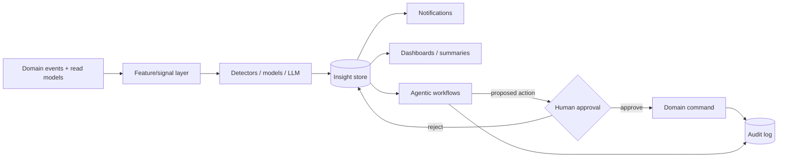

# AI Roadmap

> **Phase:** Domain Modeling (no code). Brand-agnostic. Defines the **AI / Insights** bounded context (`DOMAIN_MODEL.md` §2.14) and its capabilities. Aligns with `roadmap.md` Phase 6.
>
> **Governing principle (from the design system voice):** AI is **calm and advisory**. It **never mutates domain state directly** — it emits `Insight` / suggestion events that flow to Notifications and require **human-in-the-loop** action. Every AI/agent action is **audited and reversible**. Model hosting + data governance is an open decision (`decisions.md` U-018).

---

## 1. Architecture stance

- **Downstream & read-only on domain state.** AI consumes the event stream (`EVENT_ARCHITECTURE.md`) and analytics read models (replica) — it does not sit on the OLTP write path.
- **Insight as a first-class object:** `{type, subjectRef, confidence, evidence, status}`. Status lifecycle: `new → acknowledged → dismissed | actioned`.
- **Guardrails everywhere:** confidence thresholds, explainability (evidence attached), PII minimization, tenant isolation, human approval for any state change, full audit.

---

## 2. Capabilities (phased)

Each capability: **inputs → approach → output → guardrails → maturity**. Maturity tiers: **T1 rules/stats** (ship first, explainable, cheap), **T2 ML models**, **T3 LLM/agentic**.

### 2.1 Attendance anomaly detection — **T1 → T2**
- **Inputs:** `attendance_punches`, `attendance_records`, shifts, holidays, leave.
- **Approach:** start with rules/statistics (late/early/irregular patterns, missing check-out, impossible geo/time, device-vs-expected-location, sudden drop in worked minutes); evolve to per-employee baselines + outlier detection.
- **Output:** `AnomalyDetected` insight → manager notification; surfaced on Team/Attendance views.
- **Guardrails:** suppress known-explained days (leave/holiday); confidence + evidence ("3 of last 5 days no check-out"); no auto-correction — proposes a correction the human files.

### 2.2 Missing report detection — **T1**
- **Inputs:** expected report calendar (working days from shift/holiday/leave) vs `daily_reports`.
- **Approach:** deterministic gap detection per employee per working day, respecting `day_status` (leave/holiday excused).
- **Output:** `MissingReportDetected` → employee reminder + manager digest; feeds on-time analytics.
- **Guardrails:** quiet hours; don't nag on excused days; escalate only after the edit window.

### 2.3 Project risk alerts — **T1 → T2**
- **Inputs:** project burn (`allocated_hours` vs logged), open blockers, on-time rate, member load/heatmap, status history.
- **Approach:** rule-based risk score (burn pace > schedule, rising open tasks, blocker age, under-staffing) → ML risk model later.
- **Output:** `ProjectRiskRaised` → project owner; suggests `status → at_risk` (human confirms).
- **Guardrails:** explainable score breakdown; suggestion only — never flips project status automatically.

### 2.4 Recruitment insights — **T2 → T3**
- **Inputs:** pipeline stage durations, conversion rates, source effectiveness, time-to-fill, interview feedback (Recruitment context — U-013).
- **Approach:** funnel analytics (T1/T2); candidate-fit and feedback summarization with an LLM (T3), strictly advisory.
- **Output:** `RecruitmentInsightGenerated` → recruiter/hiring manager (bottlenecks, stale candidates, forecast time-to-fill).
- **Guardrails:** **bias/fairness controls** — no automated screening/ranking that could discriminate; decisions remain human; consent + privacy on candidate data; audit of any AI-assisted disposition.

### 2.5 Executive summaries — **T3 (LLM)**
- **Inputs:** analytics read models (hours-by-category, burn, on-time, headcount, attendance, recruitment funnel) over a period/scope.
- **Approach:** LLM generates a natural-language summary from **structured aggregates** (not raw PII); narrate-don't-cheerlead voice; cite the numbers.
- **Output:** `ExecutiveSummaryGenerated` → leadership digest (weekly/monthly), NL analytics Q&A ("how did Platform do last sprint?").
- **Guardrails:** grounded in provided data (retrieval over aggregates), numbers must be specific and traceable; no fabrication; tenant/scoped data only.

### 2.6 Agentic workflow automation — **T3 (gated)**
- **Inputs:** insights + events + permitted actions catalog.
- **Approach:** agents that **propose** multi-step actions (e.g. "remind the 4 people missing reports, then escalate to their manager if still missing by 6pm"; "pre-triage the review queue and suggest approvals for low-risk reports").
- **Output:** `AgentActionProposed → AgentActionApproved/Rejected → AgentActionExecuted` (executed only via normal domain commands, with the approver as actor).
- **Guardrails:** **human-in-the-loop approval** for any state change; scoped by the approver's RBAC permissions (`ai.agent.approve`); dry-run/preview; every step audited; reversible; rate-limited; kill-switch per tenant.

---

## 3. Capability → data/event dependencies

| Capability | Needs (phases) | Key events consumed | Emits |
|---|---|---|---|
| Attendance anomaly | Attendance (P3) | `EmployeeCheckedIn/Out`, `AttendanceMaterialized` | `AnomalyDetected` |
| Missing report | Reporting (P2) + calendar | `AttendanceMaterialized`, report calendar | `MissingReportDetected` |
| Project risk | Projects + Reporting (P2) | `ReportApproved`, burn updates | `ProjectRiskRaised` |
| Recruitment insights | Recruitment (P5, U-013) | pipeline events | `RecruitmentInsightGenerated` |
| Executive summaries | Analytics (P4) | aggregates | `ExecutiveSummaryGenerated` |
| Agentic automation | All above + approvals | all | `AgentAction*` |

---

## 4. Phasing (within roadmap Phase 6, but T1 can land earlier)

1. **Phase 4-adjacent (T1, low-risk):** missing-report detection + rule-based attendance anomalies + rule-based project risk — pure analytics, no models, high trust. Can ship alongside Analytics.
2. **Phase 6a (T2):** baselines/ML for anomaly + risk scoring; recruitment funnel analytics.
3. **Phase 6b (T3):** LLM executive summaries + NL analytics (grounded, read-only).
4. **Phase 6c (T3 gated):** agentic automation with human approval, starting with the safest loops (reminders/escalations), expanding only as trust + audit prove out.

---

## 5. Governance & risk

- **Data governance (U-018):** where models run (managed API vs self-hosted), what data leaves the tenant boundary, retention of prompts/outputs, PII redaction, per-tenant opt-in.
- **Privacy:** no raw biometrics, no secrets, minimal PII in features/prompts; tenant isolation in every inference.
- **Fairness:** recruitment AI is advisory only; documented bias controls; no automated adverse decisions.
- **Explainability:** every insight carries evidence; summaries cite numbers.
- **Auditability:** insights + agent actions fully audited; reversible; kill-switch.
- **Voice:** AI output obeys the product voice — calm, specific, never cheerleading.

## 6. Open decisions
- **U-018** model hosting + data governance + per-tenant AI opt-in.
- Build-vs-buy per capability (rules in-house; LLM via API initially).
- Human-approval UX for agentic actions (extends the approval pattern in `WORKFLOWS.md` §5).

_Related: [`DOMAIN_MODEL.md`](./DOMAIN_MODEL.md) §2.14 · [`roadmap.md`](./roadmap.md) Phase 6 · [`EVENT_ARCHITECTURE.md`](./EVENT_ARCHITECTURE.md) · [`WORKFLOWS.md`](./WORKFLOWS.md)._
