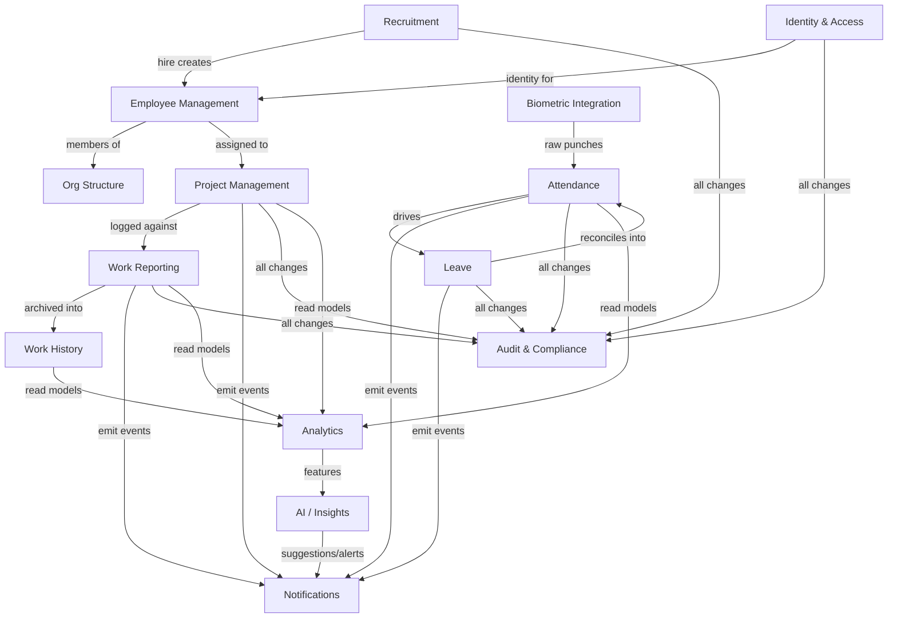

# Domain Model

> **Phase:** Domain Modeling (no implementation). Brand-agnostic ("the platform"; codename CoreOps). Builds on `architecture.md` §7 (modules), `databasedesign.md` (schema), and `decisions.md`.
>
> **New vs existing:** Identity, People, Org, Projects, Work Reporting, Attendance, Leave, Notifications, Audit, Analytics are **backed by the existing schema**. **Recruitment**, **Biometric Integration**, and **AI/Insights** are **new bounded contexts with no schema yet** (tracked as `decisions.md` U-013/U-014/U-018).

This document uses Domain-Driven Design vocabulary: **Bounded Context** (a model boundary with its own ubiquitous language), **Aggregate** (consistency boundary with a root entity), **Entity** (identity + lifecycle), **Value Object** (immutable, compared by value), **Domain Event** (something meaningful that happened, past tense).

---

## 1. Context Map

**Relationship patterns:**
- **Identity & Access** is *upstream* of everything (shared kernel for actor + permission).
- **Biometric Integration** is an *anti-corruption layer (ACL)* in front of Attendance: vendor punch formats are translated into the platform's `attendance_punches` model.
- **Recruitment** is *upstream* of Employee Management via a one-way **HireApproved → Employee onboarding** handoff.
- **Audit & Compliance** and **Notifications** are *generic subdomains* consuming events from all contexts (no FK coupling — polymorphic subjects, per the existing schema).
- **Analytics** and **AI/Insights** are *downstream, read-only* (replica-backed); AI never writes domain state directly — it emits suggestions/alerts as events.

---

## 2. Bounded Contexts

### 2.1 Identity & Access (existing)
**Ubiquitous language:** user, session, role, permission, scope, grant.

| Aggregate (root) | Entities | Value Objects |
|---|---|---|
| **User** (`auth_users`) | Session, PasswordReset, LoginAttempt | EmailAddress, PasswordHash, SsoIdentity (provider+subject), MfaSecret(encrypted), LockoutState |
| **Role** (`roles`) | RolePermission | PermissionKey (dotted), RoleKey |
| **RoleGrant** (`user_roles`) | — | Scope (type ∈ global/department/project/self, + scope_id), GrantWindow (granted_at/expires_at/revoked_at) |

**Domain events:** `UserRegistered`, `UserLoggedIn`, `LoginFailed`, `UserLockedOut`, `PasswordReset`, `MfaEnabled`, `RoleGranted`, `RoleRevoked`, `SessionRevoked`.

### 2.2 Employee Management (existing)
**Language:** employee, employment, designation, grade, manager.

| Aggregate | Entities | Value Objects |
|---|---|---|
| **Employee** (`employees`) | EmploymentHistoryEntry | EmployeeCode, PersonName (first/last/display), ContactInfo (work/personal email, phone), EmploymentType, EmploymentStatus, GradeDesignation, EmploymentDates (join/confirm/exit), Timezone |

**Domain events:** `EmployeeCreated`, `EmployeeUpdated`, `EmployeeManagerChanged`, `EmployeePromoted`, `EmployeeTransferred`, `EmployeeExited`, `EmployeeReactivated`.

### 2.3 Org Structure (existing)
**Language:** department, location, shift, hierarchy.

| Aggregate | Entities | Value Objects |
|---|---|---|
| **Department** (`departments`) | — | DepartmentCode, OrgPath (parent chain) |
| **Location** (`locations`) | — | LocationCode, Timezone, Address, CountryCode |
| **Shift** (`shifts`) | — | TimeWindow (start/end), BreakMinutes, WorkingDaysMask (7-bit), CrossesMidnight |

**Domain events:** `DepartmentCreated`, `DepartmentReparented`, `DepartmentHeadAssigned`, `LocationActivated/Deactivated`, `ShiftDefined/Updated`.

### 2.4 Project Management (existing)
**Language:** project, member, activity type, allocation, status.

| Aggregate | Entities | Value Objects |
|---|---|---|
| **Project** (`projects`) | ProjectMember (stint) | ProjectCode, ProjectStatus, AllocatedHours, BillableFlag, ColorTag, DateRange, Metadata(jsonb) |
| **ActivityType** (`activity_types`) | — | ActivityCode, BillableFlag, DisplayOrder |

**Domain events:** `ProjectCreated`, `ProjectStatusChanged` (draft/active/at_risk/on_hold/completed/archived), `ProjectMemberAssigned`, `ProjectMemberReleased`, `ProjectArchived`.

### 2.5 Work Reporting (existing)
**Language:** daily report, entry, counts, review, submission.

| Aggregate | Entities | Value Objects |
|---|---|---|
| **DailyReport** (`daily_reports`) | ReportEntry (`daily_report_entries`), Mention | DayStatus, WorkLocation, ReportStatus, ReviewDecision (by/at/note), EditWindow (locked_at), Version, **EntryCounts** (tags/docs/bom/spares/tasks_done/tasks_open), HoursWorked |

**Domain events:** `ReportDrafted`, `ReportSubmitted`, `ReportEntered` (entry added), `ReportReviewRequested`, `ReportApproved`, `ReportRejected`, `ReportEdited`, `ReportLocked`, `MentionRaised`.

### 2.6 Work History (existing — read/forensic)
**Language:** report version, snapshot, employment history.

| Aggregate | Entities | Value Objects |
|---|---|---|
| **ReportHistory** (`daily_report_history`) | — | VersionSnapshot(jsonb), ChangeType (submit/edit/review/reject) |

Immutable, append-only. Reconstructs the exact filed body at any past time. (Distinct from Audit — this is domain-facing history.)
**Domain events:** `ReportVersionSnapshotted`.

### 2.7 Attendance (existing)
**Language:** punch, attendance record, correction, holiday, present/absent.

| Aggregate | Entities | Value Objects |
|---|---|---|
| **AttendanceDay** (`attendance_records`) | AttendanceCorrection | AttendanceStatus (present/wfh/leave/comp_off/half_day/holiday/weekend/absent), TimeIn/Out, WorkedMinutes, BreakMinutes, CorrectedFlag, Source |
| **PunchStream** (`attendance_punches`) | Punch | PunchType (in/out), PunchSource (web/mobile/biometric/kiosk/manual/system), DeviceId, GeoPoint(lat/long), IpAddress, RawPayload |
| **Holiday** (`holidays`) | — | HolidayDate, HolidayType, OptionalFlag, LocationScope |

**Domain events:** `EmployeeCheckedIn`, `EmployeeCheckedOut`, `BreakStarted`, `BreakEnded`, `PunchRecorded`, `PunchRejected` (duplicate/invalid), `AttendanceMaterialized` (daily close), `AttendanceCorrectionRequested`, `AttendanceCorrected`, `AttendanceCorrectionDenied`.

### 2.8 Biometric Integration (**new** — ACL)
**Language:** device, enrollment, template, raw event, mapping.

| Aggregate | Entities | Value Objects |
|---|---|---|
| **BiometricDevice** (new) | DeviceHeartbeat | DeviceSerial, DeviceLocation, Vendor/Model, DeviceKey(credential), DeviceStatus |
| **BiometricEnrollment** (new) | — | EmployeeRef, BiometricTemplateRef (opaque/hashed — never raw biometrics in DB), EnrollmentStatus |
| **RawDeviceEvent** (new, append-only) | — | DeviceSerial, ExternalUserId, EventTimestamp, EventType, RawPayload |

Responsibility: ingest vendor events, authenticate the device, map `ExternalUserId → Employee`, normalize into `Punch` events for Attendance. **Biometric templates/PII are never stored raw** — only references/hashes (privacy + `INTEGRATIONS.md`).
**Domain events:** `DeviceRegistered`, `DeviceWentOffline/Online`, `EmployeeEnrolled`, `RawDeviceEventReceived`, `DeviceEventMappedToPunch`, `UnmappedDeviceEvent` (needs reconciliation).

### 2.9 Leave (existing)
**Language:** leave type, balance, accrual, request, day-fraction.

| Aggregate | Entities | Value Objects |
|---|---|---|
| **LeaveRequest** (`leave_requests`) | LeaveRequestDay | DateRange, DaysCount, HalfDaySegment, LeaveStatus, Decision, ProofRef |
| **LeaveBalance** (`leave_balances`) | — | Period(year), BalanceComponents (opening/accrued/carried/used/encashed/adjustments), **CurrentBalance** (generated) |
| **LeaveType** (`leave_types`) | — | LeaveCode, AccrualMethod, Quota, CarryForwardCap, NoticeDays, ProofThreshold |
| **AccrualLedger** (`leave_accruals`) | AccrualEntry | Amount(±), Reason, EffectiveDate |

**Domain events:** `LeaveRequested`, `LeaveApproved`, `LeaveDenied`, `LeaveCancelled`, `LeaveWithdrawn`, `LeaveAccrued`, `LeaveBalanceAdjusted`.

### 2.10 Recruitment (**new** — no schema yet)
**Language:** requisition, candidate, application, pipeline stage, interview, offer.

| Aggregate | Entities | Value Objects |
|---|---|---|
| **JobRequisition** (new) | — | RequisitionCode, DepartmentRef, HeadcountTarget, RequisitionStatus (open/on_hold/filled/closed), HiringManagerRef |
| **Candidate** (new) | CandidateDocument (resume) | CandidateName, ContactInfo, Source (referral/portal/agency), ConsentRecord (privacy) |
| **Application** (new) | StageTransition, Interview, Feedback, Offer | PipelineStage (applied/screen/interview/offer/hired/rejected), Disposition, OfferTerms, OfferStatus |

Handoff: **`HireApproved` → Employee onboarding** (creates an `employees` row, optionally pre-onboarding placeholder with null `user_id`, then provisions identity).
**Domain events:** `RequisitionOpened`, `CandidateAdded`, `ApplicationCreated`, `CandidateAdvanced`, `InterviewScheduled`, `FeedbackSubmitted`, `OfferExtended`, `OfferAccepted/Declined`, `CandidateRejected`, `HireApproved`, `RequisitionClosed`.

### 2.11 Notifications (existing — generic subdomain)
**Language:** template, notification, recipient, channel, preference, delivery.

| Aggregate | Entities | Value Objects |
|---|---|---|
| **Notification** (`notifications`) | NotificationRecipient | Subject (polymorphic type+id), RenderedContent (title/body materialized), Priority, Cta(label/route), Channel, DeliveryState, EngagementState |
| **NotificationTemplate** (`notification_templates`) | — | TemplateKey, DefaultChannels[], DefaultPriority |
| **NotificationPreference** (`notification_preferences`) | — | (employee, template, channel) → enabled |

**Domain events:** `NotificationRaised`, `NotificationFannedOut`, `NotificationDelivered`, `NotificationDeliveryFailed`, `NotificationRead`, `NotificationDismissed`, `PreferenceChanged`.

### 2.12 Audit & Compliance (existing — generic subdomain)
**Language:** audit event, actor, object, payload, partition, archive, retention.

| Aggregate | Entities | Value Objects |
|---|---|---|
| **AuditLog** (`worktrack_audit.audit_logs`) | AuditEvent (append-only) | Actor (user/employee/label), Action (past-tense verb), Object (polymorphic), Payload (before/after/diff), RequestContext (ip/ua/request_id/session_id) |
| **ArchivePartition** (`audit_logs_archive_meta`) | — | PartitionName, DateRange, ArchiveUri, RowCount |

**Domain events:** `AuditEventRecorded`, `PartitionCreated`, `PartitionDetached`, `PartitionArchived`. (Audit consumes all other contexts' events.)

### 2.13 Analytics (existing — read model)
**Language:** KPI, burn, heatmap, on-time rate, SLA.
Read-only projections over the replica/views (`v_employee_today`, `v_manager_review_queue`, `v_employee_org`, etc.). No aggregates of its own; consumes events to refresh materialized read models.
**Domain events (consumed):** all reporting/attendance/project events. **Emits:** none (read-only).

### 2.14 AI / Insights (**new** — downstream, advisory)
**Language:** signal, anomaly, risk score, suggestion, summary, agent action.

| Aggregate | Entities | Value Objects |
|---|---|---|
| **Insight** (new) | — | InsightType (anomaly/risk/summary/suggestion), SubjectRef (polymorphic), Confidence, Evidence, Status (new/acknowledged/dismissed/actioned) |
| **AgentTask** (new) | AgentStep | Goal, ProposedAction, ApprovalState (human-in-the-loop), Outcome |

AI never mutates domain state directly; it **emits Insight/suggestion events** that flow to Notifications and require human action (see `AI_ROADMAP.md`). All agent actions are audited.
**Domain events:** `AnomalyDetected`, `MissingReportDetected`, `ProjectRiskRaised`, `RecruitmentInsightGenerated`, `ExecutiveSummaryGenerated`, `AgentActionProposed`, `AgentActionApproved/Rejected/Executed`.

---

## 3. Cross-cutting modeling rules

- **Aggregate boundaries = transaction boundaries.** A command mutates one aggregate per transaction; cross-aggregate effects propagate via domain events (e.g. `LeaveApproved` → AttendanceDay update is a downstream reaction, not the same transaction unless co-located by design — see `EVENT_ARCHITECTURE.md`).
- **Polymorphic references** (Notifications, Audit, Insights) deliberately avoid FKs to subjects so subjects can soft-delete (existing schema principle, extended to new contexts).
- **Value objects are immutable**; corrections produce new snapshots rather than mutating history (Work History, Audit, Corrections all follow this).
- **Append-only ledgers** are the source of truth for derived read models: PunchStream→AttendanceDay, AccrualLedger→LeaveBalance, RawDeviceEvent→Punch, AuditLog. Read models are rebuildable.
- **Identity vs Person split** preserved: a Candidate becomes an Employee (people) which *optionally* gains a User (identity). Recruitment never assumes a User exists.

## 4. New decisions raised by this model
Added to `decisions.md` §C: **U-013** Recruitment data model, **U-014** biometric device/vendor + template handling, **U-018** AI hosting & data governance. Role additions (Super Admin, Team Lead, Recruiter) recorded as **D-014** — see `USER_ROLES_AND_PERMISSIONS.md`.

_Related: [`USER_ROLES_AND_PERMISSIONS.md`](./USER_ROLES_AND_PERMISSIONS.md) · [`WORKFLOWS.md`](./WORKFLOWS.md) · [`EVENT_ARCHITECTURE.md`](./EVENT_ARCHITECTURE.md) · [`databasedesign.md`](./databasedesign.md)._
