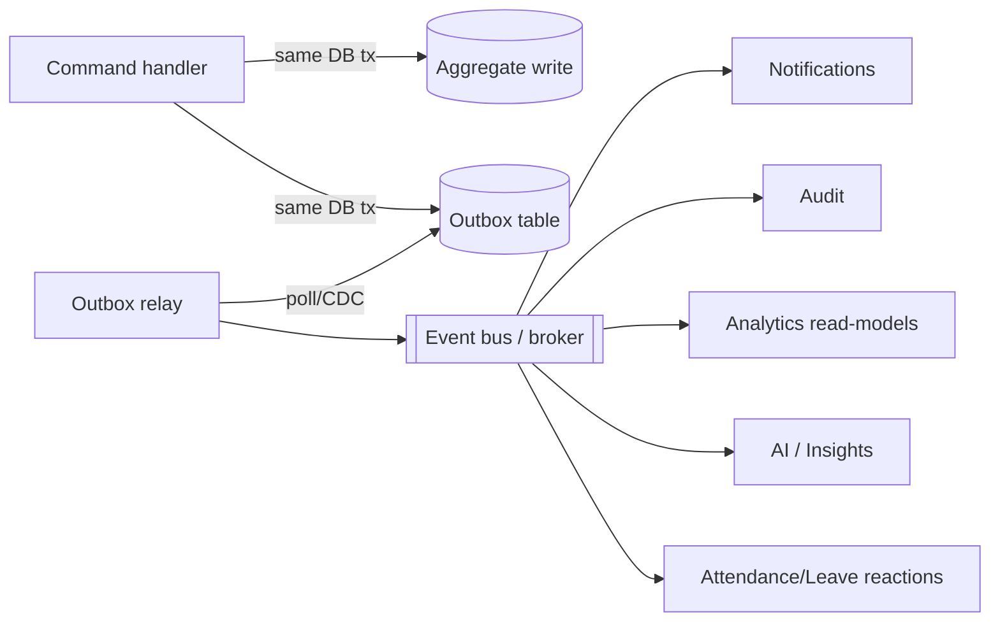

# Event Architecture

> **Phase:** Domain Modeling (no code). Brand-agnostic. Defines the event-driven backbone that decouples the bounded contexts (`DOMAIN_MODEL.md`), drives Notifications/Audit/Analytics/AI, and powers integrations (`INTEGRATIONS.md`). Builds on the existing async-worker + queue design (`backenddesign.md` §5–6) and the polymorphic-subject pattern already in the schema.
>
> **Transport is an open decision (`decisions.md` U-017).** The design below is broker-agnostic and starts with a **transactional outbox** so events are reliable from day one without a heavy broker.

---

## 1. Why events

- **Decouple contexts:** a command mutates one aggregate; side effects in other contexts react to events (no cross-aggregate transactions, no cross-module FKs).
- **One source, many consumers:** `LeaveApproved` simultaneously updates attendance, notifies the requester, writes audit, and refreshes analytics — none of them coupled to the producer.
- **Reliability & replay:** append-only event streams (already a schema pattern: punches, accruals, audit) are naturally event-sourced for derived read models.

---

## 2. Event taxonomy

**Domain events** (past tense, business-meaningful) — the contract between contexts. **Integration events** — what crosses the system boundary (inbound device/SSO, outbound deliveries). **Audit events** — every domain event is also persisted to the audit log.

### Core catalog (selected)

| Context | Events |
|---|---|
| Identity & Access | `UserLoggedIn`, `LoginFailed`, `UserLockedOut`, `RoleGranted`, `RoleRevoked` |
| Employee | `EmployeeCreated`, `EmployeeManagerChanged`, `EmployeePromoted`, `EmployeeExited` |
| Org | `DepartmentReparented`, `ShiftDefined`, `HolidayDeclared` |
| Project | `ProjectCreated`, **`ProjectAssigned`**, `ProjectStatusChanged`, `ProjectArchived` |
| Work Reporting | **`ReportSubmitted`**, `ReportApproved`, `ReportRejected`, `ReportLocked`, `MentionRaised` |
| Attendance | **`EmployeeCheckedIn`**, **`EmployeeCheckedOut`**, `BreakStarted`, `BreakEnded`, `PunchRecorded`, `PunchRejected`, `AttendanceMaterialized`, **`AttendanceCorrected`** |
| Biometric | `DeviceRegistered`, `DeviceWentOffline`, `RawDeviceEventReceived`, `UnmappedDeviceEvent` |
| Leave | `LeaveRequested`, `LeaveApproved`, `LeaveDenied`, `LeaveAccrued` |
| Recruitment | `RequisitionOpened`, `CandidateAdvanced`, `OfferExtended`, `OfferAccepted`, `HireApproved` |
| Notifications | `NotificationRaised`, `NotificationDelivered`, `NotificationDeliveryFailed` |
| Audit | `AuditEventRecorded`, `PartitionArchived` |
| AI / Insights | `AnomalyDetected`, `MissingReportDetected`, `ProjectRiskRaised`, `ExecutiveSummaryGenerated`, `AgentActionProposed` |

> The five examples requested — `EmployeeCheckedIn`, `EmployeeCheckedOut`, `ReportSubmitted`, `ProjectAssigned`, `AttendanceCorrected` — are first-class members of this catalog.

---

## 3. Event envelope

A uniform envelope for every event:

```json
{
  "event_id": "uuid",                 
  "event_type": "ReportSubmitted",    
  "event_version": 1,                 
  "occurred_at": "2026-05-30T16:32:00Z",
  "tenant_id": "uuid | null",         
  "actor": { "user_id": "uuid|null", "label": "system|integration:okta|device:<serial>" },
  "subject": { "type": "daily_report", "id": "uuid" },  
  "correlation_id": "uuid",           
  "causation_id": "uuid|null",        
  "request_id": "uuid|null",          
  "payload": { "...domain-specific..." }
}
```

- **`subject.type`/`id`** mirror the existing polymorphic pattern (no FK to the subject).
- **`tenant_id`** mandatory when multi-tenant (`TENANCY_STRATEGY.md`).
- **`correlation_id`/`causation_id`** thread a chain of events back to the originating command (and `request_id` ties to the audit log + logs/traces — `backenddesign.md` §10).
- **`event_version`** enables schema evolution (additive-first; never break consumers).

---

## 4. Delivery: transactional outbox → broker



- **Outbox pattern:** the aggregate write **and** the event row commit in the **same transaction** → no lost events, no dual-write inconsistency. A relay publishes from the outbox to the bus.
- **MVP without a broker:** the existing schema already uses partial-index "pull queues" (e.g. notification outbound). The outbox can be polled directly by workers for Phase 1–3; introduce a real broker (U-017) when fan-out/throughput grows.
- **Bus options (U-017):** managed pub/sub, log-based broker, or DB-native (LISTEN/NOTIFY + outbox) — chosen at the stack decision.

---

## 5. Consumption semantics

- **At-least-once delivery** → **idempotent consumers.** Idempotency keys: `event_id` (consumer dedup table) and natural uniqueness (e.g. `notification_recipients (notification, recipient, channel)` makes dispatch idempotent; `attendance_punches` dedup makes ingestion idempotent).
- **Ordering:** do not assume global order. Where order matters (punches for a day, accruals for a balance), order **per partition key** (`employee_id` / `tenant_id`) and design handlers to be commutative or to reconcile from the append-only ledger.
- **Choreography by default** (contexts react to events); **orchestration (saga)** only for multi-step processes needing compensation (e.g. **HireApproved → create employee → provision identity → send welcome** — compensate by deactivating the placeholder if provisioning fails).
- **Poison messages** → dead-letter queue with alerting; never silently dropped (record `failed_reason`).

---

## 6. Producer → consumer map (selected)

| Event | Producer | Consumers |
|---|---|---|
| `EmployeeCheckedIn/Out` | Attendance (via Biometric ACL) | Analytics, AI (anomaly), Audit, Notifications (manager, optional) |
| `AttendanceMaterialized` | Attendance aggregator | AI (missing/under-utilization), Analytics, Audit |
| `ReportSubmitted` | Work Reporting | Notifications (reviewer), Analytics (on-time), Audit, Work History (snapshot) |
| `ReportApproved/Rejected` | Work Reporting | Notifications (author), Analytics (SLA), Audit |
| `LeaveApproved` | Leave | Attendance (mark days), Notifications, Analytics, Audit |
| `AttendanceCorrected` | Attendance | Analytics, Notifications, Audit |
| `ProjectAssigned` | Project | Notifications (assignee), Analytics, Audit |
| `ProjectRiskRaised` | AI/Insights | Notifications (owner), Project (status→at_risk suggestion), Audit |
| `HireApproved` | Recruitment | Employee onboarding saga, Identity provisioning, Notifications, Audit |
| `MissingReportDetected` | AI/Insights | Notifications (employee+manager), Audit |

---

## 7. Audit & analytics as universal subscribers

- **Audit:** every domain event → an `audit_logs` row (append-only, `INSERT`-only app grant). The event envelope maps cleanly to audit columns (actor, action=event_type, object=subject, payload, request context). This makes audit coverage a property of the event bus, not of scattered manual logging.
- **Analytics:** read-model projections (KPIs, burn, heatmaps, on-time) refresh from events on the replica; rebuildable by replaying the relevant append-only streams.

---

## 8. Governance

- **Event registry/schema catalog** with versioning; additive changes only; deprecate with a migration window.
- **Naming:** `PascalCase`, past tense, `<Aggregate><WhatHappened>`.
- **Privacy:** payloads minimize PII (no raw biometrics, no secrets, no tokens); tenant isolation in every event.
- **Testing:** contract tests per producer/consumer pair; replay tests for read-model rebuild.

## 9. Open decisions
- **U-017** event bus transport (outbox-only vs broker; which broker).
- Saga framework vs hand-rolled compensation (revisit at stack choice, U-001).
- Ordering guarantees needed per stream (confirm with attendance/leave volume, U-012).

_Related: [`DOMAIN_MODEL.md`](./DOMAIN_MODEL.md) · [`WORKFLOWS.md`](./WORKFLOWS.md) · [`backenddesign.md`](./backenddesign.md) §5–6 · [`INTEGRATIONS.md`](./INTEGRATIONS.md)._
