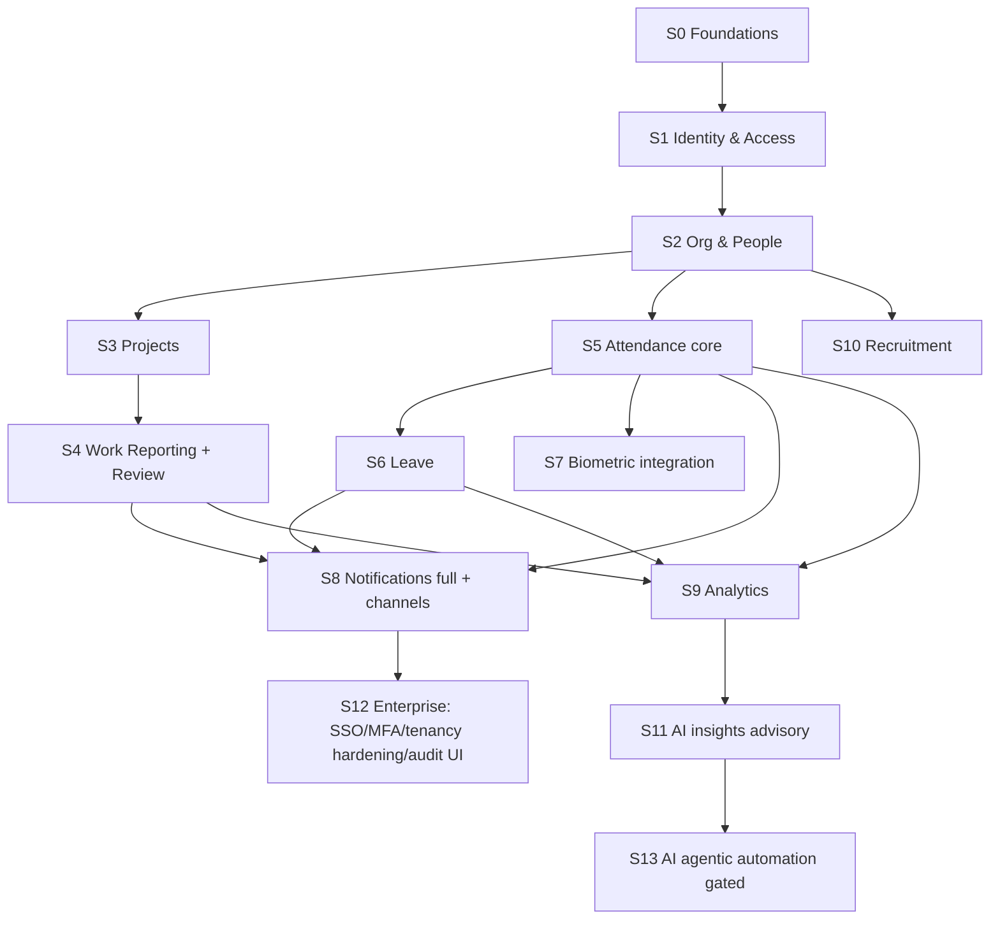

# Implementation Sequence

> **Phase:** Domain Modeling output (no code). Brand-agnostic. This orders the **safest** path to build the platform, combining the roadmap phases (`roadmap.md`), the implementation plan (`implementation-plan.md`), the bounded contexts (`DOMAIN_MODEL.md`), and the new contexts (Recruitment, Biometric, AI). "Safe" = dependency-correct, low-blast-radius, decision-gated, and reversible.
>
> **Gate:** still no production code until this and the underlying decisions are approved.

---

## 1. Sequencing principles (what "safe" means here)

1. **Foundations before features** — identity, audit, tenancy, and the event/outbox backbone must exist before domain features write data.
2. **Decide irreversible things first** — anything expensive to retrofit (tenancy `tenant_id`, brand isolation, audit coverage, event envelope) goes in **before** entities.
3. **Append-only & read-models early** — punches, accruals, audit, outbox are write-once; building them first means later features just project from them.
4. **One context at a time, vertically** — schema → domain logic → API → minimal UI → events → audit, per context, so each slice is shippable and testable.
5. **Integrations and AI are downstream** — they consume stable events; never block core delivery on a vendor (U-014/U-015/U-016/U-018).
6. **Advisory before autonomous** — AI ships as read-only insights long before any agentic action.

---

## 2. Pre-flight decision gate (must answer before Step 1)

Blocking (from `decisions.md` §C): **U-001** stack/API · **U-010** tenancy (SaaS vs self-hosted — see `TENANCY_STRATEGY.md`) · **U-004** permission catalog · **U-009** infra (queue/mail/storage) · **U-005** token file · **U-017** event transport. Soon-after: U-002, U-007, U-013, U-014.

---

## 3. The sequence

### S0 — Foundations *(roadmap P0→P1)*
Repo scaffold (`PROJECT_STRUCTURE.md`), CI/CD, containerized local stack, migration tooling. **Tenancy baseline** (`tenant_id` + RLS scaffolding **if** multi-tenant — do it now, not later). **Audit pipeline + event outbox + event envelope.** `PRODUCT_NAME`/`--product-name` brand isolation. Promote schema into `database/` with neutralized identifiers.
*Safety: nothing irreversible is deferred.*

### S1 — Identity & Access
Auth (password + ≥1 SSO), sessions (hashed tokens), password reset, login-attempt rate-limit/lockout, **RBAC (roles incl. new `super_admin`/`team_lead`/`recruiter`, permissions, scoped grants)**, per-request `current_user_id` (+ `current_tenant_id`) GUC, audit-context middleware.
*Gate: U-004 permission catalog.*

### S2 — Org & People
Locations, departments (tree), shifts, holidays, employees, employment history, manager hierarchy (`v_employee_org`); Admin → People + Invite. Emits `Employee*` events.

### S3 — Projects
Projects, members (open stints), activity types; Project detail; `ProjectCreated/Assigned/StatusChanged`.

### S4 — Work Reporting + Review *(core value)*
Report form (day details, entries, **counts grid**, remarks, queries/@mentions), draft auto-save, lifecycle state machine + optimistic concurrency, history snapshots, review queue, report-locker worker, History + export. In-app notifications for submit/review.
*Gate: U-002 (lock rule), U-007 (count semantics) — confirm before finalizing the model.*

### S5 — Attendance core
Punch API (web/manual), punch stream (append-only), nightly **aggregator → attendance_records**, calendar/history UI, corrections workflow (≤7-day) + approvals. Emits `EmployeeCheckedIn/Out`, `AttendanceMaterialized`, `AttendanceCorrected`.

### S6 — Leave
Leave types/policies, requests + per-day expansion, **balance read-model + accrual ledger** + accrual worker, approvals, attendance reconciliation, balances UI.
*Safety: balance correctness via `FOR UPDATE` + rebuildable ledger.*

### S7 — Biometric integration *(downstream of S5)*
Biometric ACL: device registration/auth, enrollment mapping, raw-event ingestion → normalized punches, reconciliation queue for unmapped events. No raw biometrics stored.
*Gate: U-014 vendor/protocol. Does not block S5 (web/manual punch works without it).*

### S8 — Notifications (full, multi-channel)
Templates, fan-out, preferences, in-app inbox/drawer/center, **email** dispatcher + retries; then **WhatsApp/SMS/push** as providers land. Driven entirely by events from S4–S7.
*Gate: U-009/U-015 providers; enum add `whatsapp`.*

### S9 — Analytics
Read-replica routing; KPIs, hours-by-category, burn/burn-down, on-time trend, workload heatmap; async CSV/PDF exports to object storage; materialized views if needed.

### S10 — Recruitment *(new context, parallelizable after S2)*
Requisitions, candidates/applications, pipeline + interviews + feedback, offers, **HireApproved → onboarding saga** into S2. Recruiter role + permissions.
*Gate: U-013 schema design (this context has no schema yet).*

### S11 — AI insights (advisory, T1→T2)
Missing-report detection, rule-based attendance anomalies, rule-based project risk → insights → notifications. Read-only; explainable; human acts.
*Safety: no state mutation; ships value with minimal risk.*

### S12 — Enterprise hardening
SSO/SAML multi-provider + MFA + directory sync (LDAP/AD, Google, M365), audit-log UI + search + retention/partition automation, **multi-tenancy hardening** (RLS coverage, per-tenant config), billing (if U-008), backup/DR drills.
*Gate: U-016 directory mapping; U-010 confirmed.*

### S13 — AI agentic automation (gated, T3)
LLM executive summaries + NL analytics (grounded), then human-approved agentic loops (reminders/escalations first), expanding with audit + trust.
*Gate: U-018 model hosting/governance; human-in-the-loop + kill-switch mandatory.*

---

## 4. Parallelization & critical path

- **Critical path:** S0 → S1 → S2 → (S4 core value) and S2 → S5 → S6.
- **Parallel after S2:** S3 (Projects) ∥ start of S5 (Attendance) ∥ S10 prep (Recruitment schema design).
- **Downstream, never blocking core:** S7 (Biometric), S8 channels, S11/S13 (AI), S12 integrations.
- **Decision-bound:** S0 tenancy (U-010), S1 permissions (U-004), S4 report rules (U-002/U-007), S7 (U-014), S10 (U-013), S13 (U-018).

## 5. Definition of done per step
Schema migration (validated, reversible) · domain logic + tests · API + contract (OpenAPI) · minimal UI (a11y pass) · **events emitted + audited** · observability (metrics/logs/traces) · docs updated. No step is "done" without audit coverage and event emission.

## 6. Risk-ordered summary (safest first)
1. Foundations + tenancy + audit + events (irreversible-if-skipped) →
2. Identity/RBAC (security gate) →
3. People/Org (everything hangs off it) →
4. Reporting + Attendance + Leave (core value, append-only ledgers) →
5. Notifications + Analytics (read/derived) →
6. Recruitment (new, isolated) →
7. Integrations + AI advisory (downstream) →
8. Enterprise hardening + AI agentic (highest blast radius, last).

_Related: [`roadmap.md`](./roadmap.md) · [`implementation-plan.md`](./implementation-plan.md) · [`DOMAIN_MODEL.md`](./DOMAIN_MODEL.md) · [`TENANCY_STRATEGY.md`](./TENANCY_STRATEGY.md) · [`decisions.md`](./decisions.md)._
