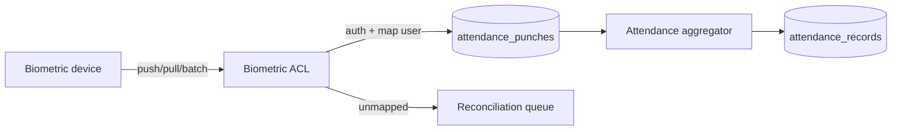
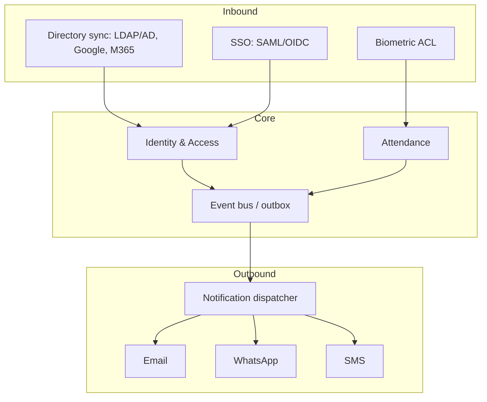

# Integrations

> **Phase:** Domain Modeling (no code). Brand-agnostic. Each integration lists its purpose, direction, protocol, data flow, mapping to the domain, auth/secrets, and failure handling. All external calls run through **workers/queues** (never the request path) where they can be slow, and through an **anti-corruption layer (ACL)** that translates vendor models into platform models.
>
> Concrete vendors/providers are open decisions: biometric **U-014**, WhatsApp/SMS **U-015**, directory sync **U-016**, infra **U-009**.

---

## 0. Principles

- **ACL per external system:** the platform never adopts a vendor's data shape internally. Each integration has a translator that emits platform domain objects/events.
- **Per-tenant configuration** (when multi-tenant): SSO connection, biometric devices, mail/WhatsApp sender identities, and directory bindings are tenant-scoped (`TENANCY_STRATEGY.md`).
- **Secrets** live in a secret manager/KMS, never in code or DB plaintext (consistent with `architecture.md` §9).
- **Idempotency + retries:** inbound events deduped; outbound sends retried with backoff and dead-lettered (`notification_recipients.delivery_status/retry_count/failed_reason` already models this).
- **Everything is audited:** integration actions write to the audit log with `actor_label` (e.g. `integration:okta`, `device:<serial>`).

---

## 1. Biometric Devices (inbound — attendance)

| | |
|---|---|
| **Purpose** | Capture physical in/out punches at sites/kiosks. |
| **Direction** | Inbound (device → platform). |
| **Protocol** | Vendor-dependent: device push (HTTP webhook / TCP), or platform **pull** (poll device API), or batch SFTP. Normalize via the Biometric ACL. |
| **Domain mapping** | `RawDeviceEvent` → authenticate device (`DeviceKey`) → map `ExternalUserId → Employee` (via `BiometricEnrollment`) → emit `Punch` into `attendance_punches` (`source='biometric'`, `device_id`). |
| **Auth** | Per-device credential/cert; mutual TLS where supported; per-device rate limit on `/ingest/punches`. |
| **Privacy** | **Never store raw biometric templates.** Store only opaque/hashed references; PII minimized; consent recorded. |
| **Failure handling** | Device offline → `DeviceWentOffline`, buffered/replayed on reconnect; unmapped user → `UnmappedDeviceEvent` queued for reconciliation (no silent drop); duplicates → `is_valid=false` (`PunchRejected`). |
| **Events** | `DeviceRegistered`, `DeviceWentOnline/Offline`, `RawDeviceEventReceived`, `DeviceEventMappedToPunch`, `UnmappedDeviceEvent`. |

---

## 2. Email (outbound — notifications + transactional)

| | |
|---|---|
| **Purpose** | Notification fan-out (`email` channel), password reset, invites, exports-ready. |
| **Direction** | Outbound (+ optional inbound bounce/complaint webhooks). |
| **Protocol** | Provider API (recommended) or SMTP relay. |
| **Domain mapping** | `notification_recipients` rows with `channel='email'` pulled from the outbound queue by the dispatcher. |
| **Auth/secrets** | API key in secret manager; signed sender domain (SPF/DKIM/DMARC). |
| **Failure handling** | Retry with backoff; bounce/complaint webhook → suppress + mark delivery failed; dead-letter after N. |
| **Events** | `NotificationDelivered`, `NotificationDeliveryFailed`. |

---

## 3. WhatsApp (outbound — notifications)

| | |
|---|---|
| **Purpose** | High-signal notifications (report due, leave decision, approvals) on WhatsApp. |
| **Direction** | Outbound (+ inbound delivery receipts; optional replies later). |
| **Protocol** | WhatsApp Business Platform API (provider/BSP). **Template-based** messages (pre-approved templates) for proactive sends. |
| **Domain mapping** | New `channel='whatsapp'` value (extends `notification_channel` enum — schema change) mapped to `notification_templates` with WhatsApp-approved template ids. |
| **Auth/secrets** | BSP API token; per-tenant sender number. |
| **Constraints** | 24-hour session window for free-form; outside it, only approved templates; opt-in required (`notification_preferences`). |
| **Failure handling** | Delivery receipts update `delivery_status`; fall back to SMS/email if undeliverable (configurable). |
| **Open** | Provider choice + template governance — `decisions.md` U-015. |

---

## 4. SMS (outbound — notifications/OTP)

| | |
|---|---|
| **Purpose** | Fallback notifications and MFA/OTP delivery. |
| **Direction** | Outbound. |
| **Protocol** | Provider API (e.g. programmable SMS). |
| **Domain mapping** | `channel='sms'` (already in `notification_channel` enum). |
| **Auth/secrets** | API key; sender id/short code. |
| **Constraints** | Cost-managed (SMS is expensive) — reserve for urgent/OTP; honor opt-out + quiet hours. |
| **Failure handling** | Retry; downgrade/upgrade channel per priority; dead-letter. |
| **Open** | Provider — U-015. |

---

## 5. LDAP / Active Directory (inbound — identity & directory)

| | |
|---|---|
| **Purpose** | Enterprise authentication + user/group sync for on-prem/AD customers. |
| **Direction** | Inbound sync (AD → platform) + auth bind. |
| **Protocol** | LDAP(S) bind for auth; scheduled directory sync (or SCIM if available). |
| **Domain mapping** | AD user → `auth_users` (`is_sso_only` where federated) and `employees`; AD groups → `roles`/`departments` mapping table (ACL). |
| **Auth/secrets** | Service-account bind credentials in secret manager; LDAPS/TLS. |
| **Failure handling** | Sync is reconciling + idempotent (upsert by stable AD object GUID → `sso_subject`); deletions → deactivate, not hard-delete (soft-delete + retention). |
| **Events** | `EmployeeCreated`/`Updated`/`Exited`, `RoleGranted` (from group mapping). |
| **Open** | Group→role mapping policy — U-016. |

---

## 6. Google Workspace (inbound — SSO + directory)

| | |
|---|---|
| **Purpose** | SSO ("Continue with Google Workspace" on the login screen) + optional directory provisioning. |
| **Direction** | Inbound auth (OIDC/OAuth) + optional Admin SDK / SCIM sync. |
| **Domain mapping** | OIDC subject → `auth_users.sso_provider='google'` + `sso_subject`; optional sync to `employees`/`departments`. |
| **Auth/secrets** | OAuth client credentials; per-tenant domain restriction (hosted domain claim). |
| **Failure handling** | JIT-provision on first login (optional); reconciling sync; revoked Google account → deactivate. |
| **Events** | `UserLoggedIn`, `EmployeeCreated` (JIT). |
| **Open** | JIT vs pre-provision; directory sync scope — U-016. |

---

## 7. Microsoft 365 / Entra ID (inbound — SSO + directory)

| | |
|---|---|
| **Purpose** | SSO (SAML/OIDC) + directory sync for M365 customers ("SAML SSO" promise on login). |
| **Direction** | Inbound auth + optional Microsoft Graph / SCIM sync. |
| **Domain mapping** | SAML/OIDC subject → `auth_users.sso_provider='azure_ad'` + `sso_subject`; Graph users/groups → `employees`/`roles` via ACL. |
| **Auth/secrets** | App registration client secret/cert; SAML metadata (ACS URL shown in Admin → SSO). |
| **Failure handling** | Reconciling, idempotent upsert by object id; SCIM deprovision → deactivate. |
| **Events** | `UserLoggedIn`, `EmployeeCreated`/`Exited` (from SCIM). |
| **Open** | SAML vs OIDC default; SCIM scope — U-016. |

---

## 8. Cross-cutting integration model

| Integration | Direction | Worker/queue | Schema touchpoint | Open decision |
|---|---|---|---|---|
| Biometric | in | ingestion + reconciliation | `attendance_punches`, new device/enrollment tables | U-014 |
| Email | out | notification dispatcher | `notification_recipients` (email) | U-009 |
| WhatsApp | out | dispatcher | enum `notification_channel` += whatsapp | U-015 |
| SMS | out | dispatcher | `notification_recipients` (sms) | U-015 |
| LDAP/AD | in | directory sync | `auth_users`, `employees`, mapping table | U-016 |
| Google Workspace | in | SSO + sync | `auth_users` (google) | U-016 |
| Microsoft 365 | in | SSO + sync | `auth_users` (azure_ad) | U-016 |

**Schema deltas implied:** add `whatsapp` to `notification_channel`; new tables for biometric devices/enrollments + raw device events; a directory-mapping table (external group/object → role/department); per-tenant integration config tables.

_Related: [`architecture.md`](./architecture.md) §9 · [`WORKFLOWS.md`](./WORKFLOWS.md) §1/§6 · [`EVENT_ARCHITECTURE.md`](./EVENT_ARCHITECTURE.md) · [`decisions.md`](./decisions.md) U-009/U-014/U-015/U-016._
