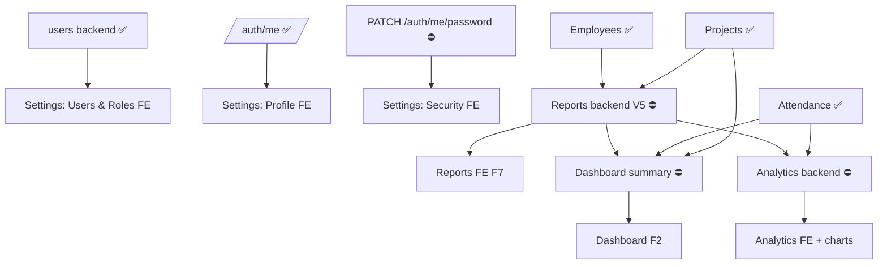

# Remaining Roadmap — CoreOps WMS

**Date:** 2026-05-31 · **Branch:** `feature/v1-authentication` · **Status:** analysis + roadmap, **no code changed.** Covers every remaining sidebar item end-to-end (backend + frontend).

---

# Current State

## 1. Sidebar / navigation inventory (`components/shell/sidebar.tsx`, `top-nav.tsx`)

| Area | Item | Route | Roles shown | State |
|---|---|---|---|---|
| Workspace | **Home** | `/dashboard` | all | ⚠️ **placeholder** (F1 stub — greeting + user/role card; no KPIs) |
| Workspace | **Employees** | `/employees` | all | ✅ complete (F4) |
| Workspace | **Projects** | `/projects` | all | ✅ complete (F5) |
| Workspace | **Attendance** | `/attendance` | all | ✅ complete (F6) |
| Workspace | **Reports** | `/reports` | all | ⛔ disabled (`soon`) |
| Workspace | **Analytics** | `/analytics` | all | ⛔ disabled (`soon`) |
| Manage | **Settings** | `/settings` | admin/manager (`isManagerial`) | ⛔ disabled (`soon`) |
| TopNav | Search (⌘K) | — | all | ⚠️ static placeholder (not wired) |
| TopNav | Notifications bell | — | all | ⚠️ static placeholder (no backend) |
| TopNav | Avatar → **Profile** | — | all | ⛔ disabled (`Profile (soon)`) |
| TopNav | Avatar → **Sign out** | — | all | ✅ works |

## 2. Existing implemented routes

**Frontend** (`app/(app)` + `(auth)`): `login` · `dashboard` (stub) · `employees` `/[id]` `/[id]/edit` `/new` · `projects` (same 4) · `attendance` (same 4). **13 app routes + login.**

**Backend modules** (live, in OpenAPI): `auth` (`/auth/login|logout|me`), `users` (`/users` CRUD + role/password — **admin**), `employees`, `projects` (+ members), `attendance` (+ `/employees/{id}/attendance`). **Migrations 0001–0004.**

---

# Missing Features

## 3. Missing routes (frontend)
- **Reports:** `/reports`, `/reports/new`, `/reports/[id]` (detail + review). *(No frontend, no backend.)*
- **Analytics:** `/analytics`. *(No frontend, no backend.)*
- **Settings:** `/settings` with tabs **Profile · Security · Users & Roles** (Users & Roles backend already live). *(No frontend.)*
- **Dashboard (real):** `/dashboard` exists but is a stub — needs the F2 widgets.
- **Profile:** the avatar-menu "Profile" target (can be `/settings` Profile tab or `/employees/[self]`).
- *(Optional)* global search results for ⌘K; notifications center/drawer.

## 4. Missing backend modules / endpoints
- **`daily_reports` (V5 Reports)** — new module + migration `0005`: report lifecycle (draft→submitted→approved/rejected), review (author≠reviewer), RBAC scoping. **Depends on employees + projects (both done).** *Open decisions:* U-002 (lock rule), U-007 (report counts semantics).
- **Dashboard summary** — `GET /dashboard/summary` (KPIs scoped self/team/org). Small read-only aggregator; meaningful **after Reports exists**.
- **Analytics** — read aggregation endpoints (hours-by-category, on-time, project burn, workload). Depends on Reports + Attendance.
- **Self password change** — `PATCH /auth/me/password` (FD-3) for the Settings → Security tab. *(Currently admin-reset only.)*
- *(Deferred, not sidebar-blocking)* Notifications, Leave.

> **Settings backend is mostly DONE:** the Users & Roles tab runs on the existing live `/users` API. Only the Security tab needs the small self-password endpoint (FD-3).

## 5. Missing frontend modules (`features/…`)
- `features/reports` (types/api/hooks/schemas + list/detail/review/form + status badges) — mirrors employees/projects.
- `features/analytics` (read hooks + chart components — **new chart primitives needed**, not in the current shadcn set).
- `features/settings` (profile read from `/auth/me`; security form; **users & roles** table+forms reusing `/users`).
- Dashboard widgets (KPI tiles + recent + small charts) — reuses `Kpi`/table; charts new.
- *(Optional)* notifications, global search.

## 6. Dependency graph

**Reads:** Settings is independent (users done). Reports is the hub — Dashboard and Analytics both depend on it for meaningful data. Charts are a shared new dependency for Dashboard + Analytics.

---

# Recommended Order

Ordered by **dependency readiness × value × risk**:

1. **Settings (F3)** — *backend ready now.* Profile (read `/auth/me`) + **Users & Roles** (live `/users`) deliver immediate admin value with low risk and full pattern reuse. Security tab gated on the small **FD-3** endpoint (decide: add `PATCH /auth/me/password` or ship admin-reset-only first).
2. **V5 Reports backend → F7 Reports frontend** — the **core product loop** (file → review → approve). Depends only on done modules. Pin **U-002** (lock rule) and **U-007** (counts) before building. Largest single piece.
3. **Dashboard (F2)** — small `/dashboard/summary` aggregator + widgets. Do **after Reports** so KPIs (reports submitted, in-review, hours) are real, not empty.
4. **Analytics** — aggregation endpoints + charts. Most data-dependent; do **last** once Reports + Attendance have data. Introduces shared **chart primitives** (also usable by the dashboard).
5. *(Cross-cutting, parallel track)* finish **production hardening** (C2/C3/H2/H3 from `PRODUCTION_HARDENING_PLAN.md`) and optional **Notifications / global search** — not sidebar-blocking.

**Rationale:** unlocks value fastest (Settings now), then the spine (Reports) that everything analytical needs, then the read-only surfaces (Dashboard, Analytics) that only become meaningful once data exists.

---

# Risk Analysis

| Module | Risk | Drivers | Mitigation |
|---|---|---|---|
| **Settings** | 🟢 Low | Reuses table/form; `/users` proven; guards (last-admin/self) already enforced server-side | Standard phased build; decide FD-3 for Security tab |
| **Reports (V5+F7)** | 🟠 High | Largest scope; **workflow state machine**; review RBAC (author≠reviewer, manager-of-author); **U-002** lock rule + **U-007** counts undecided; edit-window/locking | Resolve U-002/U-007 first; mirror approval pattern; thorough RBAC tests like employees/projects |
| **Dashboard** | 🟡 Medium | Needs a new aggregation endpoint; **new chart primitives**; scope-correct KPIs (self/team/org) | Keep summary a single read endpoint; lightweight SVG charts; ship with skeletons/empty states |
| **Analytics** | 🟠 Medium-High | Heaviest aggregation; chart variety; perf at scale (replica deferred in v1); date-range correctness | v1 = simple aggregates over the primary; cap ranges; reuse chart primitives from Dashboard |
| **FD-3 self-password** | 🟡 Medium | New auth endpoint touches credentials; must re-verify current password | Mirror existing hashing/validation; add focused tests |
| **Charts (shared)** | 🟡 Medium | No chart components in the shadcn set yet; bespoke SVG or a lib decision | Decide lib-vs-SVG once; build a small reusable set |
| **Cross-cutting prod hardening** | 🟠 High (ops) | C2/C3/H2/H3 still open; deploying before these is unsafe | Follow `PRODUCTION_HARDENING_PLAN.md` order on a separate track |

---

# Estimated Effort Per Module

Relative to completed work (Employees/Projects ≈ **L**, Attendance ≈ **L**). Each "phase" ≈ the small-commit units used so far.

| Module | Backend | Frontend | Total | Notes |
|---|---|---|---:|---|
| **Settings** (Profile + Users&Roles + Security) | **S** (only FD-3 self-password; users done) | **M** (3 tabs; reuse table/form) | **M** | Fastest value; Security tab needs FD-3 |
| **Reports** (V5 + F7) | **L** (new module, migration 0005, lifecycle, review) | **L** (list/detail/review/form, 6 phases) | **XL** | Biggest; gated on U-002/U-007 |
| **Dashboard** (F2 + summary) | **S** (one `/dashboard/summary`) | **M** (KPI tiles + recent + mini charts) | **M** | Do after Reports |
| **Analytics** (backend + FE) | **M** (aggregation endpoints) | **L** (charts/heatmap/burn) | **L** | Most data-dependent; needs charts |
| **Chart primitives** (shared, one-time) | — | **S–M** | **S–M** | Enables Dashboard + Analytics |
| **FD-3 self password** | **S** | **S** (Security form) | **S** | Folds into Settings |
| *(Optional)* Notifications | M | M | M | Deferred; not sidebar-blocking |
| *(Optional)* Global search (⌘K) | S–M | M | M | Deferred |

**Legend:** S ≈ ~1–2 small commits · M ≈ a backend module *or* ~3–4 FE phases · L ≈ a full backend module *or* ~6 FE phases · XL ≈ both.

**Critical path to "every sidebar item live":** Settings (M) → Reports backend+frontend (XL) → Dashboard (M) → Analytics (L) [+ shared charts S–M, + FD-3 S]. Production hardening runs as a **parallel track** and must precede any real deployment.

---

_Planning only — no code changed. Related: [`roadmap.md`](./roadmap.md) · [`V3_PROJECTS_PLAN.md`](./V3_PROJECTS_PLAN.md) · [`SETTINGS_SCREEN_SPEC.md`](./SETTINGS_SCREEN_SPEC.md) · [`REPORTS_SCREEN_SPEC.md`](./REPORTS_SCREEN_SPEC.md) · [`DASHBOARD_SCREEN_SPEC.md`](./DASHBOARD_SCREEN_SPEC.md) · [`decisions.md`](./decisions.md) (U-002, U-007, FD-3) · [`PRODUCTION_HARDENING_PLAN.md`](./PRODUCTION_HARDENING_PLAN.md)._
