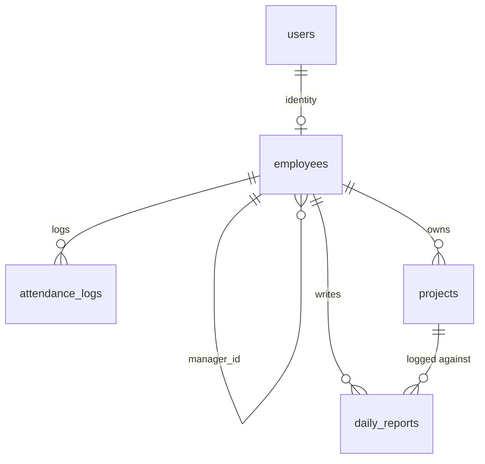

# v1 Architecture Package (FROZEN for build)

> **Status:** Final pre-build architecture package for **Workforce Management System v1**. **No implementation code.** Brand-agnostic (codename **CoreOps**; product name = one config token, D-001).
>
> **Scope lock:** internal, **single-company, single-tenant**. Excluded from v1: multi-tenant, AI, biometric, WhatsApp/SMS, event bus, microservices, Kubernetes, recruitment, SSO.
>
> **Stack:** FastAPI · PostgreSQL · Redis · Celery · Next.js · **Docker Compose**.
>
> **Ports (must never conflict with SPIR):** Frontend **3100** · Backend **8100** · PostgreSQL **5433** · Redis **6381**.

This package contains items 1–10 requested. The OpenAPI contract (item 4) is a separate artifact: [`api/openapi-v1.yaml`](./api/openapi-v1.yaml).

---

## 1. Documentation review (done)

All 18 docs reviewed. v1 is a **strict, forward-compatible subset** of the documented architecture; the rich models in `DOMAIN_MODEL.md` / `databasedesign.md` remain the north star. v1 implements the contexts **Identity (partial), Employees, Projects, Attendance, Work Reporting**, plus a minimal **Dashboard**. Validation in `V1_IMPLEMENTATION_PLAN.md` §1 stands. This package **supersedes** `V1_IMPLEMENTATION_PLAN.md` where they differ (notably **Redis 6381**, Docker-Compose-first deployment).

---

## 2. Open decisions — resolved for v1

Frozen answers (also recorded in `decisions.md` §D). "Deferred" = designed already, not built in v1.

| ID | Topic | v1 resolution |
|---|---|---|
| U-001 | Stack / API style | **FastAPI + REST/JSON** under `/api/v1`. Confirmed. |
| U-002 | Report lock rule | **Editable while `status ∈ {draft, submitted}` and not yet reviewed; hard cutoff at end of `report_date` (server local day).** No nightly locker worker in v1. |
| U-004 | Permission model | **Single `role` enum** (`admin`,`manager`,`employee`,`viewer`) + **manager scoping via `employees.manager_id`**. No `roles/permissions/user_roles` tables. |
| U-005 | Design tokens | **Re-author a minimal `tokens.css`** from the documented values (`frontenddesign.md` §1). Non-blocking. |
| U-007 | Report counts | **Generic fields only**: `hours`, `tasks_done`, `tasks_open`, `remarks`. Domain counts (BOM/Spares/Tags) deferred. |
| U-009 | Infra | **Docker Compose** on the VPS (services: db, redis, backend, worker, frontend). Email/object-storage **deferred**. |
| U-010 | Tenancy | **Single-tenant. No `tenant_id`.** |
| U-011 | Search | **Simple `ILIKE` filters** on list endpoints. No search engine. |
| U-012 | NFR target | **Internal scale**: ≤ ~1,000 employees, modest concurrency. Single DB, no replica, no partitioning. |
| U-006, U-013–U-018 | Mobile, Recruitment, Biometric, WhatsApp/SMS, Directory/SSO, Event bus, AI | **All deferred** (excluded from v1). |
| Auth scope | — | **Local email+password, JWT bearer.** No SSO/MFA/password-reset-email in v1; **admin sets/resets passwords**. Logout via **Redis JWT denylist**. |
| Audit | — | **No `audit_logs` table.** Keep `created_by`/`updated_by` + timestamps only. |

---

## 3. Final database schema (v1)

**Engine:** PostgreSQL (host **:5433**), one database `wms`, schema `public`. **Conventions** (forward-compatible with the full schema): UUID PKs (`gen_random_uuid()` via `pgcrypto`), `timestamptz` audit columns, soft-delete `deleted_at`, `numeric` for hours, `citext` emails. **5 tables** + enums.

> This is the **authoritative schema spec** for v1. Actual Alembic migration files are produced in the build phase (not here).

### Extensions & enums
```sql
CREATE EXTENSION IF NOT EXISTS "pgcrypto";
CREATE EXTENSION IF NOT EXISTS "citext";

CREATE TYPE user_role        AS ENUM ('admin','manager','employee','viewer');
CREATE TYPE employee_status  AS ENUM ('active','on_leave','exited');
CREATE TYPE attendance_status AS ENUM ('present','wfh','leave','holiday','weekend','absent');
CREATE TYPE attendance_source AS ENUM ('web','manual','system');
CREATE TYPE project_status    AS ENUM ('active','on_hold','completed','archived');
CREATE TYPE report_status     AS ENUM ('draft','submitted','approved','rejected');
```

### users
```sql
CREATE TABLE users (
  id              uuid PRIMARY KEY DEFAULT gen_random_uuid(),
  email           citext NOT NULL,
  password_hash   text   NOT NULL,
  role            user_role NOT NULL DEFAULT 'employee',
  is_active       boolean NOT NULL DEFAULT true,
  last_login_at   timestamptz,
  created_at      timestamptz NOT NULL DEFAULT now(),
  updated_at      timestamptz NOT NULL DEFAULT now(),
  deleted_at      timestamptz,
  CONSTRAINT users_email_format CHECK (email ~* '^[^@\s]+@[^@\s]+\.[^@\s]+$')
);
CREATE UNIQUE INDEX users_email_uq ON users (email) WHERE deleted_at IS NULL;
```

### employees
```sql
CREATE TABLE employees (
  id              uuid PRIMARY KEY DEFAULT gen_random_uuid(),
  user_id         uuid REFERENCES users(id) ON DELETE SET NULL,
  employee_code   text NOT NULL,
  first_name      text NOT NULL,
  last_name       text NOT NULL,
  work_email      citext,
  phone           text,
  department      text,
  designation     text,
  manager_id      uuid REFERENCES employees(id) ON DELETE RESTRICT,
  date_of_joining date,
  status          employee_status NOT NULL DEFAULT 'active',
  created_by      uuid, updated_by uuid,
  created_at      timestamptz NOT NULL DEFAULT now(),
  updated_at      timestamptz NOT NULL DEFAULT now(),
  deleted_at      timestamptz,
  CONSTRAINT employees_no_self_manager CHECK (manager_id IS NULL OR manager_id <> id)
);
CREATE UNIQUE INDEX employees_code_uq    ON employees (employee_code) WHERE deleted_at IS NULL;
CREATE UNIQUE INDEX employees_user_id_uq ON employees (user_id) WHERE user_id IS NOT NULL AND deleted_at IS NULL;
CREATE INDEX employees_manager_idx ON employees (manager_id) WHERE deleted_at IS NULL;
```

### attendance_logs
```sql
CREATE TABLE attendance_logs (
  id              uuid PRIMARY KEY DEFAULT gen_random_uuid(),
  employee_id     uuid NOT NULL REFERENCES employees(id) ON DELETE RESTRICT,
  log_date        date NOT NULL,
  check_in_at     timestamptz,
  check_out_at    timestamptz,
  status          attendance_status NOT NULL DEFAULT 'present',
  source          attendance_source NOT NULL DEFAULT 'web',
  total_minutes   integer NOT NULL DEFAULT 0,
  note            text,
  created_by      uuid, updated_by uuid,
  created_at      timestamptz NOT NULL DEFAULT now(),
  updated_at      timestamptz NOT NULL DEFAULT now(),
  CONSTRAINT attendance_minutes_nonneg CHECK (total_minutes >= 0),
  CONSTRAINT attendance_out_after_in   CHECK (check_out_at IS NULL OR check_in_at IS NULL OR check_out_at >= check_in_at)
);
CREATE UNIQUE INDEX attendance_emp_date_uq ON attendance_logs (employee_id, log_date);
CREATE INDEX attendance_date_idx ON attendance_logs (log_date, status);
```

### projects
```sql
CREATE TABLE projects (
  id                uuid PRIMARY KEY DEFAULT gen_random_uuid(),
  code              text NOT NULL,
  name              text NOT NULL,
  description       text,
  status            project_status NOT NULL DEFAULT 'active',
  owner_employee_id uuid REFERENCES employees(id) ON DELETE SET NULL,
  start_date        date,
  end_date          date,
  allocated_hours   numeric(10,2),
  color             text,
  created_by        uuid, updated_by uuid,
  created_at        timestamptz NOT NULL DEFAULT now(),
  updated_at        timestamptz NOT NULL DEFAULT now(),
  deleted_at        timestamptz,
  CONSTRAINT projects_dates CHECK (end_date IS NULL OR start_date IS NULL OR end_date >= start_date)
);
CREATE UNIQUE INDEX projects_code_uq  ON projects (code) WHERE deleted_at IS NULL;
CREATE INDEX projects_status_idx      ON projects (status) WHERE deleted_at IS NULL;
```

### daily_reports
```sql
CREATE TABLE daily_reports (
  id            uuid PRIMARY KEY DEFAULT gen_random_uuid(),
  employee_id   uuid NOT NULL REFERENCES employees(id) ON DELETE RESTRICT,
  report_date   date NOT NULL,
  project_id    uuid REFERENCES projects(id) ON DELETE RESTRICT,
  hours         numeric(5,2) NOT NULL DEFAULT 0,
  tasks_done    integer NOT NULL DEFAULT 0,
  tasks_open    integer NOT NULL DEFAULT 0,
  remarks       text,
  status        report_status NOT NULL DEFAULT 'draft',
  reviewed_by   uuid REFERENCES employees(id) ON DELETE SET NULL,
  reviewed_at   timestamptz,
  review_note   text,
  created_by    uuid, updated_by uuid,
  created_at    timestamptz NOT NULL DEFAULT now(),
  updated_at    timestamptz NOT NULL DEFAULT now(),
  deleted_at    timestamptz,
  CONSTRAINT dr_hours_nonneg  CHECK (hours >= 0 AND hours <= 24),
  CONSTRAINT dr_counts_nonneg CHECK (tasks_done >= 0 AND tasks_open >= 0),
  CONSTRAINT dr_review_consistency CHECK (
    (reviewed_at IS NULL AND reviewed_by IS NULL) OR (reviewed_at IS NOT NULL AND reviewed_by IS NOT NULL))
);
CREATE UNIQUE INDEX dr_emp_date_uq ON daily_reports (employee_id, report_date) WHERE deleted_at IS NULL;
CREATE INDEX dr_status_idx ON daily_reports (status, report_date) WHERE deleted_at IS NULL;
CREATE INDEX dr_reviewer_idx ON daily_reports (reviewed_by, status) WHERE deleted_at IS NULL;
```

### ERD


---

## 4. OpenAPI contract

Produced as a standalone artifact: **[`docs/api/openapi-v1.yaml`](./api/openapi-v1.yaml)** (OpenAPI 3.1, bearer-JWT, all v1 endpoints + schemas + the uniform error envelope). FastAPI will additionally serve a live spec at `/api/v1/openapi.json` once built; the YAML is the **design-time contract of record**.

---

## 5. Frontend route map (Next.js App Router)

| Route | Group | Auth | Roles (view) | Screen |
|---|---|---|---|---|
| `/login` | `(auth)` | public | all | Email/password sign-in |
| `/dashboard` | `(app)` | required | all | KPIs (today, this week, pending reviews) |
| `/employees` | `(app)` | required | admin, manager(team), viewer(R) | Directory + detail/edit (admin) |
| `/employees/[id]` | `(app)` | required | admin, manager(team) | Employee profile |
| `/attendance` | `(app)` | required | all (self); manager/admin (team/all) | Calendar + history + check-in/out |
| `/projects` | `(app)` | required | all (R); admin (CRUD) | Project list |
| `/projects/[id]` | `(app)` | required | all (R) | Project detail |
| `/reports` | `(app)` | required | self; manager/admin (team/all) | Report list + filters |
| `/reports/new` | `(app)` | required | employee+ | New daily report |
| `/reports/[id]` | `(app)` | required | owner; manager/admin (review) | Report detail / review |

- `(app)/layout.tsx` enforces the **auth guard** (redirect to `/login` if no valid token) and renders the role-gated **AppShell** sidebar.
- Navigation items shown by role: Manager adds *Team* views; Admin adds *Employees/Projects* management. Viewer is read-only.
- Client talks to `NEXT_PUBLIC_API_BASE_URL` (`http://…:8100/api/v1`), attaching the JWT.

---

## 6. Backend module map (FastAPI)

```
app/
├── main.py            # create_app(): CORS, exception handlers, include routers, /health
├── core/
│   ├── config.py      # Settings (env): DB url, redis url, secret, ports, cors
│   ├── database.py    # engine/session (Postgres :5433)
│   ├── security.py    # bcrypt/argon2 hashing, JWT encode/decode, denylist check
│   ├── deps.py        # get_db, get_current_user, require_role(*roles), scope helpers
│   └── celery_app.py  # Celery(broker=redis :6381) — present, minimal use in v1
├── shared/
│   ├── base.py        # UUID + timestamps + soft-delete mixin
│   ├── pagination.py  # limit/offset + envelope
│   └── errors.py      # AppError + uniform JSON error handler
└── modules/
    ├── auth/          # router: /auth/login,/logout,/me   service: authenticate, issue/revoke JWT
    ├── users/         # router: /users*                    service: create/list/update, set role/password (admin)
    ├── employees/     # router: /employees*                service: CRUD, team(manager_id)
    ├── projects/      # router: /projects*                 service: CRUD
    ├── attendance/    # router: /attendance*               service: check-in/out, month/history
    ├── daily_reports/ # router: /reports*                  service: submit/edit/review, scope filters
    └── dashboard/     # router: /dashboard/summary          service: aggregates
```

**Conventions:** routers thin → call `service.py`; pydantic `schemas.py` for I/O; SQLAlchemy `models.py`; deny-by-default authz via `deps.require_role`; all writes set `created_by/updated_by`. Module imports flow **downward only** (see §dependency order in `V1_IMPLEMENTATION_PLAN.md` §12).

---

## 7. API permission matrix (v1)

Legend: **✓** full · **S** scoped (manager→own team via `manager_id`; employee→self) · **R** read-only · **—** denied.

| Endpoint (method) | admin | manager | employee | viewer |
|---|:--:|:--:|:--:|:--:|
| `POST /auth/login`, `/logout`, `GET /auth/me` | ✓ | ✓ | ✓ | ✓ |
| `GET /users` | ✓ | — | — | — |
| `POST /users`, `PATCH /users/{id}`, `/role`, `/password` | ✓ | — | — | — |
| `GET /employees` | ✓ | S (team) | self | R |
| `POST /employees`, `PATCH /employees/{id}` | ✓ | — | self(profile fields) | — |
| `GET /employees/{id}` | ✓ | S | self | R |
| `GET /employees/{id}/team` | ✓ | S(own) | — | — |
| `GET /projects`, `/projects/{id}` | ✓ | R | R | R |
| `POST /projects`, `PATCH /projects/{id}` | ✓ | — | — | — |
| `POST /attendance/check-in`, `/check-out` | self | self | self | — |
| `GET /attendance` (any employee/month) | ✓ | S(team) | self | R(team) |
| `GET /attendance/me` | ✓ | ✓ | ✓ | — |
| `GET /reports` | ✓ all | S team | self | R(team) |
| `POST /reports`, `PATCH /reports/{id}`, `/submit` | self | self | self | — |
| `POST /reports/{id}/review` | ✓ | S(team) | — | — |
| `GET /dashboard/summary` | ✓ org | S team | self | R |
| `GET /health` | ✓ | ✓ | ✓ | ✓ |

**Invariants:** deny-by-default; **author ≠ reviewer** for `/reports/{id}/review`; employee mutations are implicitly `self`; viewer touches no mutating endpoint; manager scope is strictly `employees.manager_id = current_employee.id`.

---

## 8. Git repository structure

Single repo (`coreops`), monorepo of backend + frontend + docs.

```
coreops/
├── .gitignore                 # (contents below)
├── README.md
├── docker-compose.yml         # local dev stack (§9)
├── docker-compose.prod.yml    # production overrides (VPS)
├── .env.example               # root compose env (ports, names) — committed
├── docs/                      # SSOT (this package, etc.)
├── design-assets/             # read-only source
├── backend/                   # FastAPI (own .env.example, Dockerfile)
├── frontend/                  # Next.js (own .env.local.example, Dockerfile)
├── database/
│   ├── schema-v1.sql          # this schema (reference)
│   └── seeds/seed_admin.py    # idempotent first-admin seed (build phase)
└── scripts/                   # backup, deploy helpers
```

**Branching:** `main` protected + always deployable; short-lived `feature/<module>` branches; PR + green CI; **squash merge**; Conventional Commits; tag `v1.0.0`.

**`.gitignore` (root):**
```gitignore
# Python
__pycache__/
*.py[cod]
.venv/
.pytest_cache/
.coverage
# Node / Next
node_modules/
.next/
out/
# Env & secrets — commit only *.example
.env
.env.*
!.env.example
!*.env.example
!.env.local.example
*.key
*.pem
secrets/
# Docker / data
**/pgdata/
**/redisdata/
# OS / editor
.DS_Store
.idea/
.vscode/
```

**Secrets policy:** real `.env` files never committed; `*.example` only; production secrets live on the VPS (`/etc/wms/*.env`, mode 600) and are referenced by compose `env_file`, never in git.

---

## 9. Docker architecture (Docker Compose)

**Project name `wms`** (isolates networks/volumes from SPIR). Host ports per spec; container-internal ports are defaults.

```
                    ┌─────────────── wms_net (bridge) ───────────────┐
 host:3100  ──────► │ frontend (next)  ──http──► backend:8000        │
 host:8100  ──────► │ backend (uvicorn) ──► db:5432 / redis:6379     │
 host:5433  ──────► │ db (postgres)  vol: pgdata                     │
 host:6381  ──────► │ redis          vol: redisdata                  │
                    │ worker (celery) ──► redis, db  (minimal in v1) │
                    └────────────────────────────────────────────────┘
```

**Services & host→container port mapping:**

| Service | Image base | Host port | Container port | Notes |
|---|---|---|---|---|
| `db` | postgres:16 | **5433** | 5432 | volume `pgdata`; db `wms`, role `wms` |
| `redis` | redis:7 | **6381** | 6379 | volume `redisdata`; Celery broker (DB 1) + JWT denylist (DB 0) |
| `backend` | python (FastAPI) | **8100** | 8000 | `depends_on: db, redis`; runs migrations on start (entrypoint) |
| `worker` | same as backend | — | — | `celery -A app.core.celery_app worker`; minimal in v1 |
| `frontend` | node (Next.js) | **3100** | 3000 | `NEXT_PUBLIC_API_BASE_URL` → backend |

**Isolation from SPIR:** distinct compose project (`-p wms`), distinct network `wms_net`, distinct named volumes (`wms_pgdata`, `wms_redisdata`), distinct host ports (3100/8100/5433/6381). SPIR's containers/ports/volumes are untouched.

**Local vs prod:** `docker-compose.yml` (dev: bind-mounts, hot reload, `.env`) + `docker-compose.prod.yml` (prod: built images, `env_file: /etc/wms/*.env`, restart policies, no source mounts). **Production reverse proxy:** a **new nginx server block** (host) for a new subdomain (placeholder `wms.cdccmms.com`, TBD) → `/`→:3100, `/api`→:8100, TLS via existing certbot. SPIR's nginx config is not modified.

---

## 10. Migration plan

- **Tool:** **Alembic** (own history in `backend/alembic/`), pointed at the **v1 DB on :5433** via `DATABASE_URL`. Completely separate from SPIR.
- **Baseline (rev 0001):** create extensions + 6 enums + 5 tables + all indexes/constraints exactly as §3.
- **Workflow:** model change → `alembic revision --autogenerate` → **human review of generated SQL** → `alembic upgrade head`. Forward-only; reversible where safe.
- **Execution in Docker:** backend container entrypoint runs `alembic upgrade head` before launching uvicorn (idempotent); never runs against SPIR's DB.
- **Seeding:** separate idempotent `database/seeds/seed_admin.py` (first admin user) run manually post-migrate — **not** part of migrations.
- **Safety:** distinct DB name/role; no autogenerate against any non-`wms` database; backups (`pg_dump wms`) before each prod migration.
- **No** partitioning / RLS / `tenant_id` in v1 (documented upgrade paths in `databasedesign.md` / `TENANCY_STRATEGY.md`).

---

## Approval gate
This package is **frozen** pending your approval. On approval, the build begins at **V0 Foundations** (`V1_IMPLEMENTATION_PLAN.md` §13) — scaffold + the first safe, non-code commit (`.gitignore`, `.env.example` files, `docker-compose.yml`), then module-by-module per the dependency order. **No code until approved.**

_Related: [`V1_IMPLEMENTATION_PLAN.md`](./V1_IMPLEMENTATION_PLAN.md) · [`api/openapi-v1.yaml`](./api/openapi-v1.yaml) · [`databasedesign.md`](./databasedesign.md) · [`USER_ROLES_AND_PERMISSIONS.md`](./USER_ROLES_AND_PERMISSIONS.md) · [`decisions.md`](./decisions.md)._
