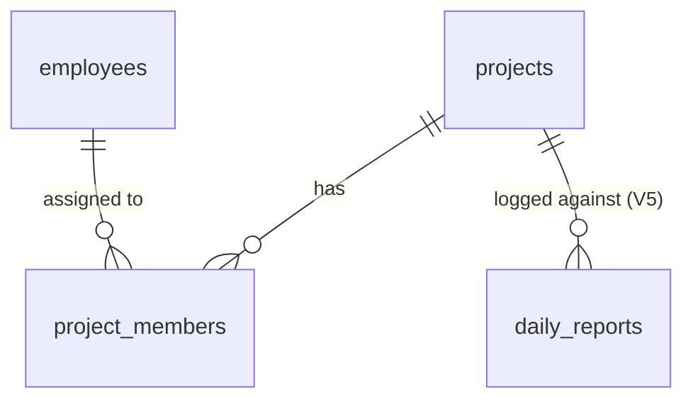

# V3 — Projects Backend: Architecture & Implementation Plan

> **Plan only — no code.** Designs the **Projects** domain as the next core module after Employees. Reuses the exact patterns from Users (V1) and Employees (V2): FastAPI modular monolith, SQLAlchemy ORM, thin router → service layer, uniform error envelope, JWT/RBAC, incremental Alembic, contract-typed frontend.
>
> **Scope discipline (minimum for WMS v1):** no task management, no milestones, no Gantt, no file uploads, no document storage, no burn/utilization analytics. Just: a project record, its lifecycle status, and **assigned employees** (membership). Projects **depend on Employees**.

---

## 1. Domain model

**Bounded context: Project Management.** Aggregate root **Project**; child entity **ProjectMember** (an employee's assignment to a project). A project groups people and carries status + dates; it is the thing daily reports (V5) will later be logged against.

| Concept | Meaning |
|---|---|
| **Project** | A unit of work with a unique code, name, optional client, status, and date window. |
| **ProjectMember** | An assignment linking an **Employee** to a **Project** with a role (`lead` / `member`). |
| **Lead** | The member with `role = lead` (replaces a separate `owner` column — single source of truth for "who runs it"). |

Domain events (conceptual, not implemented in v1): `ProjectCreated`, `ProjectStatusChanged`, `ProjectArchived`, `EmployeeAssigned`, `EmployeeUnassigned`. (No event bus in v1 — listed for continuity with `EVENT_ARCHITECTURE.md`.)

---

## 2. Database schema

PostgreSQL (`wms`, `public` schema). Same conventions as employees: UUID PKs (`gen_random_uuid()`), `timestamptz` audit columns, soft-delete `deleted_at`, partial-unique on natural keys, `created_by/updated_by`. **Two new enums + two tables.**

```
project_status:        planning | active | on_hold | completed | archived
project_member_role:   lead | member
```

### projects
| Column | Type | Notes |
|---|---|---|
| id | uuid PK | gen_random_uuid() |
| code | text | **Code**; partial-unique (alive) |
| name | text NOT NULL | **Name** |
| client | text NULL | **Client** (free text; no clients catalog in v1) |
| description | text NULL | **Description** |
| status | project_status NOT NULL default `planning` | **Status** |
| start_date | date NULL | **Start Date** |
| end_date | date NULL | **End Date** |
| created_by / updated_by | uuid NULL | audit actor |
| created_at / updated_at / deleted_at | timestamptz | timestamps + soft-delete |

CHECK `projects_dates`: `end_date IS NULL OR start_date IS NULL OR end_date >= start_date`.
_Deferred (not in v1): `allocated_hours`, `color`, `at_risk` status — these belong with Reports/Analytics (burn) and are premature now._

### project_members
| Column | Type | Notes |
|---|---|---|
| id | uuid PK | |
| project_id | uuid → projects.id **ON DELETE CASCADE** | child of project |
| employee_id | uuid → employees.id **ON DELETE RESTRICT** | **Assigned Employee** |
| role | project_member_role NOT NULL default `member` | lead / member |
| created_by | uuid NULL | who assigned |
| created_at / updated_at | timestamptz | |

**Unassign = hard-delete the row** (a join row, not a domain entity) — simplest, no stint history in v1. _(Open-stint history with `left_at` is a documented future enhancement, mirroring `INTEGRATIONS`/design-asset schema, if assignment history is later required.)_

---

## 3. Tables & relationships



- **projects 1—N project_members** (CASCADE: deleting/hard-removing a project removes its membership rows; but projects are **archived/soft-deleted**, not hard-deleted).
- **employees 1—N project_members** (RESTRICT: an employee referenced by a membership can't be hard-deleted; employees are soft-deleted anyway).
- **projects ← daily_reports** (V5): `daily_reports.project_id` → `projects.id` **RESTRICT** — a project with reports cannot be deleted, only archived. This is the main reason projects use **soft-delete/archive**.

---

## 4. Project membership model

- **Assignment** = one `project_members` row per `(project, employee)`.
- **Uniqueness:** partial-unique index on `(project_id, employee_id)` `WHERE deleted_at IS NULL` — but since membership has no soft-delete in v1, a plain **UNIQUE(project_id, employee_id)** suffices (one active assignment per employee per project). Re-assigning a removed member just inserts a new row.
- **Role:** `lead` or `member`. **At most one `lead` per project** enforced in the service layer (assigning a new lead demotes the prior lead, or rejects — see §9). _(A partial-unique index `(project_id) WHERE role='lead'` is the DB-level option; service-level enforcement chosen to keep UX flexible.)_
- **Indexes:** `(project_id)`, `(employee_id)` for "members of a project" and "projects of an employee".
- **Display:** project "lead" = the `lead` member; "members" = the rest.

---

## 5. RBAC matrix

Reuses the Employees scoping approach (role gate on writes + row-scoping on reads; `_current_employee(user)` helper). v1 keeps **writes admin-only** (consistent with `V1_ARCHITECTURE_PACKAGE` §7 `project.manage = admin`); reads are scoped.

| Action | admin | manager | employee | viewer |
|---|:--:|:--:|:--:|:--:|
| List projects | ✓ all | ✓ all | scoped: projects they're a member of | ✓ all (read) |
| Get project | ✓ | ✓ | member-only | ✓ |
| Create project | ✓ | — | — | — |
| Update project | ✓ | — | — | — |
| Archive (delete) project | ✓ | — | — | — |
| List members | ✓ | ✓ | member-only | ✓ |
| Assign / unassign member | ✓ | — | — | — |
| Change member role | ✓ | — | — | — |

**Notes:** manager read is **all projects** in v1 (simpler; no project-ownership writes yet). Employee read is **scoped to projects they're assigned to** (via `project_members.employee_id = own employee id`). Server enforces; the frontend mirrors with `can(role,"project.manage")` (already in `rbac.ts` → admin). _Future:_ "manager manages projects they lead" is a documented enhancement (gate writes on `role=lead` membership).

---

## 6. API endpoints

Base `/api/v1`. Mirrors the employees router shape exactly.

| Method | Path | Access | Purpose |
|---|---|---|---|
| GET | `/projects` | any auth (scoped) | list + search/filter/pagination |
| POST | `/projects` | admin | create |
| GET | `/projects/{id}` | any auth (scoped) | read one |
| PATCH | `/projects/{id}` | admin | update |
| DELETE | `/projects/{id}` | admin | archive (soft-delete + status `archived`) |
| GET | `/projects/{id}/members` | any auth (scoped) | list assigned employees (+ role) |
| POST | `/projects/{id}/members` | admin | assign employee (body: `employee_id`, `role`) |
| PATCH | `/projects/{id}/members/{employee_id}` | admin | change member role |
| DELETE | `/projects/{id}/members/{employee_id}` | admin | unassign |

_(Optional, deferred: `GET /employees/{id}/projects` — "projects this employee is on". Not needed for F5; add if a profile tab wants it.)_

---

## 7. OpenAPI contract

FastAPI auto-generates the spec (as for employees); the **design-time contract** is:

**Component schemas**
- `ProjectStatus`: enum `planning|active|on_hold|completed|archived`
- `ProjectMemberRole`: enum `lead|member`
- `ProjectOut`: `id, code, name, client?, description?, status, start_date?, end_date?, member_count, lead?, created_at` *(member_count + lead are convenience read-fields derived in the service; or omit and let the frontend read /members)*
- `ProjectCreate`: `code*, name*, client?, description?, status?(default planning), start_date?, end_date?`
- `ProjectUpdate`: `name?, client?, description?, status?, start_date?, end_date?` *(excludes `code` — immutable, like employees `employee_code`)*
- `ProjectPage`: `{ items: ProjectOut[], total, limit, offset }`
- `ProjectMemberOut`: `id, project_id, employee_id, employee_name, role, created_at`
- `ProjectMemberCreate`: `employee_id*, role?(default member)`
- `ProjectMemberRoleUpdate`: `role*`

**Operations** as in §6, all returning the uniform error envelope `{error:{code,message,details,request_id}}` on 4xx/5xx (401/403/404/409/422). The committed contract snapshot (`frontend/openapi.json`) is regenerated after build, and the frontend types come from `openapi-typescript` (same as F4 — **no hand-inferred types**).

---

## 8. Pagination / search / filter strategy

Identical to employees:
- **Pagination:** `limit` (1–100, default 20) + `offset`; response `{items,total,limit,offset}`.
- **Search `q`:** ILIKE over `code`, `name`, `client`.
- **Filters:** `status` (enum); optional `employee_id` (projects an employee is assigned to, via join). Default list hides `archived` unless `status=archived` requested.
- **Ordering:** `created_at DESC` (stable, recent-first), same as employees.
- URL-driven on the frontend (`?q=&status=&offset=`).

---

## 9. Validation rules

- `code` required, **unique among alive projects** (409 on dup) — partial-unique index + service check (mirrors employee_code).
- `name` required (min length 1).
- `end_date >= start_date` when both present (DB CHECK + 422).
- `status` ∈ enum; `code` immutable on update.
- **Archive (DELETE):** sets `deleted_at` + `status=archived`; if (V5) the project has daily reports, the FK is RESTRICT so hard-delete is impossible — archive is the only removal.
- **Membership:**
  - `employee_id` must reference an **existing, active, non-deleted** employee (422 if not).
  - **No duplicate assignment** for `(project, employee)` (409).
  - Cannot assign to an `archived` project (422) — keep membership meaningful.
  - **At most one `lead`:** assigning/PATCHing a member to `lead` demotes the current lead to `member` in the same transaction (service-enforced; documented behavior). Unassigning the lead is allowed (project may temporarily have no lead).
- All decision/uniqueness errors surface via the uniform envelope (`conflict`/`validation_error`).

---

## 10. Service-layer architecture

New module `backend/app/modules/projects/` mirroring `employees/`:

```
projects/
├── __init__.py
├── models.py     # Project, ProjectMember, ProjectStatus, ProjectMemberRole
├── schemas.py    # ProjectOut/Create/Update/Page, ProjectMemberOut/Create/RoleUpdate
├── service.py    # RBAC-scoped reads + admin writes + membership ops
└── router.py     # thin endpoints → service
```

- `router.py` is thin; all logic in `service.py` (same as users/employees).
- **Cross-module reuse:** projects service imports `Employee`/`employees.service._current_employee`-style helper for scoping and membership validation. To avoid duplication, promote `_current_employee(db, user)` into a tiny shared helper (e.g. `app/modules/employees/service.py` already has it; expose it, or add `app/shared/identity.py`). **No new patterns** — same `select`/`func.count`/`AppError` style.
- Service functions: `list_projects(actor, filters)`, `get_project(actor, id)`, `create_project`, `update_project`, `archive_project`, `list_members(actor, project_id)`, `add_member(project_id, body)`, `update_member_role(...)`, `remove_member(...)`.
- Writes set `created_by/updated_by`; reads prefer alive rows; pagination via `func.count` over the filtered subquery (same as employees).
- Register router in `app/main.py` after employees.

---

## 11. Alembic migration strategy

- **Incremental**, same as 0001/0002: **`0003_projects`**, `down_revision = "0002_employees"`.
- Creates: `project_status` enum, `project_member_role` enum, `projects` table (+ partial-unique `code`, status index, dates CHECK), `project_members` table (+ UNIQUE `(project_id, employee_id)`, FKs, indexes).
- **Reversible** (`downgrade` drops tables + enums) — verified up→down→up like 0002.
- `alembic/env.py` imports `app.modules.projects.models` for autogenerate parity.
- Applied automatically by the backend container entrypoint (`alembic upgrade head`); tests run it against `wms_test`.

---

## 12. Test strategy

Mirror `tests/test_employees.py` (full suite already green at 43). New `tests/test_projects.py`:
- **CRUD:** create + get; duplicate code 409; missing name 422; `end_date < start_date` 422; update (status/client/dates); code immutable; archive removes from default list + 404 after; unknown 404.
- **List:** pagination (total vs page), search by name/code/client, filter by status, archived hidden by default.
- **Membership:** assign member (201); duplicate assignment 409; assign unknown/inactive employee 422; assign to archived project 422; list members; change role to `lead` demotes prior lead; remove member (204); members list reflects changes.
- **RBAC:** viewer read-but-not-create (403); employee sees only projects they're a member of; employee can't view non-member project (403); manager reads all; manager/non-admin can't create/assign (403).
- **conftest additions:** `make_project`, `make_project_member` fixtures; extend the per-test `TRUNCATE` to include `project_members, projects` (CASCADE order). Reuse existing `make_user`, `make_employee`, `login`, `auth_header`.
- Run in the `python:3.12` container: `docker compose run --rm --no-deps --entrypoint pytest backend -q` — expect the suite to grow green; plus a live smoke (login → create project → assign employee → list).

---

## 13. Frontend implications (F5, later — not now)

Reuses **everything** built for F4 — no new primitives expected:
- **Types:** regenerate `src/types/openapi.ts` from the live contract (the `gen:api` script already exists); derive `Project`, `ProjectMember`, etc. from `components["schemas"]`.
- **Feature module** `features/projects/{types,keys,schemas,api,hooks,components}` mirroring `features/employees`.
- **Reused components:** `ui/{table,badge,select,alert-dialog,card,form,input}`, `data/{pagination,search-input}`, `feedback/{empty-state,error-state,table-skeleton}`, `auth/require-capability`, `StatusBadge` pattern.
- **Pages:** `/projects` (list — table or cards), `/projects/[id]` (detail + **members/assignment UI**), `/projects/new`, `/projects/[id]/edit`. Assignment UI = the same Select-of-employees pattern used for the employee manager/user-link selects (`useEmployees` for the picker).
- **RBAC:** admin-gated create/edit/archive/assign via `can(role,"project.manage")`; enable the `Projects` sidebar item (currently `soon`).
- **Status badge** mapping: planning→neutral, active→success, on_hold→warning, completed→info, archived→neutral.

## 14. Future Attendance integration

- **v1 keeps Projects and Attendance decoupled.** `attendance_logs` (V4) has **no `project_id`** — attendance is per employee/day, not per project. No schema coupling now.
- **Future (optional):** if per-project time allocation is ever needed, it flows through **Reports** (a daily report logs hours against a project), not through raw attendance. A direct project↔attendance link would only be added if the business needs project-level presence — explicitly out of scope.

## 15. Future Reports integration

- **This is the real linkage.** When **V5 Reports** lands, `daily_reports.project_id` → `projects.id` (**RESTRICT**): each daily report logs work (hours/tasks) against a project.
- **Consequences already designed for here:**
  - Projects use **archive (soft-delete)**, never hard-delete, because reports will reference them (RESTRICT).
  - The deferred `allocated_hours` (+ burn-down, on-time, project KPIs from the `ProjectDetail` design) become meaningful **only once reports exist** — adding them in V5/Analytics, not now (avoids premature complexity).
  - Project detail will later gain a "recent reports against this project" section (per the design-asset `ProjectDetail` spec) — a read join `daily_reports WHERE project_id = …`.

---

## Decisions / non-goals (explicit)
- **No** task management, milestones, Gantt, file uploads, document storage, burn/utilization, `at_risk` automation — all premature for v1.
- **Lead via membership role**, not a separate `owner` column (one source of truth).
- **Writes admin-only** in v1 (manager-led-project writes = future).
- **Membership unassign = hard-delete** the join row (no stint history in v1).
- **Soft-delete/archive** projects (Reports FK will be RESTRICT).

_Related: [`V2_EMPLOYEES_REPORT.md`](./V2_EMPLOYEES_REPORT.md) · [`FRONTEND_F4_EMPLOYEES_REPORT.md`](./FRONTEND_F4_EMPLOYEES_REPORT.md) · [`V1_ARCHITECTURE_PACKAGE.md`](./V1_ARCHITECTURE_PACKAGE.md) · [`databasedesign.md`](./databasedesign.md) · [`USER_ROLES_AND_PERMISSIONS.md`](./USER_ROLES_AND_PERMISSIONS.md)._
