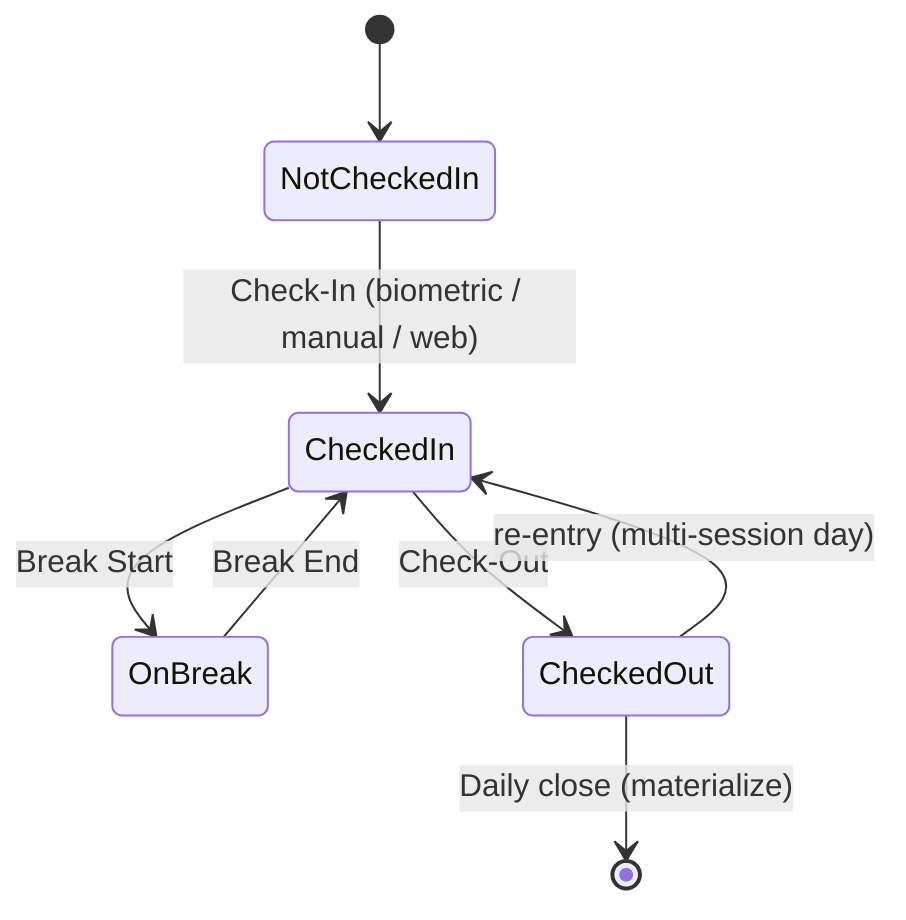
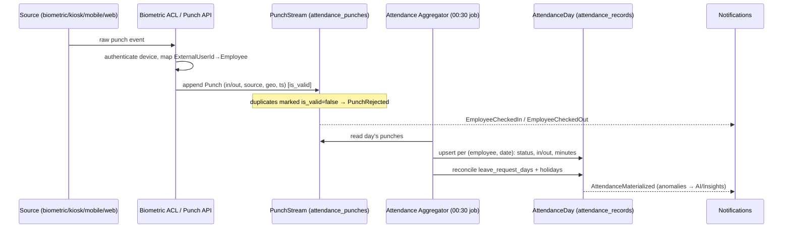
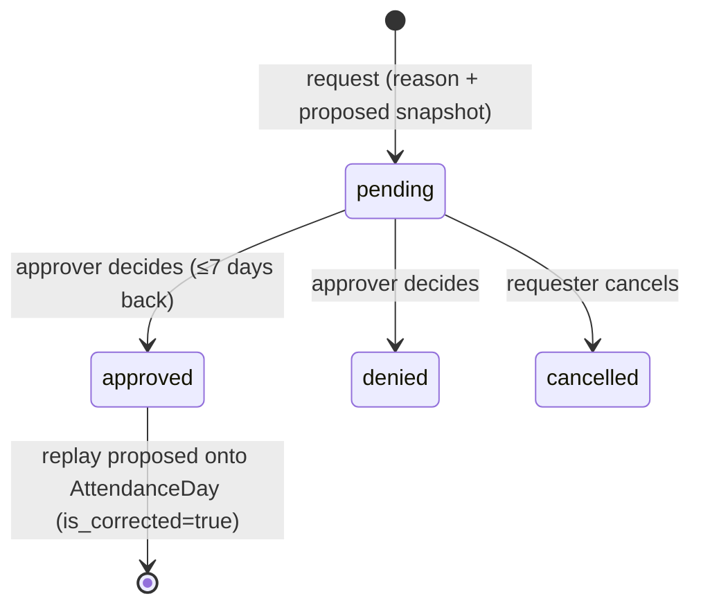
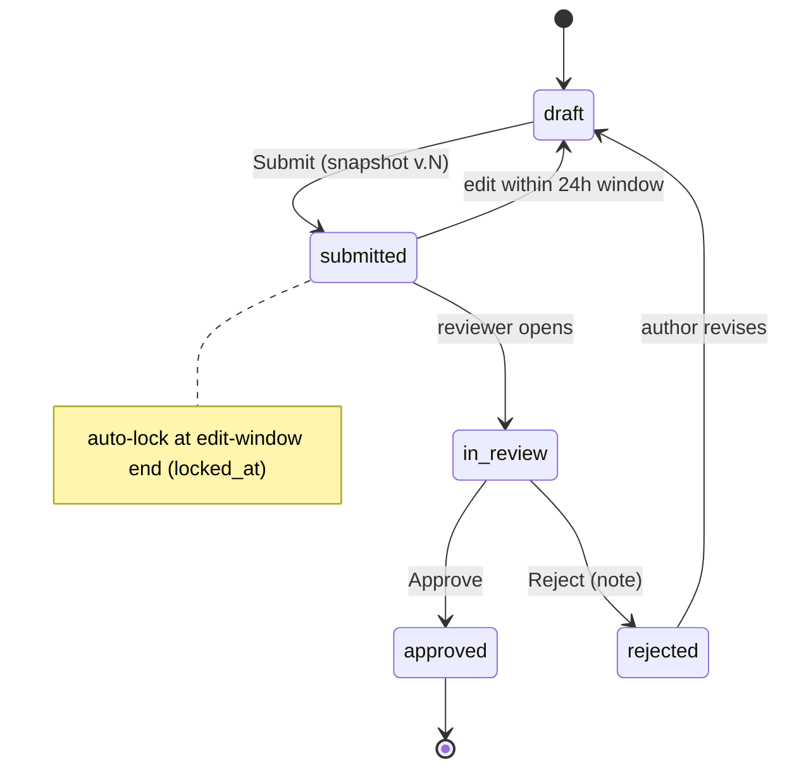
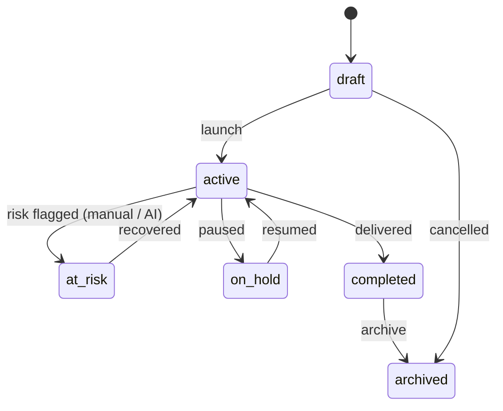
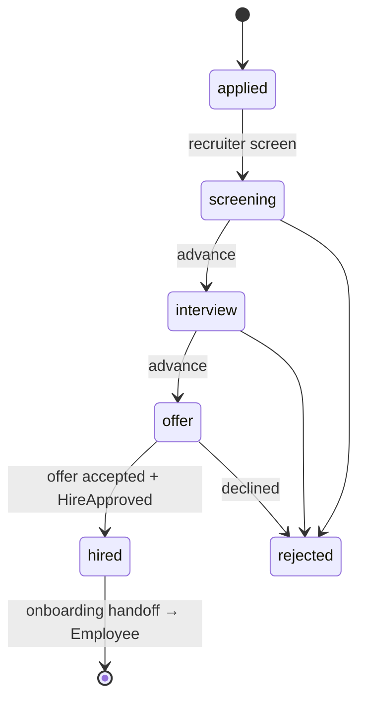
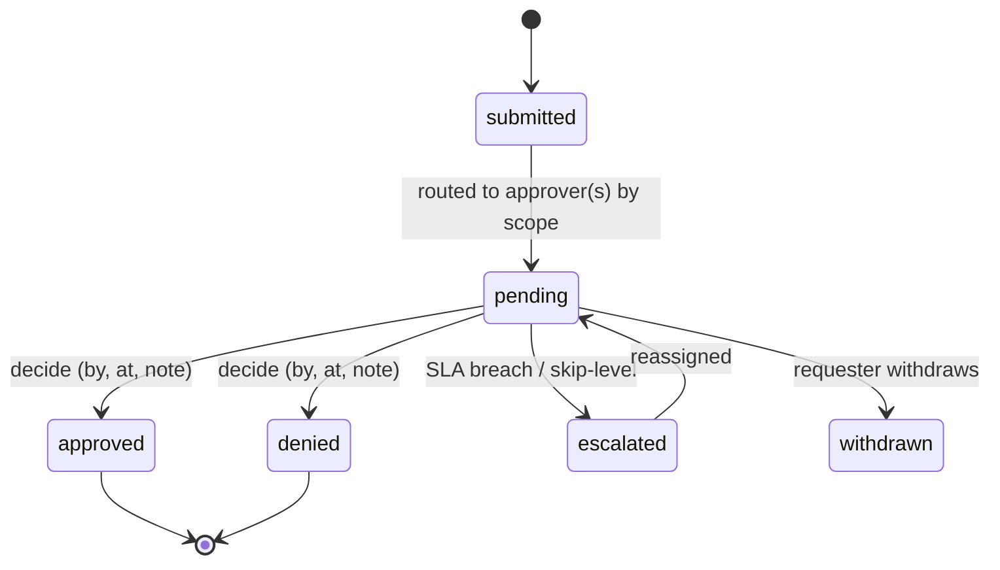
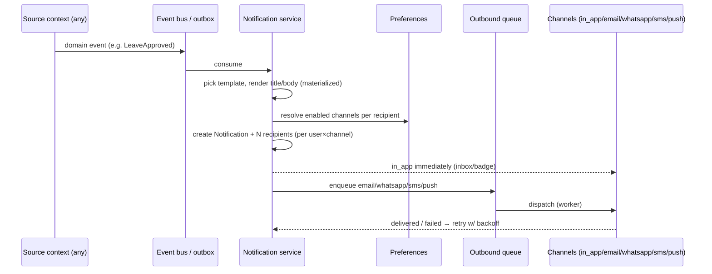

# Workflows

> **Phase:** Domain Modeling (no code). Brand-agnostic. Each workflow lists the actors, the state machine, the happy path, the key rules, and the domain events emitted (see `EVENT_ARCHITECTURE.md`). Consistent with the schema enums in `databasedesign.md`.

---

## 1. Attendance Workflow

### 1.1 Punch state machine (a working day)

### 1.2 Punch ingestion → materialization

### 1.3 The six events
| Action | Source(s) | Effect | Event |
|---|---|---|---|
| **Check-In** | biometric / manual / web / kiosk / mobile | first `in` punch of the day | `EmployeeCheckedIn` |
| **Biometric Punch** | device via ACL | normalized `in`/`out` punch | `PunchRecorded` (+ checked-in/out) |
| **Manual Check-In** | employee/manager (source=`manual`) | `in` punch with actor + reason; flagged for review | `EmployeeCheckedIn` (manual) |
| **Break Start** | web/mobile/kiosk | begins break interval | `BreakStarted` |
| **Break End** | web/mobile/kiosk | ends break; accrues break minutes | `BreakEnded` |
| **Check-Out** | any | last `out` punch; closes session | `EmployeeCheckedOut` |

**Rules:** raw punches are immutable/append-only; the day summary is **materialized** by the nightly aggregator, not written live. Duplicate/again-within-threshold punches → `is_valid=false`. Manual punches require actor + reason and are subject to correction review. Geolocation/IP captured where available.

### 1.4 Correction sub-workflow

Events: `AttendanceCorrectionRequested` → `AttendanceCorrected` | `AttendanceCorrectionDenied`. Window (**≤7 days**) is a UI/business rule enforced in the app (schema has no CHECK — `decisions.md` G10). Decision consistency enforced by schema CHECK.

---

## 2. Daily Reporting Workflow

**Happy path:** employee fills Day details (status/location/shift) → adds entries (project × activity + counts: tags/docs/bom/spares/tasks) → remarks + queries (@mentions) → **Submit**. On submit: recompute denormalized totals, snapshot to history, raise mentions, notify reviewer (manager via hierarchy).
**Rules:** leave/holiday `day_status` ⇒ work entries not required. Optimistic concurrency via `version` (409 on conflict). Editable 24h post-submit, then `ReportLocked` by the scheduler. **Locking-rule ambiguity (midnight vs +24h) is U-002.**
**Events:** `ReportDrafted`, `ReportSubmitted`, `ReportReviewRequested`, `ReportApproved`/`ReportRejected`, `ReportEdited`, `ReportLocked`, `MentionRaised`.

---

## 3. Project Workflow

**Flow:** Admin/Manager creates a project (code, owner, dept, allocated hours, billable) → assigns members (open stints, `allocated_pct`) → members log time via daily reports → burn tracked vs `allocated_hours` → status transitions (incl. `at_risk` from AI project-risk alerts) → completion → archive.
**Rules:** one open membership per (project, employee); `RESTRICT` on member/employee deletion; report entries `RESTRICT` project deletion (archive, don't delete).
**Events:** `ProjectCreated`, `ProjectMemberAssigned`/`Released`, `ProjectStatusChanged`, `ProjectAssigned` (to an employee), `ProjectArchived`, `ProjectRiskRaised` (from AI).

---

## 4. Recruitment Workflow (**new context**)

**Flow:** Recruiter opens a **requisition** (dept, headcount, hiring manager) → adds **candidates/applications** → moves through pipeline stages with **interviews + feedback** → **offer** → on acceptance, **`HireApproved`** triggers a one-way handoff that creates an `employees` record (pre-onboarding placeholder, null `user_id`) and queues identity provisioning.
**Rules:** candidate consent/privacy recorded; documents (resumes) in object storage with signed URLs; hire approval respects separation of duties (recruiter + hiring manager). Schema for this context does not exist yet (**U-013**).
**Events:** `RequisitionOpened`, `CandidateAdded`, `CandidateAdvanced`, `InterviewScheduled`, `FeedbackSubmitted`, `OfferExtended`, `OfferAccepted`/`Declined`, `CandidateRejected`, `HireApproved`, `RequisitionClosed`.

---

## 5. Approval Workflow (generic pattern)

A single, reusable approval pattern underlies report review, leave, corrections, and hire approval.

**Routing:** approver resolved by **scope** — manager via `v_employee_org` (org subtree, supports skip-level escalation), project owner via `project_members`, or role (`*.approve` permission). **Decision consistency** (`decided_by`/`decided_at` set together) enforced by schema CHECKs. SLA timers feed escalation and analytics (e.g. review SLA = 4.2h).
**Events:** `ApprovalRequested`, `ApprovalGranted`, `ApprovalDenied`, `ApprovalEscalated`, `ApprovalWithdrawn` (specialized per domain: `LeaveApproved`, `ReportApproved`, `AttendanceCorrected`, `HireApproved`).

---

## 6. Notification Workflow

**Rules:** one `notifications` row per event, N recipients (user × channel) honoring `notification_preferences`; title/body **materialized at insert** (template edits never rewrite history); in-app served from partial indexes (inbox/unread); outbound retried with backoff and dead-lettered; auto-dismiss in-app after 90 days.
**Events:** `NotificationRaised`, `NotificationFannedOut`, `NotificationDelivered`, `NotificationDeliveryFailed`, `NotificationRead`, `NotificationDismissed`.

---

## 7. Workflow → event → notification cross-reference

| Workflow trigger | Domain event | Typical notification |
|---|---|---|
| Report submitted | `ReportSubmitted` | → reviewer: "report waiting on your review" |
| Report reviewed | `ReportApproved`/`Rejected` | → author |
| Report missing (AI) | `MissingReportDetected` | → employee + manager |
| Leave approved | `LeaveApproved` | → requester (balance updated) |
| Correction decided | `AttendanceCorrected`/`Denied` | → requester |
| Check-in anomaly (AI) | `AnomalyDetected` | → manager |
| Project at risk (AI) | `ProjectRiskRaised` | → project owner |
| Hire approved | `HireApproved` | → admin/onboarding + new hire |

_Related: [`DOMAIN_MODEL.md`](./DOMAIN_MODEL.md) · [`EVENT_ARCHITECTURE.md`](./EVENT_ARCHITECTURE.md) · [`backenddesign.md`](./backenddesign.md) §4._
