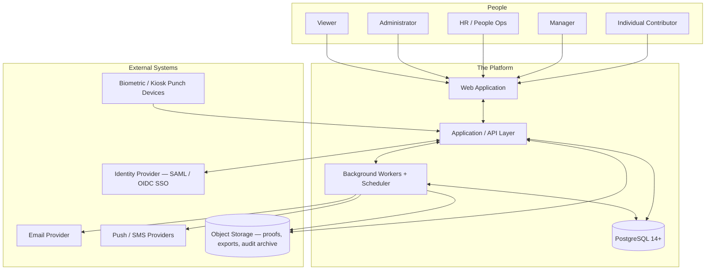
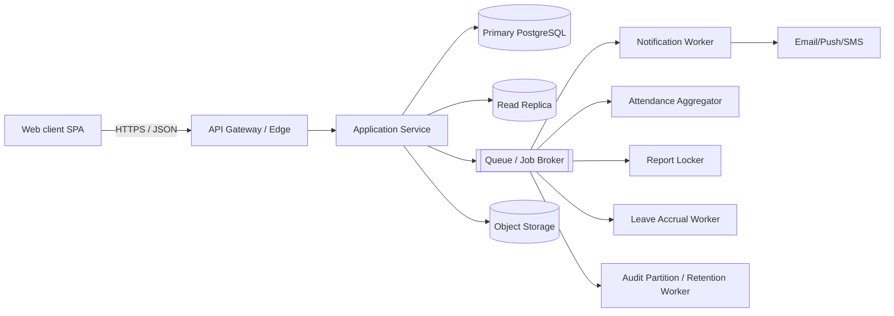
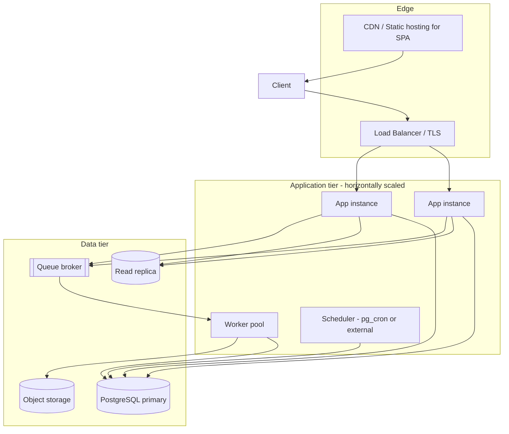

# Architecture

> **Status:** Source-of-truth architecture document, derived from `design-assets/` during the documentation consolidation pass (2026-05-30). No implementation exists yet; sections marked _(proposed)_ or _(assumed)_ are design intent pending approval, not built reality.
>
> **Naming convention used in this document:** The product has **no final name**. Throughout these docs the platform is referred to generically as **"the platform"**. Where a concrete identifier is unavoidable, **`CoreOps`** is used strictly as a **working codename** (it is also the repository name). It carries **no architectural weight** and is deliberately confined to a single configurable identifier (see [Naming Decision Record](#14-naming-decision-record)). `WorkTrack` and `Cadence` appearing in imported assets are historical references, not product decisions.

---

## 1. Vision

A calm, dense, enterprise-grade **workforce operations platform** that replaces the spreadsheet-and-chat sprawl most teams use to capture daily work, attendance, leave, and project effort — and turns that captured data into trustworthy management signal.

The guiding product principle, carried verbatim from the design system: **"calm by default."** The product narrates state; it never cheerleads. Daily reporting should take ~90 seconds; managers should see what shipped without chasing anyone.

The platform is **operations-domain aware**: daily work is logged not just as hours but as concrete artifacts — Tags, Docs, BOM (bill of materials), Spares, and task counts — indicating the target users perform engineering/field/manufacturing operations, not generic knowledge work alone (see [Glossary](#15-glossary)).

## 2. Problem Statement

Teams running operational work today suffer from:

- **Fragmented capture.** Daily activity lives across spreadsheets, chat channels, and email. There is no single, structured record of "what did each person work on, on which project, producing what."
- **Opaque attendance & leave.** Presence, shifts, WFH, comp-offs, holidays, and leave balances are tracked in disconnected systems, making corrections and audits painful.
- **No management signal.** Managers cannot see team load, on-time submission rates, review backlogs, project burn, or blockers without manual aggregation.
- **Weak auditability.** When something must be reconstructed (who approved what, when), the trail is incomplete — a compliance and trust liability.

The platform consolidates these into one system with a structured **daily report → review → analytics** spine, an **attendance/leave** subsystem, and an **append-only audit log** underpinning everything.

## 3. Business Goals

| # | Goal | Signal it's working |
|---|---|---|
| BG-1 | Make daily reporting frictionless | Median report submission time ≈ 90s; high daily on-time submission rate |
| BG-2 | Give managers real-time team visibility | Review SLA tracked; load/blocker dashboards used daily |
| BG-3 | Unify attendance & leave with reporting | Single calendar reconciles punches, leave, holidays; balances never drift |
| BG-4 | Be audit-ready by construction | Every state change is in the audit log; reconstructable history per entity |
| BG-5 | Sell into the enterprise | SSO/SAML, RBAC, SOC-2-aligned controls, data retention guarantees |
| BG-6 | Turn captured effort into analytics | Hours-by-category, project burn, workload heatmaps, on-time trends |

## 4. User Personas

Derived from the RBAC roles (`roles.key`: `admin`, `manager`, `employee`, `hr`, `viewer`) and the UI's role-gated navigation.

| Persona | Role key | Primary jobs-to-be-done | Key screens |
|---|---|---|---|
| **Individual Contributor** ("Priya") | `employee` | Submit daily reports fast; track own attendance/leave; see own projects & history | Dashboard, Report form, History, Attendance, Notifications |
| **Manager** ("Marco") | `manager` | Review team reports; approve leave & corrections; watch team load, blockers, SLA | Team, Review queue, Analytics, Project detail |
| **HR / People Ops** | `hr` | Leave policy & balances, employment history, attendance audit, exports | Admin (people, leave, corrections), Audit log |
| **Administrator** | `admin` | Manage members, projects, roles, SSO; full audit access; (latent: billing) | Admin (all tabs) |
| **Viewer / Stakeholder** | `viewer` | Read-only visibility into project pages | Project detail, (read-only) Analytics |

RBAC is **scoped** (`global` / `department` / `project` / `self`), so a single person can hold a role at multiple scopes (e.g. "Manager of Platform" and "Viewer of Q3 Planning").

## 5. System Context Diagram

_External integrations (IdP, mail/push/SMS, biometric devices, object storage) are implied by the schema and UI but not yet specified — see `decisions.md` (U-001, U-005, U-006)._

## 6. High-Level Architecture

A conventional, brand-agnostic **3-tier + async-workers** topology. Only the data tier is pinned (PostgreSQL 14+, 16 recommended); the application tier stack is an **open decision** (see `backenddesign.md` §1 and `decisions.md` U-001).

**Layers:**
- **Web client** — SPA rendering the screens in `frontenddesign.md`; consumes the API layer over JSON.
- **Application service** — auth, RBAC enforcement, domain workflows, transactional writes. Sets a per-request user GUC (legacy name `worktrack.current_user_id`) so DB triggers stamp `updated_by` and the audit logger captures the actor.
- **Data tier** — single logical PostgreSQL database, two schemas (`worktrack` for entities, `worktrack_audit` for the partitioned audit log). Read replica for analytics/heatmaps. _(Schema names are legacy asset identifiers; see Naming Decision Record.)_
- **Async workers + scheduler** — see [Service Boundaries](#7-service-boundaries) and `backenddesign.md` §5–6.

## 7. Service Boundaries

The system decomposes into clear **domain modules**, each owning a slice of the schema. For the MVP these are **modules inside a modular monolith** (recommended); the boundaries below are drawn so they can later be extracted into services (see [Future Expansion](#13-future-expansion-strategy) and `backenddesign.md` §14).

| Domain module | Owns (schema) | Responsibilities |
|---|---|---|
| **Identity & Access** | `auth_users`, `auth_sessions`, `auth_password_resets`, `auth_login_attempts`, `roles`, `permissions`, `role_permissions`, `user_roles` | Authentication, sessions, SSO, RBAC evaluation, lockout/rate-limiting |
| **Org & People** | `locations`, `departments`, `shifts`, `employees`, `employment_history` | Employee directory, org/manager hierarchy, departments, shifts, locations |
| **Projects** | `activity_types`, `projects`, `project_members` | Project catalog, membership stints, activity taxonomy |
| **Daily Reporting** | `daily_reports`, `daily_report_entries`, `daily_report_history`, `daily_report_mentions` | Report lifecycle (draft→submit→review→approve/reject), versioning, @mentions |
| **Attendance** | `attendance_records`, `attendance_punches`, `attendance_corrections`, `holidays` | Punch ingestion, daily materialization, corrections workflow, holidays |
| **Leave** | `leave_types`, `leave_balances`, `leave_accruals`, `leave_requests`, `leave_request_days` | Leave catalog, balances (generated), accrual ledger, request approval |
| **Notifications** | `notification_templates`, `notifications`, `notification_recipients`, `notification_preferences` | Event fan-out, per-channel delivery, preferences, inbox/badge |
| **Audit & Compliance** | `worktrack_audit.audit_logs`, `audit_logs_archive_meta` | Append-only event log, partition lifecycle, archival, retention |
| **Analytics (read)** | views in `09_indexes_views.sql` + replica | Dashboards, burn, heatmaps, on-time trends |

Key boundary rules:
- **Identity is decoupled from People.** `auth_users` ⟷ `employees` is an optional 1:1, so service accounts and pre-onboarding placeholders exist without an employee record.
- **Attendance materialization is a one-way derivation**: punches → daily record (by a worker); corrections replay onto the materialized record.
- **Leave balance is a read model** generated from the accrual ledger + approved requests; never hand-edited.
- **Notifications & audit reference subjects polymorphically** (`subject_type`/`object_type` + id, not FKs) so subject rows can soft-delete without losing history.

## 8. Deployment Architecture _(proposed)_

- **Environments (assumed):** `dev` → `staging` → `production`, promoted by CI/CD. `docker/` and `scripts/` are placeholders for containerization and ops tooling (Phase 0).
- **Stateless app instances** behind a load balancer; horizontal scale-out.
- **Scheduler** runs the recurring jobs (attendance close, report lock, retention) — `pg_cron` per the schema notes, or an external scheduler if workers are externalized.
- **Object storage** for upload proofs (`proof_url`), photos, CSV/PDF exports, and detached audit-log partitions.

_Concrete cloud/provider choices are unresolved (`decisions.md` U-009)._

## 9. Security Architecture

Carried from the schema's security notes and the login screen's "SOC 2 · SAML SSO · audit log" promise.

- **Authentication:** password (hashed; `password_hash`, never plaintext) **or** SSO-only accounts (`is_sso_only` + `sso_provider`/`sso_subject`). Providers referenced: `okta`, `google`, `azure_ad`. Optional **MFA** (`mfa_enabled`, `mfa_secret_encrypted` — encrypted at the **application layer** with a KMS-managed key; the DB never sees plaintext).
- **Sessions:** only the **SHA-256 hash** of the bearer/refresh token is stored (`auth_sessions.token_hash`); the raw token never round-trips through the DB. Sessions carry IP + user-agent + device label; revocable.
- **Brute-force defense:** `auth_login_attempts` (append-only) feeds rate-limiting; `failed_login_count` + `locked_until` enforce lockout.
- **Authorization:** three-tier RBAC (roles → role_permissions → permissions) with **scoped grants** (`user_roles.scope_type`/`scope_id`). Dotted permission keys (`report.submit`, `report.review`, `leave.approve`, `attendance.correct`, `admin.audit_log`, `employee.invite`, …).
- **Least-privilege DB roles:** app role gets `SELECT/INSERT/UPDATE` on `worktrack.*` and `INSERT`-only on the audit log; HR/admin reporting role gets `SELECT` on `worktrack_audit.*`.
- **Audit by construction:** every business event is logged (`worktrack_audit.audit_logs`), with actor, action (past-tense verb), object, payload diff, IP, user-agent, request id, session id.
- **Transport & data:** TLS at the edge (assumed); `timestamptz` everywhere; `citext` emails; `inet` for IPs to power abuse detection.
- **Soft delete + retention** preserve history while honoring deletion (see `databasedesign.md`).

## 10. Scalability Strategy

Directly from the schema's "Production considerations":

- **Partition the audit log by month** (`audit_logs` RANGE on `occurred_at`); detach + archive on a **13-month** retention boundary; pre-create N+2 partitions via `pg_partman`/cron.
- **Partition `attendance_punches` by month** once it crosses ~50M rows (same pattern).
- **Read replicas** for analytics (org tree, heatmaps, exports) — charts/exports never hit the primary.
- **Denormalized aggregate snapshots** are intentional: `attendance_records` (materialized per-day summary) and `daily_reports.total_hours/total_tasks_*` are precomputed; dashboards read snapshots, not live recomputation.
- **Tuned partial indexes** keep hot queues tiny (review queue, notification inbox/unread, outbound delivery) by filtering to pending/unread states.
- **Stateless app tier** scales horizontally; the DB is the coordination point.

## 11. Observability Strategy _(proposed)_

- **Audit log** doubles as a business-event timeline (who/what/when), queryable by actor, object, action, time, and GIN-indexed payload.
- **DB observability:** `pg_stat_statements`, `auto_explain`, `pg_partman` recommended by the schema.
- **App telemetry (assumed):** structured logs with `request_id` (already a column on the audit log, traceable to the gateway), metrics (RED: rate/errors/duration), and distributed tracing across app → workers → DB.
- **Product/SLA metrics surfaced in-app:** on-time submission rate, review SLA (e.g. "4.2h"), open blockers, workload heatmap — these are first-class dashboards, not just ops metrics.
- **Worker health:** queue depth, job latency, retry counts (the notification recipient row already tracks `delivery_status`/`retry_count`/`failed_reason`).

## 12. Reliability & Data Integrity

- Explicit `ON DELETE` semantics throughout: `RESTRICT` for parents the app must reassign first (manager, project member, referenced activity type), `CASCADE` for true children, `SET NULL` for soft references.
- FKs are validated (no `NOT VALID` shortcuts); all triggers are `BEFORE` on `NEW` only (no implicit cascade writes).
- **Optimistic concurrency** on daily reports (`version` bumped per save; compare-and-swap).
- **Decision consistency CHECKs** (e.g. `decided_at`/`decided_by` null-together) keep workflow state coherent.
- Backup/DR (from schema): nightly logical dump of the `worktrack` schema, WAL archiving + PITR, detached audit partitions shipped to object storage with `audit_logs_archive_meta` recording their location.

## 13. Future Expansion Strategy

- **Service decomposition.** Promote the modular-monolith boundaries (§7) into independently deployable services as load demands — Notifications and Attendance-ingestion are the most natural first extractions (clear async boundaries).
- **Mobile & field capture.** `punch_source` already includes `mobile`/`biometric`/`kiosk`; a mobile client and device-ingestion API are a planned expansion (`ui_kits/` is plural but only `web_app` exists today — `decisions.md` U-006).
- **Multi-tenancy.** Today single-tenant by construction; a tenant strategy (schema-per-tenant vs row-level `tenant_id`) is an open decision (`databasedesign.md` §7).
- **AI / agentic features (roadmap Phase 6):** report drafting from activity, anomaly detection on attendance/load, natural-language analytics, automated review triage.
- **Integrations:** calendar, HRIS/payroll, ticketing (the report counts already gesture at engineering/ops tooling).

## 14. Naming Decision Record

> This section satisfies the explicit requirement for a **Branding / Naming Decision Record** and is mirrored as **D-001** in `decisions.md`.

**Context.** The imported `design-assets/` contain three product names:

| Name | Where it appears | Classification |
|---|---|---|
| **Cadence** | `screenshots/01-dashboard*.png` (wordmark + "C" mark), `Login.jsx` seed email `priya@cadence.work`, `app.css` header comment | **Legacy** — earliest brand, superseded |
| **WorkTrack** | Design-system deck, `schema/README.md`, DB schema namespace `worktrack`/`worktrack_audit`, UI kit README, most screens, `screenshots/02` & `05` (bar-chart mark), email `@worktrack.app` | **Design-system reference** — the brand the current assets were built under |
| **CoreOps** | Repository / working directory name | **Working codename** — this repo |

**Decision.**
1. **No final product name is assumed.** The brand is explicitly **undecided**.
2. **CoreOps** is the **repository and working codename only**. It is a placeholder and carries **no architectural meaning**.
3. **WorkTrack** is treated as the **design-system reference** (its tokens, components, and voice are authoritative for UI; its *name* is not).
4. **Cadence** is **legacy**; its screenshots/strings are historical and superseded.
5. **All documentation is written brand-agnostically** — "the platform" — so the eventual product name changes nothing structural.

**Implementation rule (to keep rename cost ≈ zero).**
- The product name must live in **exactly one place**: a single configuration constant / token (e.g. `PRODUCT_NAME`) on the backend, and a single design token (e.g. `--product-name` / a `Brand` component) on the frontend. **No module, table, route, or API path may hardcode a product name.**
- **Asset cleanup backlog** (tracked, not yet actioned): DB schema namespaces `worktrack`/`worktrack_audit`, the per-request GUC `worktrack.current_user_id`, UI brand strings/marks, and seed email domains all still say *WorkTrack/Cadence*. These are **legacy identifiers** to be neutralized when the name is fixed (recommended neutral schema names e.g. `core`/`audit`, neutral GUC e.g. `app.current_user_id`). Until then they are documented as-is for fidelity to the source.

**Consequences.** Choosing/changing the product name later is a configuration + asset-rename task, not an architecture change.

## 15. Glossary

| Term | Meaning |
|---|---|
| **Daily report** | One header per (employee, date) + N entries (one per project × activity). The core capture unit. |
| **Entry counts** | Per-entry domain tallies: **Tags**, **Docs**, **BOM** (bill of materials), **Spares**, **Tasks done**, **Tasks open**. Their precise operational meaning is **undocumented** (`decisions.md` U-007) — strong signal of an engineering/manufacturing-ops domain. |
| **Punch** | A raw in/out attendance event (`web`/`mobile`/`biometric`/`kiosk`/`manual`/`system`). |
| **Attendance record** | The materialized per-(employee, day) summary derived from punches + leave + holidays. |
| **Correction** | An employee-initiated request to amend an attendance record (diffed via JSON snapshots). |
| **Accrual** | An append-only credit/debit event feeding a leave balance. |
| **Scope (RBAC)** | The breadth of a role grant: `global` / `department` / `project` / `self`. |
| **Soft delete** | `deleted_at` tombstone; live views (`v_*`) hide tombstoned rows; uniqueness is partial-on-`deleted_at IS NULL`. |
| **Codename** | A placeholder name (here, *CoreOps*) with no product/brand commitment. |

---

_Related: [`backenddesign.md`](./backenddesign.md) · [`frontenddesign.md`](./frontenddesign.md) · [`databasedesign.md`](./databasedesign.md) · [`roadmap.md`](./roadmap.md) · [`decisions.md`](./decisions.md) · [`documentation-review-report.md`](./documentation-review-report.md)_
