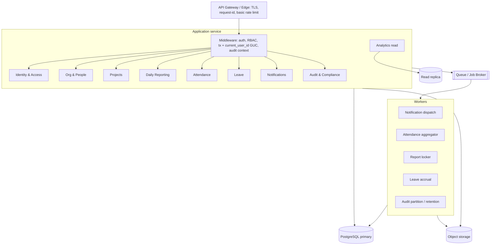

# Backend Design

> **Status & caveat.** No backend code or stack exists in the imported assets. The **only pinned tier is the database** (PostgreSQL 14+). This document defines the backend **contract and design intent** that the schema (`design-assets/schema/`) and the UI prototype (`design-assets/ui_kits/web_app/`) jointly imply. The application-tier **technology stack is an open decision** (`decisions.md` U-001) — everything here is expressed stack-agnostically.
>
> **Naming:** brand-agnostic ("the platform"); API paths and module names below contain **no product name**. Legacy DB identifiers (`worktrack` schema, `worktrack.current_user_id` GUC) are documented as-is per the [Naming Decision Record](./architecture.md#14-naming-decision-record).

---

## 1. Service Architecture

**Recommended shape for MVP: a modular monolith** — one deployable application organized into the domain modules of `architecture.md` §7, plus a pool of async workers and a scheduler. This maximizes delivery speed while keeping clean seams for later extraction (§14).

**Cross-cutting middleware (every request):**
1. **AuthN** — resolve bearer token → session (`auth_sessions.token_hash` lookup).
2. **AuthZ** — evaluate RBAC (role + scope) for the requested permission.
3. **Transaction + actor** — open a transaction and `SET LOCAL worktrack.current_user_id = '<auth_users.id>'` so DB triggers stamp `updated_by` and the audit logger records the actor.
4. **Audit context** — carry `request_id`, `ip`, `user_agent`, `session_id` for audit rows.

## 2. API Structure

**Style _(proposed)_:** resource-oriented **REST + JSON** over HTTPS, versioned under `/api/v1`. (GraphQL is a viable alternative — `decisions.md` U-001.) The surface below is **derived** from the UI routes/screens and the schema; it is the integration contract a real OpenAPI spec must formalize (`decisions.md` G2).

Conventions: cursor or page/offset pagination on list endpoints; consistent filter query params; `If-Match`/version on report mutations (optimistic concurrency); standard error envelope (§11).

| Area | Representative endpoints | Backs UI |
|---|---|---|
| **Auth** | `POST /auth/login`, `POST /auth/logout`, `POST /auth/refresh`, `POST /auth/password/forgot`, `POST /auth/password/reset`, `GET /auth/sso/{provider}/initiate`, `POST /auth/sso/{provider}/acs`, `POST /auth/mfa/verify` | Login screen |
| **Me / session** | `GET /me`, `GET /me/permissions`, `GET /me/notifications`, `GET /me/notifications/unread-count`, `PATCH /me/preferences` | Shell, TopNav badge |
| **Daily reports** | `GET /reports`, `POST /reports`, `GET /reports/{id}`, `PATCH /reports/{id}` (version-checked), `POST /reports/{id}/submit`, `POST /reports/{id}/review` (approve/reject), `GET /reports/{id}/history`, `GET /reports/export?format=csv` | Dashboard, Report form, History |
| **Report entries** | `POST /reports/{id}/entries`, `PATCH /entries/{id}`, `DELETE /entries/{id}` | Report form counts grid |
| **Team / review** | `GET /team`, `GET /team/review-queue`, `GET /team/members`, `GET /team/load` | Team screen |
| **Attendance** | `GET /attendance/calendar?month=`, `GET /attendance/history`, `POST /attendance/punch` (in/out), `GET /attendance/today` | Attendance (calendar/history/punch) |
| **Corrections** | `GET /attendance/corrections`, `POST /attendance/corrections`, `POST /attendance/corrections/{id}/decide` | Corrections tab / Admin |
| **Leave** | `GET /leave/balances`, `GET /leave/types`, `GET /leave/requests`, `POST /leave/requests`, `POST /leave/requests/{id}/decide`, `POST /leave/requests/{id}/cancel` | Balances, Apply, Admin approvals |
| **Projects** | `GET /projects`, `POST /projects`, `GET /projects/{id}`, `PATCH /projects/{id}`, `GET /projects/{id}/reports`, `GET /projects/{id}/members`, `POST /projects/{id}/members` | Projects, Project detail, Admin |
| **Analytics** | `GET /analytics/summary`, `GET /analytics/hours-by-category`, `GET /analytics/project-burn`, `GET /analytics/on-time`, `GET /analytics/heatmap`, `GET /analytics/export` | Analytics screen |
| **Admin** | `GET/POST /admin/people`, `POST /admin/people/invite`, `GET/POST /admin/projects`, `GET/PATCH /admin/roles`, `GET /admin/audit-log`, `GET/PATCH /admin/sso` | Admin tabs |
| **Search** | `GET /search?q=` (people, reports — ⌘K palette) | TopNav search _(infra TBD, G8)_ |
| **Notifications** | `GET /notifications`, `POST /notifications/read-all`, `POST /notifications/{id}/read`, `POST /notifications/{id}/dismiss`, `GET/PATCH /notifications/preferences` | Notification center/drawer |
| **Punch ingestion** | `POST /ingest/punches` (biometric/kiosk devices, authenticated by device key) | external devices |

## 3. Domain Model

The domain model is the schema (`databasedesign.md` §3). Backend domain objects map 1:1 to the schema modules, with these **aggregate roots**:

- **User** (identity, sessions, role grants) — root of Identity & Access.
- **Employee** (org placement, manager chain, employment history) — root of Org & People.
- **Project** (members, activity allocation).
- **DailyReport** (entries, history, mentions) — guards the lifecycle state machine and `version`.
- **AttendanceDay** (the materialized record; punches and corrections attach).
- **LeaveRequest** (request days; debits balance via accrual ledger on approval).
- **Notification** (recipients; per-channel delivery).

Value/lookup objects: Location, Department, Shift, ActivityType, LeaveType, Holiday, NotificationTemplate, Role, Permission.

## 4. Business Modules (logic that lives above the schema)

### 4.1 Daily report lifecycle
`draft → submitted → in_review → approved | rejected` (enum `report_status`).
- On **save**: bump `version` (compare-and-swap), recompute denormalized `total_hours`/`total_tasks_*` from entries, extract @mentions → `daily_report_mentions`.
- On **submit**: set `submitted_at`, snapshot to `daily_report_history` (`change_type='submit'`), notify reviewer (manager via `employees.manager_id`), audit `report.submitted`.
- On **review**: set `reviewed_by`/`reviewed_at`/`review_note`, snapshot, notify author, audit.
- **Edit window:** editable for 24h after submit; **auto-lock** via scheduler (`locked_at`). _(Conflict with "lock at midnight" UI copy — U-002.)_
- **Validation:** leave/holiday `day_status` ⇒ no work entries required.

### 4.2 Attendance pipeline
- **Punch ingestion** (`/ingest/punches`, `/attendance/punch`) → append to `attendance_punches` (raw, immutable), dedupe (`is_valid=false` for duplicates).
- **Daily close** (worker, 00:30): aggregate punches + `leave_request_days` + `holidays` → upsert `attendance_records` (one per employee/day). Sets `status`, `check_in/out`, `total_minutes`.
- **Corrections:** employee submits `attendance_corrections` with original/proposed JSON snapshots (window: **up to 7 days back** — UI rule, enforce in app, not in schema; G10). Manager/HR decides → on approve, replay proposed snapshot onto `attendance_records`, set `is_corrected=true`, audit `attendance.corrected`.

### 4.3 Leave workflow
- **Apply:** validate against `leave_types` rules (`min_notice_days`, `allows_half_day`, `requires_proof_after_days` → `proof_url`), overlap check (partial index), expand into `leave_request_days` (with `day_fraction`, holiday/weekend flags), compute `days_count`.
- **Approve:** in **one transaction**, `SELECT … FOR UPDATE` the `leave_balances` row, write a debit to `leave_accruals` / update `used`, set request `approved`, drive `attendance_records.status='leave'` for the days, notify, audit `leave.approved`. `current_balance` (generated) updates automatically.
- **Accrual worker:** mints `leave_accruals` per `accrual_method` (annual grant / monthly accrual), applies `max_carry_forward`/`max_balance`.
- **Rebuild:** balances are a read model — re-summable from `leave_accruals` + approved `leave_request_days`.

### 4.4 Notifications fan-out
- A business event → one `notifications` row → N `notification_recipients` (one per user × enabled channel, honoring `notification_preferences`).
- Title/body **materialized at insert** (template edits never rewrite history).
- In-app served from partial indexes (inbox/unread); email/push/SMS dispatched by the worker from the outbound queue index, with retry bookkeeping.

### 4.5 Org & RBAC
- Manager hierarchy via recursive `v_employee_org` (≤12 levels) — powers org-scoped permissions and "reports my org owes."
- Employment changes append to `employment_history` and audit.

## 5. Worker Architecture

| Worker | Trigger | Job |
|---|---|---|
| **Notification dispatcher** | queue (outbound) | Send email/push/SMS for pending non-in-app recipients; update `delivery_status`/`retry_count`/`failed_reason`; exponential backoff. |
| **Attendance aggregator** | scheduled (daily 00:30) | Materialize `attendance_records` from punches + leave + holidays. |
| **Report locker** | scheduled (daily 23:55) | Set `locked_at` on submitted reports past the edit window. |
| **Leave accrual** | scheduled (monthly/annual per type) | Mint `leave_accruals`; apply carry-forward/caps at period boundaries. |
| **Audit partition/retention** | scheduled (monthly + weekly) | Pre-create N+2 audit partitions; detach+archive at 13mo; `purge_old_login_attempts(180)`; `autodismiss_notifications(90)`. |
| **Export builder** _(proposed)_ | on-demand/queued | Generate CSV/PDF exports to object storage, notify when ready. |

Workers run with the same per-transaction `current_user_id` discipline (or `actor_label='system'`) so their writes are audited.

## 6. Queue Architecture

- **Purpose:** decouple slow/external work (email/push/SMS, exports, large aggregations) from the request path; provide retries and backpressure.
- **Design _(proposed, broker-agnostic)_:** durable queue with at-least-once delivery, idempotent consumers (notification recipient uniqueness `(notification, recipient, channel)` makes dispatch idempotent), dead-letter queue for poison messages, visibility timeout ≥ max handler time.
- **DB-native option:** the outbound partial index on `notification_recipients` already functions as a pull-queue; a lightweight worker can poll it without external infra for the MVP. External broker added when volume/throughput demands.

## 7. Authentication Design

- **Credentials:** password (verify against `password_hash`; never store/log plaintext) or **SSO** (SAML/OIDC; `okta`/`google`/`azure_ad`). SSO-only accounts have no password.
- **Sessions:** issue an opaque bearer token; store only `sha256(token)` in `auth_sessions.token_hash`; optional refresh token (`refresh_hash`). Carry IP/UA/device label; support revoke (`revoked_at`/`revoked_reason`) and expiry.
- **MFA:** optional TOTP; secret stored encrypted at the app layer (`mfa_secret_encrypted`, KMS key) — DB never sees plaintext.
- **Password reset:** single-use hashed token (`auth_password_resets`), 30-minute expiry (per Login copy).
- **Every attempt logged** to `auth_login_attempts` (success/failure + reason) for rate-limiting and analytics.

## 8. Authorization Design

- **Model:** `roles → role_permissions → permissions`; users get **scoped grants** via `user_roles` (`scope_type` = global/department/project/self, + `scope_id`).
- **Evaluation:** a request needs permission `key` (e.g. `report.review`) **at a scope** that covers the target. Scope resolution uses `v_employee_org` for department/org reach and `project_members` for project scope; `self` restricts to the actor's own rows.
- **Enforcement points:** middleware gate per endpoint + row-level filters in queries (e.g. a manager's review queue is bounded by their org subtree). Prefer **deny-by-default**.
- **System roles** are immutable (`roles.is_system_role`); tenant-defined roles may be added.

## 9. Audit Logging

- **Every state-changing operation** writes to `worktrack_audit.audit_logs` (app has `INSERT`-only). Action verbs are past-tense (`report.submitted`, `leave.approved`, `attendance.corrected`, `role.assigned`, `project.archived`, `login.succeeded/failed`).
- Capture actor (`current_user_id` / `system`), object (type/id/label), `payload` (before/after | diff | context), and request context (`ip`, `user_agent`, `request_id`, `session_id`).
- Use `log_event(...)` helper or direct insert. Reads (HR/admin) go through dedicated indexes (actor, object, action, time, GIN payload).

## 10. Observability

- **Structured logs** keyed by `request_id` (same id stored on audit rows — request↔audit correlation).
- **Metrics:** RED per endpoint; queue depth & job latency & retry counts per worker; DB via `pg_stat_statements`/`auto_explain`.
- **Tracing:** propagate trace/`request_id` from edge → app → workers → DB.
- **Product SLAs as metrics:** on-time submission rate, review SLA, blockers, delivery success rate.
- **Health/readiness** endpoints; alert on queue backlog, failed deliveries, partition-creation failures, replica lag.

## 11. Error Handling

- **Uniform error envelope** _(proposed)_: `{ "error": { "code": "<machine_code>", "message": "<human, sentence-case>", "details": {...}, "request_id": "..." } }`. Voice: calm, specific, no exclamations (matches design voice).
- **HTTP mapping:** 400 validation, 401 unauthenticated, 403 unauthorized, 404 not found / soft-deleted, **409 version conflict** (optimistic lock on reports), 422 domain-rule violation (e.g. leave overlap, notice period), 429 rate limited, 5xx server.
- **Idempotency:** mutation idempotency keys for punch ingestion and notification dispatch.
- **DB-enforced invariants** (CHECKs, decision-consistency, non-negativity) surface as 422 with field details.
- **Workers:** retry with backoff → dead-letter after N attempts; never silently drop (record `failed_reason`).

## 12. Rate Limiting

- **Edge/gateway:** coarse per-IP limits.
- **Auth-specific:** per-email and per-IP login throttling driven by `auth_login_attempts`; account lockout via `failed_login_count`/`locked_until`.
- **API:** per-user/per-token quotas on expensive endpoints (exports, analytics, search); 429 + `Retry-After`.
- **Ingestion:** per-device limits on `/ingest/punches`.

## 13. Security Controls (summary)

Full posture in `architecture.md` §9. Backend-specific: TLS-only; secrets in a manager/KMS (never in code); least-privilege DB roles (app: `SELECT/INSERT/UPDATE` on `worktrack.*`, `INSERT`-only on audit); parameterized queries only; input validation at the boundary; output encoding; CSRF protection for cookie-based sessions; signed/expiring URLs for object-storage proofs and exports; PII minimization in logs (no tokens, no MFA secrets, no passwords).

## 14. Future Service Decomposition

Extraction order (when load/teams justify it), following §7 boundaries:
1. **Notification service** — clearest async seam; owns templates/recipients/delivery; consumes domain events.
2. **Attendance ingestion service** — high-volume punch intake + materialization; isolates device traffic.
3. **Analytics/reporting service** — read-only, replica-backed; can diverge to a separate store/warehouse.
4. **Identity service** — auth/SSO/RBAC as a shared platform capability.

Enablers already in the design: polymorphic subject references (no cross-module FK coupling for notifications/audit), append-only ledgers (punches, accruals, audit) that are naturally event-friendly, and clean module-owned table sets. Introduce an **event bus** and per-service data ownership at extraction time; avoid distributed transactions (prefer sagas / outbox).

---

_Related: [`architecture.md`](./architecture.md) · [`databasedesign.md`](./databasedesign.md) · [`frontenddesign.md`](./frontenddesign.md) · [`decisions.md`](./decisions.md)._
