# Database Design

> **Source of truth.** This document is the canonical interpretation of the production-grade DDL under `design-assets/schema/` (`00_setup` → `09_indexes_views`, run via `apply_all.sql`). The SQL is authoritative and internally consistent; this doc structures and explains it. Target engine: **PostgreSQL 14+ (16 recommended)**.
>
> **Naming note:** the DDL uses two schemas, `worktrack` (entities) and `worktrack_audit` (audit log), and a per-request GUC `worktrack.current_user_id`. These are **legacy identifiers** from the design-system reference brand; they are documented verbatim for fidelity. The [Naming Decision Record](./architecture.md#14-naming-decision-record) recommends neutralizing them (e.g. `core` / `audit`, `app.current_user_id`) when the product name is fixed.

---

## 1. Conventions (apply to every table)

- **UUID primary keys** via `gen_random_uuid()` (`pgcrypto`); `bigserial` only for high-write append-only logs (`auth_login_attempts`, `audit_logs`).
- **`citext`** for emails; **`numeric(p,s)`** for money/hours/days (never `float`); **`timestamptz`** for every timestamp (app renders in employee timezone); **`jsonb`** for variable schemas (always GIN-indexed where searched); **`inet`** for IPs.
- **Audit timestamps** on every mutable table: `created_at`, `updated_at`, `created_by`, `updated_by`. The `tg_set_audit_fields` BEFORE trigger stamps these, reading the actor from `SET LOCAL worktrack.current_user_id = '<uuid>'` (set once per transaction by the app).
- **Soft delete**: `deleted_at timestamptz NULL` on every user-facing entity; all uniqueness on those tables is a **partial unique index** `WHERE deleted_at IS NULL`.
- **Enums** for closed sets the app branches on; **lookup tables** for sets admins extend (activity types, leave types, notification templates).
- **Extensions:** `pgcrypto`, `citext`, `btree_gin`.

### Enum types (`00_setup.sql`)

| Enum | Values |
|---|---|
| `employment_status` | active, on_leave, suspended, exited |
| `employment_type` | full_time, part_time, contractor, intern |
| `day_status` | working, half_day, wfh, leave, comp_off, holiday |
| `report_status` | draft, submitted, in_review, approved, rejected |
| `attendance_status` | present, wfh, leave, comp_off, half_day, holiday, weekend, absent |
| `punch_type` | in, out |
| `punch_source` | web, mobile, biometric, kiosk, manual, system |
| `leave_request_status` | draft, pending, approved, denied, cancelled, withdrawn |
| `correction_status` | pending, approved, denied, cancelled |
| `project_status` | draft, active, at_risk, on_hold, completed, archived |
| `notification_priority` | low, normal, high, urgent |
| `notification_channel` | in_app, email, push, sms |
| `delivery_status` | pending, sent, failed, skipped |
| `rbac_scope` | global, department, project, self |

---

## 2. ERD Interpretation

```mermaid
erDiagram
  auth_users        ||--o{ auth_sessions         : opens
  auth_users        ||--o{ user_roles            : grants
  auth_users        ||--o| employees             : "1:1 optional"
  roles             ||--o{ user_roles            : assigned
  roles             ||--o{ role_permissions      : grants
  permissions       ||--o{ role_permissions      : in

  departments       ||--o{ departments           : parent_child
  departments       ||--o{ employees             : has
  locations         ||--o{ employees             : based_at
  locations         ||--o{ holidays              : observed_by
  shifts            ||--o{ employees             : default_for
  employees         ||--o{ employees             : manages
  employees         ||--o{ employment_history    : logs

  projects          ||--o{ project_members       : has
  employees         ||--o{ project_members       : joins
  activity_types    ||--o{ daily_report_entries  : categorizes

  employees         ||--o{ daily_reports         : writes
  daily_reports     ||--o{ daily_report_entries  : has
  daily_reports     ||--o{ daily_report_history  : versions
  daily_reports     ||--o{ daily_report_mentions : mentions
  projects          ||--o{ daily_report_entries  : logged_against

  employees         ||--o{ attendance_records    : per_day
  attendance_records ||--o{ attendance_corrections : amended_by
  employees         ||--o{ attendance_punches    : punches
  holidays          ||--o{ attendance_records    : marks

  leave_types       ||--o{ leave_balances        : tracked_per_type
  leave_types       ||--o{ leave_requests        : of_type
  leave_types       ||--o{ leave_accruals        : credits
  employees         ||--o{ leave_balances        : owns
  employees         ||--o{ leave_requests        : applies
  leave_requests    ||--o{ leave_request_days    : expands_to
  leave_requests    ||--o| attendance_records    : drives_status

  notification_templates ||--o{ notifications        : renders
  notifications          ||--o{ notification_recipients : fans_out
  employees              ||--o{ notification_recipients : receives
  notification_templates ||--o{ notification_preferences : opt

  auth_users        ||--o{ audit_logs            : actor_logical
  auth_sessions     ||--o{ audit_logs            : request_context
```

**Reading the model:** Identity (`auth_users`) sits above People (`employees`) as an optional 1:1. Everything operational hangs off `employees`. Reporting, Attendance, and Leave are three parallel time-series subsystems that reconcile on `attendance_records`. Notifications and Audit are cross-cutting and reference subjects **polymorphically** (no FKs) so subjects can soft-delete without orphaning history.

---

## 3. Entity Definitions (by module)

### 3.1 Authentication & RBAC (`01_auth_rbac.sql`)

| Table | Purpose | Notable columns / rules |
|---|---|---|
| `auth_users` | Identity record, decoupled from employees | `email citext`, `password_hash` (NULL for SSO-only), `is_sso_only`+`sso_provider`/`sso_subject` (CHECK enforces both when SSO-only), `mfa_secret_encrypted bytea` (app-encrypted), `failed_login_count`/`locked_until`, soft-deletable. Partial-unique email; partial-unique `(sso_provider, sso_subject)`. |
| `auth_sessions` | Active sessions / refresh tokens | Stores `token_hash bytea` (SHA-256) only; `refresh_hash`; IP/UA/device; `expires_at`, `revoked_at`. Unique on `token_hash`. |
| `auth_password_resets` | Reset tokens | `token_hash` unique, `expires_at`, `used_at`. |
| `auth_login_attempts` | Append-only auth ledger (`bigserial`) | `succeeded`, `reason`, IP/UA — feeds rate-limiting & analytics. |
| `roles` | Role catalog | `key` (admin/manager/employee/hr/viewer), `is_system_role`, soft-deletable. |
| `permissions` | Permission catalog | Dotted `key` (`report.submit`, `leave.approve`, …). |
| `role_permissions` | Role↔permission M:N | PK `(role_id, permission_id)`. |
| `user_roles` | Scoped grants | `scope_type` (global/department/project/self) + `scope_id`; CHECK: global ⇒ scope_id NULL, else NOT NULL. Unique per `(user, role, scope_type, scope_id)` where not revoked. `expires_at`, `revoked_at`. |

### 3.2 Org & People (`02_employees.sql`)

| Table | Purpose | Notable columns / rules |
|---|---|---|
| `locations` | Office/site catalog | `code`, `timezone`, country; soft-deletable. |
| `departments` | Org tree | Self-FK `parent_id` (`ON DELETE RESTRICT`, CHECK no self-parent); `head_employee_id` FK wired after `employees` exists. |
| `shifts` | Shift definitions | `start_time`/`end_time` (local), `break_minutes`, `crosses_midnight`, `working_days_mask smallint` (7-bit, 31=Mon–Fri), `timezone`. |
| `employees` | Core person record | `user_id` (nullable → pre-onboarding placeholders), `employee_code` (human ID), `display_name` GENERATED, work/personal email, `department_id`, `designation`/`grade`, `employment_type`/`status`, self-FK `manager_id` (`RESTRICT`, CHECK no self-manage), `location_id`, `default_shift_id`, `timezone` override, joining/confirmation/exit dates (CHECK exit ≥ join). Trigram-style display-name search index. |
| `employment_history` | HR-facing role/dept/manager change log | `effective_date`/`end_date`, `reason` (promotion/transfer/rehire). Distinct from the forensic `audit_logs`. |

### 3.3 Projects (`03_projects.sql`)

| Table | Purpose | Notable columns / rules |
|---|---|---|
| `activity_types` | Picklist for report entries | `code` (dev/code_review/meeting…), `is_billable`, `display_order`. |
| `projects` | Project catalog | `code`, `status` (`project_status` enum), `color` (hex for charts), `department_id`, `owner_employee_id`, `start/end_date` (CHECK), `allocated_hours` (budget), `is_billable`, `metadata jsonb` (GIN). |
| `project_members` | Open/closed stint membership | `role_in_project`, `allocated_pct` (0–100), `joined_at`/`left_at`. **Partial unique** one open stint per `(project, employee)` where `left_at IS NULL`. |

### 3.4 Daily Reporting (`04_daily_reports.sql`)

| Table | Purpose | Notable columns / rules |
|---|---|---|
| `daily_reports` | Header: one per (employee, date) | `day_status`, `work_location`, `shift_id`, denormalized `total_hours`/`total_tasks_done`/`total_tasks_open`, workflow (`status`, `submitted_at`, `reviewed_by`/`reviewed_at`/`review_note`), `locked_at` (auto-lock window), `remarks`, `queries` (@mentions extracted), **`version`** (optimistic lock). CHECKs: hours ≥ 0; reviewed_by/at null-together. Partial-unique `(employee_id, report_date)`. |
| `daily_report_entries` | The counts grid; one per (project, activity) | `hours numeric(5,2)` (0–24), and the six domain counts **`tags_count`, `docs_count`, `bom_count`, `spares_count`, `tasks_done_count`, `tasks_open_count`** (all ≥ 0), `note`, `position`. |
| `daily_report_history` | Versioned snapshots (jsonb) | `version`, `change_type` (submit/edit/review/reject), `snapshot jsonb`. Reconstruct any filed body. |
| `daily_report_mentions` | Extracted @mentions | `mentioned_employee_id`, `source` (remarks/queries) — drives notifications. |

> **Domain note:** the six counts (`BOM` = bill of materials, `Spares`) point to an engineering/manufacturing-ops domain. Their operational semantics are **undocumented** — tracked as `decisions.md` U-007.

### 3.5 Attendance (`05_attendance.sql`)

| Table | Purpose | Notable columns / rules |
|---|---|---|
| `attendance_records` | **Materialized** per-(employee, day) summary | `status` (`attendance_status`), `shift_id`, `check_in_at`/`check_out_at`, `total_minutes`/`break_minutes`, `is_corrected`, `source`, links `leave_request_id` & `holiday_id` (FKs wired in later files). CHECKs: minutes ≥ 0; out ≥ in. Unique `(employee_id, attendance_date)`. Authored by the daily aggregation job. |
| `attendance_punches` | Raw event stream (append-only) | `punched_at`, `punch_type`, `source`, `device_id`, IP, lat/long, `is_valid`, `raw_payload jsonb`. Partition candidate (see §5). |
| `attendance_corrections` | Amendment requests | `reason`, `original_snapshot`/`proposed_snapshot jsonb` (diffable, replayable), `status` (`correction_status`), `decided_by`/`decided_at` (CHECK consistency with status). |
| `holidays` | Per-location holidays | `holiday_date`, nullable `location_id` (NULL = company-wide), `holiday_type`, `is_optional`. Unique `(holiday_date, COALESCE(location_id, …))`. |

### 3.6 Leave (`06_leave.sql`)

| Table | Purpose | Notable columns / rules |
|---|---|---|
| `leave_types` | Admin-extensible catalog (CL/SL/EL/CO/BL/PL) | `annual_quota`, `accrual_method` (annual_grant/monthly_accrual/none), `accrual_rate_per_month`, `max_carry_forward`, `max_balance`, `requires_proof_after_days`, `allows_half_day`, `min_notice_days`. |
| `leave_balances` | **Read model** per (employee, type, year) | `opening_balance`, `accrued`, `carried_forward`, `used`, `encashed`, `adjustments`, and **`current_balance` STORED GENERATED** = opening+accrued+carried_forward+adjustments−used−encashed. Cannot drift. |
| `leave_accruals` | Append-only credit/debit ledger | `effective_date`, `amount` (±), `reason` (monthly_accrual/annual_grant/manual_adjustment/carry_forward). Source of truth for balances. |
| `leave_requests` | Applications | `start/end_date` (CHECK), `days_count` (CHECK > 0), `is_half_day`+`half_day_segment` (CHECK first/second), `reason`, `proof_url`, `status` (`leave_request_status`), decision fields, cancellation fields, soft-deletable. |
| `leave_request_days` | Per-day expansion | `leave_date`, `day_fraction` (CHECK 0.5 or 1.0), `is_holiday`/`is_weekend`. Joins cleanly into `attendance_records`. |

### 3.7 Notifications (`07_notifications.sql`)

| Table | Purpose | Notable columns / rules |
|---|---|---|
| `notification_templates` | Admin-editable templates | `key`, `default_priority`, `default_channels[]`, `title_template`/`body_template`. |
| `notifications` | One row per business event | `template_key` (denorm), **polymorphic** `subject_type`/`subject_id` (not FK), **materialized** `title`/`body` (rendered at insert so template edits don't rewrite history), `cta_label`/`cta_route`, `data jsonb`, `priority`, `actor_employee_id`. |
| `notification_recipients` | Per-user × per-channel delivery state | `channel`, `delivery_status`/`delivered_at`/`failed_reason`/`retry_count`, engagement `read_at`/`clicked_at`/`dismissed_at`. Unique `(notification, recipient, channel)`. Busiest read path in the system. |
| `notification_preferences` | Per-user opt-in/out | PK `(employee_id, template_id, channel)`, `enabled`. |

### 3.8 Audit (`08_audit.sql`) — see §6.

---

## 4. Relationships (rules that matter)

- **Manager hierarchy:** `employees.manager_id` self-FK, `ON DELETE RESTRICT` (reassign before delete). Recursive view `v_employee_org` returns (descendant, ancestor, depth) up to **12 levels** — powers org-scoped permissions, "reports my org owes," and skip-level escalation.
- **Department tree:** `departments.parent_id` self-FK, `RESTRICT`, no self-parent.
- **Open-stint membership:** `project_members` allows repeated stints; one open per (project, employee).
- **Polymorphic references (no FK):** `notifications.subject_*`, `audit_logs.object_*` — deliberate, so subjects survive soft-delete.
- **Cross-module FKs wired late:** `departments.head_employee_id`→employees; `attendance_records.holiday_id`→holidays; `attendance_records.leave_request_id`→leave_requests (added in `06`).
- **ON DELETE policy:** `RESTRICT` (manager, project member employee, activity type/project/leave_type referenced by entries), `CASCADE` (auth_sessions, daily_report_entries, leave_request_days, recipients), `SET NULL` (location, default_shift, reviewer, decided_by).

---

## 5. Index Strategy

Principles (from `schema/README.md`):
1. Every UNIQUE on a soft-deletable table is **partial** `WHERE deleted_at IS NULL` — tombstones don't block re-creation.
2. Every list view has a covering composite index ordered `(scope, time DESC)`.
3. Every queue read is backed by a **partial index** filtered to the pending state — keeps it tiny.

| Pattern | Table | Index |
|---|---|---|
| Login by email | `auth_users` | partial UNIQUE `(email)` where alive |
| Session validation | `auth_sessions` | UNIQUE `(token_hash)` |
| Soft-deleted uniqueness | many | partial UNIQUE on natural keys where alive |
| Manager hierarchy lookup | `employees` | `(manager_id)` partial, alive |
| Recent activity | `daily_reports`, `attendance_records` | `(employee_id, date DESC)` |
| Manager review queue | `daily_reports` | partial `(reviewed_by, status, submitted_at)` where status in (submitted, in_review) |
| Notification inbox | `notification_recipients` | partial `(recipient, created_at DESC)` where in_app & not dismissed |
| Unread badge | `notification_recipients` | partial `(recipient)` where in_app & unread & not dismissed |
| Outbound queue | `notification_recipients` | partial `(channel, created_at)` where pending & not in_app |
| Audit search | `audit_logs` | `(actor,time)`, `(object_type,object_id,time)`, `(action,time)`, `(time)`, `(actor,action,time)`, GIN on `payload` |
| JSONB metadata | `projects.metadata`, `audit_logs.payload` | GIN |
| Leave overlap | `leave_requests` | partial `(employee_id, start_date, end_date)` where status in (pending, approved) |

**Soft-delete read views** (`09_indexes_views.sql`): `v_employees`, `v_projects`, `v_daily_reports`, `v_leave_requests` — application reads should prefer these. Dashboard views: `v_employee_today`, `v_manager_review_queue`, `v_unread_notifications`, plus recursive `v_employee_org`.

---

## 6. Partitioning Strategy

- **`worktrack_audit.audit_logs`** — declarative **monthly RANGE partitioning** on `occurred_at`, PK `(id, occurred_at)`. Ships a `DEFAULT` partition + `2026_05/06/07`. Production maintains **N+2** partitions ahead via `pg_partman` or a monthly cron. Hot indexes live on the parent (propagate to partitions). Old partitions are **detached and archived** at the 13-month boundary; `audit_logs_archive_meta` records `partition_name`, range, `row_count`, `archived_at`, `archive_uri`.
- **`attendance_punches`** — partition by month (`PARTITION BY RANGE (punched_at)`) once it crosses ~50M rows (same pattern). _(Not yet partitioned in the DDL — a planned change.)_

---

## 7. Audit Tables

- `worktrack_audit.audit_logs` lives in its **own schema** so it can be granted and partitioned independently. App role gets **`INSERT` only**; HR/reporting role gets `SELECT`.
- Columns: actor (`actor_user_id`, denorm `actor_employee_id`, `actor_label` for `system`/integrations), `action` (past-tense verb, e.g. `report.submitted`, `leave.approved`, `attendance.corrected`), object (`object_type`/`object_id`/`object_label`), `payload jsonb` (before/after | diff | context), context (`ip`, `user_agent`, `request_id`, `session_id`→auth_sessions SET NULL).
- Helper `worktrack_audit.log_event(action, object_type, object_id, object_label, payload)` for psql/stored-proc capture; the app may `INSERT` directly.
- **Two history mechanisms, by design:** `audit_logs` (forensic, system-wide) vs `daily_report_history` / `employment_history` (domain-facing, queryable history). Both are intentional.

---

## 8. Tenant Design

**Current state:** the schema is **single-tenant** — there is no `tenant_id` / `organization_id` anywhere. All data implicitly belongs to one workspace.

**Open decision (`decisions.md` U-010).** Three viable paths if multi-tenancy is required:
1. **Row-level `tenant_id`** on every entity + Postgres Row-Level Security — least infra, most app discipline.
2. **Schema-per-tenant** — strong isolation, heavier migration/ops, bounded tenant count.
3. **Database-per-tenant** — strongest isolation, highest ops cost.

Recommendation _(proposed)_: if multi-tenant SaaS is the target, **row-level `tenant_id` + RLS**, introduced **before** GA (retrofitting later is expensive). If single-tenant/self-hosted per customer, keep as-is. This must be resolved early because it touches every table and index.

---

## 9. Data Retention Policy

| Data | Retention | Mechanism |
|---|---|---|
| Audit logs | **13 months** hot, then detach + archive to object storage | monthly partition detach; `audit_logs_archive_meta` |
| Login attempts | **180 days** | `worktrack.purge_old_login_attempts(180)` (weekly) |
| In-app notifications | **90 days** then auto-dismiss | `worktrack.autodismiss_notifications(90)` (weekly) |
| HR-relevant data (employees, etc.) | **~7 years** then hard delete | separate scheduled job at retention horizon; soft delete in the interim |
| Attendance punches | indefinite for compliance (kept post day-close) | retained even after the daily record is materialized |

Soft delete (`deleted_at`) is the interim state; **hard deletion** is a distinct scheduled job run only at the retention horizon.

---

## 10. Backup Strategy

From the schema's Backup & DR notes:
- **Nightly logical backup** (`pg_dump`) of the `worktrack` schema.
- **WAL archiving + PITR** on the cluster.
- **Detached audit partitions** shipped to object storage; `audit_logs_archive_meta` records each partition's archive URI so legal/compliance can retrieve it.
- _(Assumed)_ periodic restore drills; cross-region copy of object storage for DR.

---

## 11. Migration Strategy

- **`apply_all.sql` is first-run DDL only**, not idempotent for re-application (the README is explicit: "for re-application, use migrations").
- _(Proposed)_ adopt a **versioned, forward-only migration tool** (e.g. a SQL-first migrator) before any schema change post-bootstrap. Each migration: reversible where safe, validated FKs (no `NOT VALID` shortcuts), zero-downtime patterns for large tables (create index `CONCURRENTLY`, backfill in batches).
- **Scheduled jobs** are part of the operational schema and must be provisioned with the DB (see §12).
- **Partition pre-creation** (audit N+2) is a recurring migration-adjacent job, not a one-off.

---

## 12. Scheduled Jobs (operational)

From `schema/README.md` (wire via `pg_cron` or external scheduler):

| Cadence | Job |
|---|---|
| Daily 00:30 | Close yesterday's `attendance_records` from punches + leave_request_days + holidays |
| Daily 23:55 | Lock submitted daily reports older than 24h (`daily_reports.locked_at`) |
| Weekly Sun 02:00 | `autodismiss_notifications(90)`, `purge_old_login_attempts(180)` |
| Monthly 1st 02:00 | Create next two months of `audit_logs` partitions |

Every transaction should `SET LOCAL worktrack.current_user_id`; the audit trigger and `updated_by` stamping depend on it.

> **Conflict flagged:** the "lock at 24h" job vs the UI's "reports lock at midnight" copy — reconcile the locking rule (`decisions.md` U-002).

---

## 13. Future Scaling Plan

- Execute the **`attendance_punches` monthly partitioning** at ~50M rows.
- Add/curate **read replicas** for analytics; route all dashboard/heatmap/export reads off the primary.
- Consider **materialized views** for the heaviest analytics (hours-by-category, burn, heatmap) refreshed by the scheduler, if live views strain the replica.
- Introduce **`tenant_id` + RLS** before GA if multi-tenant (see §7).
- If a module is extracted to a service (e.g. Notifications), give it a clear data contract; avoid cross-service FKs (the polymorphic subject pattern already anticipates this).
- Evaluate `pg_partman` for automated partition lifecycle and `pg_stat_statements`/`auto_explain` for ongoing index tuning.

---

_Related: [`architecture.md`](./architecture.md) · [`backenddesign.md`](./backenddesign.md) · [`decisions.md`](./decisions.md). Authoritative DDL: `design-assets/schema/`._
