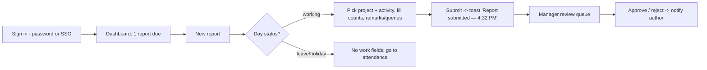

# Frontend Design

> **Status.** Derived from the hi-fi prototype `design-assets/ui_kits/web_app/` (React via CDN + Babel — a click-through prototype, **not** production code), the design-system deck (`design-assets/deck/`), brand assets, and the dashboard screenshots. The UX/IA, component library, design tokens, and voice below are **authoritative**; the prototype implementation is reference-only.
>
> **Naming:** brand-agnostic. The brand wordmark/mark is a **single swappable `Brand` component + `--product-name` token** (see [Naming Decision Record](./architecture.md#14-naming-decision-record)). Prototype strings still say *WorkTrack/Cadence* — legacy, to be neutralized.

---

## 1. Design System (foundations)

> **Token-file gap:** `app.css`, the deck, and `preview/*.html` all reference `colors_and_type.css`, which is **missing from the imported assets** (`decisions.md` U-005). Token *values* below are reconstructed from the deck swatches + CSS usage; exact radii/shadow/duration numbers are marked **TBD** until the token file is recovered or re-authored.

### 1.1 Color
One neutral, one accent, three semantic signals. **Slate carries ~90% of the UI; one blue accent** for primary actions/focus/selection; green/amber/red for status.

| Token | Hex | Role |
|---|---|---|
| `--blue-900` (brand mark) | `#1A2C6C` | Logo mark, deep brand |
| `--blue-600` (primary) | `#2F4FCB` | Primary buttons, focus, selection, links |
| `--slate-50` (app canvas) | `#F7F8FA` | App background |
| `--slate-900` (foreground) | `#141821` | Primary text |
| Surface | `#FFFFFF` | Cards, inputs, surfaces |
| `--green-600` (success) | `#079455` | Submitted/approved/present |
| `--amber-600` (warning) | `#DC6803` | Pending/blockers/leave |
| `--red-600` (danger) | `#D92D20` | Blocked/absent/destructive |

Each hue has a `-50/-100/-500/-600/-700` ramp. **Chart palette** `--chart-1…6` (chart-1 = brand blue). **Avatar palette** (deterministic by name): `#4F70E0 #14B8A6 #8B5CF6 #F59E0B #EC4899 #10B981 #6366F1`.

### 1.2 Typography
**Inter** for the work, **Source Serif 4** for headings. Monospace (**Geist Mono**, `--font-mono`) is reserved for **code / IDs / version strings**; numeric/tabular data (hours, counts) uses **Inter with `tabular-nums`** (the `.mono` utility class — note the name is a misnomer; see `decisions.md` C5/U-005).

Canonical scale (deck **spec column** values — authoritative over rendered slide sizes):

| Token | Size / weight | Family |
|---|---|---|
| H1 Display | 40 / 700 | Serif |
| H2 Heading | 32 / 600 | Serif |
| H3 Heading | 24 / 600 | Serif |
| H4 Subhead | 20 / 600 | Serif |
| Body Large | 16 / 400 | Inter |
| Body Base | 14 / 400 | Inter |
| Body Small | 12 / 400 | Inter |
| Caption | 11 / 400 | Inter |
| Tabular | Inter + `tnum` | numeric data |

_(Note: page `h1` renders at 32px serif in `app.css` — i.e. the H2 token in practice; documented in `decisions.md` C4.)_

### 1.3 Radii, shadow, motion, layout
- **Radii:** `--radius-sm` (controls ≈6–8px), `--radius-md`, `--radius-lg` (cards ≈12px), `--radius-xl` (modals), `--radius-full` (pills). Exact px **TBD** (token file).
- **Shadows:** `--shadow-xs … --shadow-xl` (subtle; cards use `xs`, modals `xl`). Values **TBD**.
- **Motion:** short and never bouncy — **120–240ms, Linear-style ease-out** (`--duration-fast`, `--duration-page`, `--ease-out`). No hover-lift, no glow, no scale.
- **Layout tokens:** `--sidebar-w`, `--topnav-h` (~60–64px), `--page-max`. Focus ring ≈ `0 0 0 4px rgba(63,99,224,0.22)` at `--blue-500`.

### 1.4 Voice & tone
Sentence case everywhere. No exclamations, no "Awesome!", no emoji-cheerleading. Numbers are specific; verbs concrete. The product **narrates state** ("Report submitted — 4:32 PM"), it doesn't celebrate ("🎉 You've submitted!"). This voice governs all copy, toasts, empty states, and errors.

### 1.5 Iconography & brand
Lucide icon set, stroke 1.5, sizes 16/20/24. Brand mark = three ascending bars (chart) in `--blue-900`; rendered via `assets/logo-mark.svg` / `logo-wordmark.svg`. **The wordmark text is a single `Brand` component bound to `--product-name`** so the product name is changed in one place.

---

## 2. UI Inventory (component library)

From `components.jsx`, `shell.jsx`, `toasts.jsx`, `app.css`. All are reusable primitives; in production they become the component library.

| Component | Purpose / variants |
|---|---|
| `AppShell` | Sidebar + sticky TopNav + content frame; mobile-aware (collapsible sidebar + scrim) |
| `Sidebar` / `NavItem` | Left rail, role-gated sections (Workspace / Manage), active state, count badges |
| `TopNav` | Breadcrumbs, ⌘K search field, notifications bell (with dot), help, avatar menu; backdrop-blur sticky bar |
| `Card` / `CardHeader` / `CardBody` | Surface primitive (muted header, body) |
| `Button` | `primary` / `secondary` / `ghost` / `danger` / `link`; sizes `sm`/`md`/`lg`; leading/trailing icon |
| `Badge` | Status pill, `neutral`/`info`/`success`/`warning`/`danger`, optional semantic dot |
| `Avatar` / `AvatarStack` | Initials on deterministic color; presence dot; overflow "+N" |
| `Field` / `Input` / `Textarea` / `Select` / `PillSelect` | Form controls with label/help/error; focus ring |
| `Tabs` / `Segmented` | In-page tabbed nav (with counts) / segmented control (day/week/month) |
| `DataTable` (`table`) | Header (uppercase caption), hover row, selected row, checkbox select, pagination footer |
| `Modal` | Centered modal, scrim + 8px blur (e.g. Invite people) |
| `PageHeader` | Serif title + sub + actions row |
| `EmptyState` | Glyph + title + description + action |
| `Kpi` | Label + big tabular value + delta (up/down with trend icon) |
| `Toast` / `ToastStack` | Bottom-right transient notifications; `info`/`success`/`warning`/`danger`; auto-dismiss ~4.2s |
| `NotificationDrawer` | TopNav popover of recent notifications; "View all" → center |
| Chart primitives | SVG `WeekChart`, `StackedBars`, `Donut`, `LineChart`, `BurnChart`, `Heatmap`, `TeamBars`, `Timeline` |

## 3. Page Inventory

| Screen (file) | Route | Role | Contents |
|---|---|---|---|
| **Login** (`Login.jsx`) | `/` | public | Email/password + SSO (SSO, Google Workspace), forgot/reset states, marketing panel ("SOC 2 · SAML SSO · audit log") |
| **Dashboard** (`Dashboard.jsx`) | `/home` | employee+ | Greeting, 4 KPIs (hours/reports/in-review/blockers), recent reports, my projects, week chart, team activity timeline |
| **Report form** (`ReportForm.jsx`) | `/report/new` | employee+ | Day details (status/location/shift), Work (project/activity), **counts grid** (Tags/Docs/BOM/Spares/Tasks done/Tasks open), Remarks, Queries/blockers (@mention), sidecar totals + "submitted by team"; auto-save; leave/holiday short-circuits work fields |
| **History** (`History.jsx`) | `/reports` | employee+ | Tabs (all/submitted/in-review/draft), search + filter chips, table, export CSV, pagination |
| **Attendance** (`Attendance.jsx`) | `/attendance` | employee+ | Tabs: Calendar (month grid + legend + shift + today's punch), History, Leave balances (CL/SL/EL/CO/BL/PL cards), Corrections; request leave/correction |
| **Team** (`Team.jsx`) | `/team` | manager+ | KPIs (avg hours, on-time, blockers, review SLA), hours-by-member, review queue, members table |
| **Analytics** (`Analytics.jsx`) | `/analytics` | manager+ | Range segmented; hours-by-category (stacked + donut), project burn, on-time line, workload heatmap; export |
| **Admin** (`Admin.jsx`) | `/admin` | admin | Tabs: People, Projects, Roles, Leave approvals, Attendance corrections, Audit log, SSO; Invite modal. (Latent `BillingTab` exists, unwired — `decisions.md` U-008) |
| **Project detail** (`ProjectDetail.jsx`) | `/projects/:id` | viewer+ | Header + status, KPIs, burn-down (ideal vs actual), recent reports, contributors, blockers |
| **Notifications** (`Notifications.jsx`) | `/notifications` | employee+ | Tabs (all/unread/reports/approvals), notification rows with icon/CTA; + TopNav drawer |

## 4. User Journeys

**Other key journeys:**
- **Apply for leave:** Attendance → balances → Apply → request → manager/HR approves (Admin) → calendar shows leave, balance decrements, notification.
- **Attendance correction:** Attendance → Corrections → request (reason + proposed change) → manager/HR decides → record updated.
- **Manager day:** Dashboard/Team → review queue (count badge) → review reports → watch load/heatmap/blockers.
- **Admin onboarding:** Admin → People → Invite (emails + default role + team) → invited user joins via email link.

## 5. Navigation Structure

Role-gated left rail (`shell.jsx`), two sections:
- **Workspace** (all): Home, Today's report, My reports, Attendance, Projects, Analytics, Notifications.
- **Manage** (manager/admin): Team; **Admin** (admin only).
Sidebar footer = current user + sign-out. TopNav = breadcrumbs + ⌘K search + bell + help + avatar. Count badges on nav items (e.g. My reports `12`, Team `3`, Notifications `3`). Breadcrumb map defined per route.

## 6. State Management Strategy _(proposed)_

The prototype uses in-memory React state with components published on `window`. For production:
- **Server state:** a data-fetching/caching layer (query library) keyed by resource; cache invalidation on mutations; optimistic updates for report edits (with `version` for conflict 409s).
- **UI state:** local component state for forms (auto-save drafts), URL-driven state for route/tab/filter/month so views are linkable and back-button friendly.
- **Session/auth state:** a single auth context (current user, permissions, unread count) hydrated from `/me`, `/me/permissions`, `/me/notifications/unread-count`.
- **No heavy global store needed** initially; introduce one only if cross-cutting client state grows.

## 7. API Consumption Strategy

- Talk to the REST surface in `backenddesign.md` §2 over JSON; bearer token in `Authorization`.
- **List views** request server-side filtered/paginated data (History tabs, audit log, people) — never load-all-then-filter in the client.
- **Optimistic concurrency:** send report `version`; handle 409 by surfacing a calm "this report changed — reload" path.
- **Denormalized reads:** dashboards/calendars read precomputed snapshots/views (`v_employee_today`, attendance records) — the client does not recompute hours.
- **Exports** (CSV/PDF) are async jobs → poll/notify when ready (object-storage URL).
- **Real-time _(proposed)_:** unread badge + drawer via polling initially; WebSocket/SSE later for live notifications.

## 8. Error Handling Strategy

- Consume the uniform error envelope (`backenddesign.md` §11); show **calm, specific, sentence-case** messages (matching voice) — inline field errors (`Field` `error` prop) for 400/422, toasts for transient failures, full-page states for 401/403/404.
- **409 version conflict** → non-destructive "reload to see changes" affordance, never silent overwrite.
- **Empty vs error vs loading** are distinct states: `EmptyState` for no-data, skeletons (`.skel`) for loading, explicit error cards for failures.
- Network/offline → retry affordance; auto-save indicator ("auto-saved 12s ago") communicates persistence state.

## 9. Accessibility Strategy _(proposed — gap to close)_

The prototype is visually polished but **not yet accessibility-audited**. Production requirements:
- **WCAG 2.1 AA** target. Verify contrast (the slate/blue palette is largely compliant; confirm amber/secondary text on tints).
- **Keyboard:** full keyboard operability — ⌘K palette, tab order, focus-visible rings (already designed), Esc to close modals/drawers, arrow-key calendar navigation.
- **Semantics:** real `<button>`/`<a>` (prototype uses some clickable `
`s — fix), `<table>` semantics for data tables, labelled form controls (`Field` → `label` association), `aria-live` for toasts and unread counts.
- **Screen readers:** alt text for avatars/icons-as-content; status conveyed by text+icon, not color alone (badges already pair a dot + label).
- **Reduced motion:** honor `prefers-reduced-motion` (motion is already short/non-essential).

## 10. Responsive Design Strategy

From `app.css` (breakpoint **860px**):
- **Sidebar** collapses to an off-canvas drawer with scrim on mobile (`useMediaQuery`).
- **KPI grid** drops to 2 columns; page header stacks; tables shrink type/padding; content padding reduces.
- **Two-column layouts** (report sidecar, calendar sidecar, dashboard) reflow to single column.
- **Touch targets** and the punch/leave actions remain reachable; charts are width-fluid SVG (`viewBox`, `width:100%`).
- Mobile-first review still pending a dedicated mobile UX pass (and a separate mobile app — `decisions.md` U-006).

## 11. Future Frontend Roadmap

- **Recover/re-author `colors_and_type.css`** as the single token source; wire `--product-name`/`Brand`.
- **Production framework migration** off the CDN prototype (component library + design tokens as packages).
- **Accessibility audit** to WCAG 2.1 AA; semantic-HTML cleanup.
- **Real-time notifications** (WS/SSE) replacing polling.
- **Command palette (⌘K)** wired to the search API.
- **Internationalization & timezone rendering** (timestamps are tz-aware; render per `employees.timezone`).
- **Mobile/field client** (punch, quick report) — see roadmap Phase 5.
- **Charting** — replace bespoke SVG with a maintained chart lib if interactivity grows.
- **Wire latent features** (billing) or formally cut them.

---

_Related: [`architecture.md`](./architecture.md) · [`backenddesign.md`](./backenddesign.md) · [`databasedesign.md`](./databasedesign.md) · [`decisions.md`](./decisions.md). Source: `design-assets/ui_kits/web_app/`, `design-assets/deck/`._
