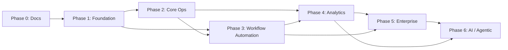

# Roadmap

> **Status:** Proposed, phased delivery plan derived from the documented modules (`architecture.md` §7) and screens (`frontenddesign.md` §3). Sequencing is dependency-driven. No code exists yet; **Phase 0 is documentation (this pass) and must be approved before implementation begins.** Brand-agnostic throughout — the product name is a Phase-0/1 configuration concern only (see [Naming Decision Record](./architecture.md#14-naming-decision-record)).

---

## Phase 0 — Documentation & Foundations

**Objectives**
- Establish the single source of truth from `design-assets/`; resolve naming; surface assumptions and open decisions before any code.

**Deliverables**
- `architecture.md`, `frontenddesign.md`, `backenddesign.md`, `databasedesign.md`, `roadmap.md`, `decisions.md`, `documentation-review-report.md`, `PROJECT_STRUCTURE.md`, `implementation-plan.md`.
- Naming Decision Record; assumptions & unresolved-decisions registers.
- Repo scaffolding plan for `backend/`, `frontend/`, `docker/`, `scripts/` (structure only).

**Risks**
- Open decisions (backend stack U-001, multi-tenancy U-010, locking rule U-002, domain semantics U-007) stall planning if not answered.
- Missing token file (U-005) blocks pixel-faithful UI.

**Dependencies**
- Imported design assets (complete). Stakeholder answers to the unresolved-decisions register.

**Success Criteria**
- All six+ docs reviewed and approved; every unresolved decision has an owner; green light to start Phase 1.

---

## Phase 1 — MVP Foundation

**Objectives**
- Stand up the spine: identity, RBAC, org/people, and the data layer + CI/CD, so anything can be built on top.

**Deliverables**
- Chosen backend stack (resolve U-001) + project skeleton; containerization (`docker/`), migration tooling, CI/CD pipeline (`scripts/`).
- DB bootstrapped from `design-assets/schema/` (with neutralized identifiers per decision); migration baseline.
- **Identity & Access:** login (password + at least one SSO), sessions, password reset, RBAC evaluation, audit-context middleware (`current_user_id` GUC), login-attempt rate limiting.
- **Org & People:** employees, departments, locations, shifts, manager hierarchy; Admin → People + Invite; basic AppShell/Login/Dashboard frontend with `Brand`/`--product-name` token.
- Single `PRODUCT_NAME` config + `Brand` component (rename-safe).

**Risks**
- Multi-tenancy (U-010) decided late ⇒ expensive retrofit across all tables — **decide before building entities**.
- RBAC scope complexity (global/dept/project/self) underestimated.

**Dependencies**
- Phase 0 approval; U-001 and U-010 resolved.

**Success Criteria**
- A user can sign in (incl. SSO), see a role-appropriate shell; admins can invite/manage people; every write is audited; pipeline deploys to staging.

---

## Phase 2 — Core Operations (Daily Reporting + Projects)

**Objectives**
- Deliver the product's reason for being: fast daily reporting against projects, with the manager review loop.

**Deliverables**
- **Projects:** catalog, members (open-stint), activity types; Project detail screen.
- **Daily Reporting:** report form (day details, work, counts grid, remarks, queries/@mentions), draft auto-save, lifecycle (draft→submit→review→approve/reject), versioning/history, optimistic concurrency, History screen + CSV export.
- **Team/review:** manager review queue, hours-by-member.
- Report-locker worker; mention extraction; submit/review notifications (in-app).

**Risks**
- **Domain semantics of counts (U-007)** unresolved ⇒ wrong core data model; confirm BOM/Spares/Tags meaning with domain owners.
- **Locking rule (U-002)** ambiguity (midnight vs +24h) ⇒ user confusion; pin the rule.

**Dependencies**
- Phase 1 (people, RBAC, audit). Notifications minimal (in-app) — can precede full Phase-3 notifications.

**Success Criteria**
- Median report submission ≈ 90s; managers review from a single queue; on-time submission tracked; history exportable.

---

## Phase 3 — Workflow Automation (Attendance, Leave, Notifications)

**Objectives**
- Automate the time-and-presence subsystems and the multi-channel notification engine.

**Deliverables**
- **Attendance:** punch ingestion (web + device endpoint), daily aggregator worker, calendar/history UI, corrections workflow (≤7-day window) with approvals.
- **Leave:** leave types/policies, requests + per-day expansion, balance read-model + accrual ledger + accrual worker, approvals (manager/HR), calendar reconciliation, balances UI.
- **Notifications:** templates, event fan-out, per-channel delivery (in-app + email; push/SMS if providers chosen), preferences, inbox/drawer/center, outbound worker + retries.
- Scheduled jobs wired (attendance close, report lock, accruals, retention).

**Risks**
- Notification provider integrations (email/push/SMS, U-005/G5) unscoped; biometric/kiosk device protocol (U-006) undefined.
- Balance correctness under concurrency — must use `FOR UPDATE` + ledger rebuild path.

**Dependencies**
- Phase 1 (people/shifts/holidays), Phase 2 (reports drive some notifications). Object storage for leave proofs/exports (U-001/G7).

**Success Criteria**
- Attendance reconciles punches+leave+holidays nightly with zero drift; leave balances never drift; notifications deliver across channels with retry; corrections auditable.

---

## Phase 4 — Reporting & Analytics

**Objectives**
- Turn captured effort into management signal.

**Deliverables**
- Analytics screen: hours-by-category (stacked + donut), project burn / burn-down, on-time trend, workload heatmap, KPI tiles.
- Read-replica routing; analytics endpoints; CSV/PDF exports (async, object storage).
- Materialized views for heavy aggregations if needed; per-org scoping via `v_employee_org`.

**Risks**
- Analytics queries on the primary degrade OLTP — must route to replica; heatmap/burn cost at scale.
- Export volume/PII handling.

**Dependencies**
- Phases 2–3 (data to analyze); read replica provisioned (architecture §10).

**Success Criteria**
- Dashboards load from snapshots/replica within target latency; exports generated without impacting OLTP; managers rely on analytics daily.

---

## Phase 5 — Enterprise Features

**Objectives**
- Make the platform enterprise-sellable and operable at scale.

**Deliverables**
- Full **audit log UI** + search, retention/partition automation (N+2, 13-month archive), archival to object storage.
- **SSO/SAML** hardening (multi-provider: Okta/Google/Azure AD), SCIM-style provisioning _(proposed)_, MFA.
- **Multi-tenancy** (if U-010 = yes) via `tenant_id`+RLS; org-scoped admin.
- Mobile/field capture client (punch + quick report); biometric/kiosk device onboarding.
- Compliance posture (SOC-2-aligned controls), data-residency options; backup/DR drills; billing (if U-008 confirmed).

**Risks**
- Multi-tenancy retrofit if deferred from Phase 1; compliance certification timeline; mobile scope.

**Dependencies**
- Phases 1–4; security/compliance program; provider/cloud decisions (U-009).

**Success Criteria**
- Audit-ready; SSO/MFA in production; (if applicable) multi-tenant isolation verified; mobile capture live; DR tested.

---

## Phase 6 — AI & Agentic Features

**Objectives**
- Layer intelligence on the structured corpus of reports, attendance, and projects.

**Deliverables**
- **Assisted report drafting** (summarize activity/PRs/tickets into a daily report).
- **Anomaly detection** (under-utilization, missing reports, attendance irregularities) feeding notifications.
- **Natural-language analytics** ("how did Platform do last sprint?").
- **Agentic review triage** (pre-screen reports, surface blockers, suggest approvals).
- Guardrails: human-in-the-loop, audit of AI actions, privacy boundaries.

**Risks**
- Data privacy/PII in model context; over-automation eroding trust; accuracy/hallucination on domain counts (U-007).
- Cost and latency of inference at scale.

**Dependencies**
- Phases 2–4 (rich, clean data); clear domain semantics (U-007); governance/compliance (Phase 5).

**Success Criteria**
- AI suggestions measurably cut report time and review backlog while preserving the "calm, narrates-not-cheerleads" voice; all AI actions audited and reversible.

---

## Dependency overview

_Related: [`architecture.md`](./architecture.md) · [`decisions.md`](./decisions.md) · [`implementation-plan.md`](./implementation-plan.md)._
